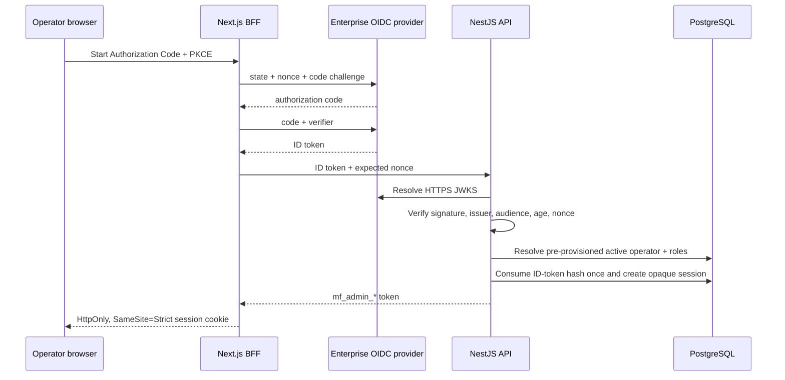

# Administrator support model

Status: implemented locally in iteration 014; production identity provider, shared deployment, retention and alert ownership remain gated

## Purpose and non-purpose

The administrator surface exists to answer a narrow support question: “For this exact account and documented ticket, what lifecycle evidence is safe to confirm?” It is not a user browser, content moderation console, impersonation tool or database editor.

Allowed output is limited to account lifecycle, configured identity-provider names, onboarding presence/revision, active session/photo counts, aggregate record counts and optional-consent state. Names, provider subjects, raw health values, workout/meal content, plan content, AI text, image bytes, private storage keys, session tokens and deletion mutations are outside this boundary.

## Independent trust boundary

User and operator sessions use different tables, token prefixes, guards and OpenAPI security schemes. An end-user token cannot call administrator routes and an administrator token cannot call user-owned health routes. The browser receives only an opaque cookie; the BFF alone adds the administrator Bearer token to API calls.

Production OIDC verification requires:

- Remote JWKS signature verification with `RS256`, `PS256` or `ES256`.
- Exact configured issuer and audience.
- Exact issuer bytes are preserved from configuration; a trailing slash is never silently added or removed.
- A token age of at most ten minutes plus a five-second clock tolerance.
- A matching browser-flow nonce.
- A subject already provisioned in `admin_identities` for that issuer.
- An active operator with at least one current role.
- A one-time `admin_oidc_exchanges.token_hash`; replay is rejected.

The local `dev` operator issuer can provision a development identity and roles only outside production. `NODE_ENV=production` returns `404` and appends a denied audit event even if the management UI is misconfigured to display local login.

## Authorization model

| Role             | May do                                                       | May not do                                            |
| ---------------- | ------------------------------------------------------------ | ----------------------------------------------------- |
| `support_reader` | Exact UUID lookup with bounded ticket reference and reason   | Read global audit, search users, view content, mutate |
| `audit_reader`   | Read newest-first bounded audit pages with opaque pagination | Look up account evidence unless separately granted    |

Roles are re-read from PostgreSQL on every authenticated request. Disabling an operator or removing every role makes an otherwise unexpired token unusable. Session revocation writes `revoked_at`; raw session tokens are never stored.

## Exact support lookup

`POST /v1/admin/support/users/lookup` requires all three values:

- One UUID account ID; there is no name, phone, email or fuzzy-search route.
- A 3–40 character uppercase ticket reference.
- One enumerated reason: account access, data export, account erasure or technical issue.

The API builds aggregates from owner tables in a transaction, appends `support.user.lookup` with `allowed` or `not_found`, and returns `Cache-Control: no-store, private`. A successful response contains its audit event ID as `lookupReceiptId`. The user target is represented in audit only by HMAC-SHA-256, so the table never stores the account UUID as a lookup target.

## Audit model

`admin_audit_events` records session creation/denial/revocation, profile reads, support lookups, audit reads and role denials. Each row carries outcome, operator when known, bounded target type/HMAC reference, request UUID, up to eight bounded scalar detail fields and occurrence time.

A PostgreSQL trigger rejects every `UPDATE` and `DELETE` on the audit table. This is primary-database immutability, not a complete retention guarantee: backup inclusion, external log export, retention duration, access review and alert ownership remain production work.

Opaque pagination projects only `(occurredAt, eventId)` into a bounded base64url cursor. It does not serialize the event body or expose internal query state.

## Data tables

| Table                  | Responsibility                                                   |
| ---------------------- | ---------------------------------------------------------------- |
| `admin_operators`      | Display label and active/disabled lifecycle                      |
| `admin_operator_roles` | Explicit least-privilege grants                                  |
| `admin_identities`     | Provider, issuer and pre-provisioned subject                     |
| `admin_sessions`       | SHA-256 token hash, expiry, use and revocation                   |
| `admin_oidc_exchanges` | One-time ID-token hash consumption                               |
| `admin_audit_events`   | Append-only access/decision evidence with HMAC target references |

## Management UI

`apps/admin` is a Next.js 16 App Router application with standalone output. Its BFF routes own OIDC secrets and the API session cookie. The browser-facing response sets CSP, no-referrer, anti-framing, nosniff and a permissions policy that disables camera, microphone and geolocation. Authorization, token and redirect URLs must all be HTTP(S), and all three must be HTTPS in production.

The visual signature is the **Evidence Rail / 访问证据轨**: a vertical immutable-event rail beside the documented query and bounded result. It reuses the Mineral/Juniper/Paper logbook palette but deliberately avoids dense dashboard charts or destructive controls. On mobile, reading order remains request, proof, summary.

## Known limits

- No enterprise OIDC tenant/client or named operator owner has been selected or deployed.
- Operator provisioning and disablement are runbook/SQL operations, not a self-service UI.
- Audit events are append-only in the primary database but not yet exported to independent immutable storage.
- No just-in-time approval, periodic access recertification or security-alert workflow is implemented.
- Windows local testing uses Next production preview because the standalone pnpm symlink tree can require privileges; the Linux standalone runtime remains the deployment candidate and still needs a container/deployment proof.

The accepted architecture decision is [ADR-0014](decisions/0014-independent-operator-trust-boundary.md), and operational procedures are in the [administrator access runbook](../operations/ADMIN_ACCESS_RUNBOOK.md).
