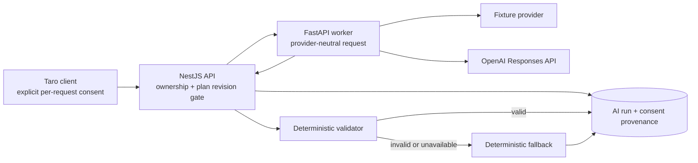

# AI plan-explanation model

Status: implemented for iteration 009 review-only explanations

## Boundary

The AI path explains an already-generated deterministic weekly plan. It cannot add sessions, change activities, prescribe nutrition, infer a diagnosis, or write a confirmed health record. The weekly-plan aggregate remains the authority; an explanation is a version-bound secondary artifact.

The client labels `model`, `fixture`, and `fallback` separately. No UI action can apply model prose to the plan.

## Input minimization

`buildAiPlanContext` sends only the current plan revision, week, selected activities, qualitative nutrition focuses, plan reasons, and already-aggregated evidence. It deliberately excludes:

- user ID, provider identity, name, contact details, and raw consent rows;
- unselected activity alternatives;
- raw body, workout, meal, and recovery record histories;
- photos, free-text notes, and database identifiers other than the plan ID needed for request correlation.

The API stores a SHA-256 input fingerprint, not the serialized prompt or minimized input. A completed run stores the explanation, plan revision, prompt/validator/model provenance, source, failure code, latency, optional token counts, provider response ID, and consent-event reference.

## Consent and lifecycle

Generation requires the client to submit an affirmative `ai_plan_explanation` consent for version `ai-plan-explanation-2026-07-19.v1`. The API then:

1. verifies ownership, current plan revision, actionable status, onboarding revision, and professional-clearance eligibility;
2. records or reuses the immutable purpose/version consent event;
3. reserves a `pending` run before contacting a provider, using an owner-scoped idempotency key;
4. returns the prior completed result for an identical retry or reports an in-progress conflict;
5. validates the provider output and completes the run as `model`, `fixture`, or `fallback`.

The client considers an explanation current only when its `planRevision` exactly matches the plan. After a plan change, the old result remains auditable in storage but is not shown as the current explanation.

## Prompt and provider contract

Prompt version `plan-explanation-v1` asks for short simplified-Chinese explanation, supplied evidence keys, and a strict JSON result. It explicitly forbids diagnosis, treatment, prescription, invented facts/numbers, calorie or macro targets, supplements, rapid-loss targets, guarantees, and shame.

Local development defaults to the deterministic `fixture` provider. The OpenAI adapter uses the Responses API with:

- configurable model, currently `gpt-5.6-terra`;
- low reasoning effort, low verbosity, 900 maximum output tokens;
- strict `json_schema` structured output;
- `store: false`;
- one retry only for transient 429/5xx responses;
- typed handling for refusal, timeout, provider error, and invalid output.

The adapter follows the current official [model catalog](https://developers.openai.com/api/docs/models), [Structured Outputs guide](https://developers.openai.com/api/docs/guides/structured-outputs), and [data controls documentation](https://developers.openai.com/api/docs/guides/your-data). `store: false` is an application setting, not proof of a full zero-data-retention agreement; organization eligibility, regional processing, contractual retention, abuse monitoring, and production privacy disclosures require separate review before enabling the provider.

No billable production-model call was made in iteration 009. The HTTP adapter and exact request/response behavior are verified with a mock transport; production model quality, cost, latency, and account-level retention remain deployment gates.

## Deterministic safety validation

Validator version `plan-explanation-safety-v1` accepts only the shared Zod schema and then rejects:

- medical, prescription, guarantee, punishment, rapid-loss, calorie, macro-target, or BMI phrases;
- evidence keys outside the allow-list supplied with the request;
- numeric claims not already present in the minimized context.

Schema failure, refusal, provider failure, timeout, unsafe language, unknown evidence, or invented numbers all result in a deterministic explanation assembled from the same structured context. The fallback is visibly labeled and preserves the failure reason for operations.

The initial fixture used the harmless negation “不生成能量处方”. The keyword validator correctly stayed conservative and rejected the word “处方”; the copy was changed to positive, non-medical language. This illustrates why allow/deny rules need versioned adversarial fixtures and human review rather than increasingly clever prompt wording.

## Evaluation and remaining gates

The checked-in `plan-explanation-v1.json` evaluation set covers grounded output, an allowed plan number, calorie prescription, diagnosis, invented number, unknown evidence, and missing schema fields. `pnpm eval:ai` writes the reproducible report under `output/evals/`.

Before shared beta, add expert-reviewed Chinese cases, multilingual/obfuscated unsafe text, prompt-injection inputs, cost/latency budgets, rate limits, trace correlation, abandoned-pending recovery, consent revocation/export, provider data-processing review, and a real-provider canary approved by the project owner.
