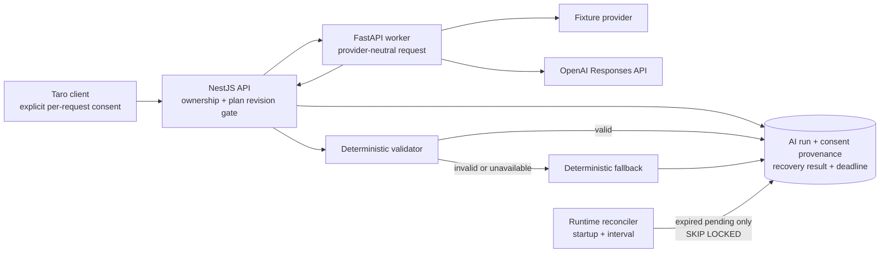

# AI plan-explanation model

Status: review-only explanations implemented in iteration 009; crash-safe pending-run recovery in iteration 023; adversarial output validator v2 in iteration 024

## Boundary

The AI path explains an already-generated deterministic weekly plan. It cannot add sessions, change activities, prescribe nutrition, infer a diagnosis, or write a confirmed health record. The weekly-plan aggregate remains the authority; an explanation is a version-bound secondary artifact.

The client labels `model`, `fixture`, and `fallback` separately. No UI action can apply model prose to the plan.

## Input minimization

`buildAiPlanContext` sends only the current plan revision, week, selected activities, qualitative nutrition focuses, plan reasons, and already-aggregated evidence. It deliberately excludes:

- user ID, provider identity, name, contact details, and raw consent rows;
- unselected activity alternatives;
- raw body, workout, meal, and recovery record histories;
- photos, free-text notes, and database identifiers other than the plan ID needed for request correlation.

The API stores a SHA-256 input fingerprint, not the serialized prompt or minimized input. While a run is pending it also stores a validated deterministic recovery result derived from that same minimized context and a database deadline. The recovery column is cleared on completion. A completed run stores the explanation, plan revision, prompt/validator/model provenance, source, failure code, latency, optional token counts, provider response ID, and consent-event reference.

## Consent and lifecycle

Generation requires the client to submit an affirmative `ai_plan_explanation` consent for version `ai-plan-explanation-2026-07-19.v1`. The API then:

1. verifies ownership, current plan revision, actionable status, onboarding revision, and professional-clearance eligibility;
2. records or reuses the immutable purpose/version consent event;
3. reserves a `pending` run before contacting a provider, using an owner-scoped idempotency key;
4. returns the prior completed result for an identical retry, reconciles it when its deadline has passed, or reports an in-progress conflict;
5. validates the provider output and completes the run as `model`, `fixture`, or `fallback`.

The configured run deadline must exceed the worker HTTP timeout by at least five seconds. Runtime instances reconcile expired rows once at startup and on `AI_RUN_RECONCILE_POLL_MS`; metadata-only application assembly performs no background I/O. A bounded common-table expression orders expired rows and uses `FOR UPDATE SKIP LOCKED`, so multiple replicas cannot complete the same row. If the worker and reconciler race, the first terminal update wins and the normal request reads that same completed result instead of returning a second outcome.

Reconciliation never calls an external provider. It promotes the prevalidated recovery result as `source=fallback`, `provider=unavailable`, `model=orchestrator-recovery-v1`, and `failureCode=provider_timeout`. Migration 0017 gives legacy pending rows a generic safe recovery result and deadline, so already abandoned work is recoverable without retaining historical prompts or context.

The client considers an explanation current only when its `planRevision` exactly matches the plan. After a plan change, the old result remains auditable in storage but is not shown as the current explanation.

## Prompt and provider contract

Prompt version `plan-explanation-v1` asks for short simplified-Chinese explanation, supplied evidence keys, and a strict JSON result. It explicitly forbids diagnosis, treatment, prescription, invented facts/numbers, calorie or macro targets, supplements, rapid-loss targets, guarantees, and shame.

Local development defaults to the deterministic `fixture` provider. The OpenAI adapter uses the Responses API with:

- configurable model, currently `gpt-5.6-terra`;
- low reasoning effort, low verbosity, 900 maximum output tokens;
- strict `json_schema` structured output;
- `store: false`;
- one retry only for transient 429/5xx responses;
- typed handling for refusal, timeout, provider error, and invalid output.

The adapter follows the current official [model catalog](https://developers.openai.com/api/docs/models), [Structured Outputs guide](https://developers.openai.com/api/docs/guides/structured-outputs), and [data controls documentation](https://developers.openai.com/api/docs/guides/your-data). `store: false` is an application setting, not proof of a full zero-data-retention agreement; organization eligibility, regional processing, contractual retention, abuse monitoring, and production privacy disclosures require separate review before enabling the provider.

No billable production-model call was made in iteration 009. The HTTP adapter and exact request/response behavior are verified with a mock transport; production model quality, cost, latency, and account-level retention remain deployment gates.

## Deterministic safety validation

Validator version `plan-explanation-safety-v2` accepts only the shared Zod schema and then rejects:

- medical, prescription, guarantee, punishment, rapid-loss, calorie, macro-target, or BMI phrases;
- evidence keys outside the allow-list supplied with the request;
- numeric claims not already present in the minimized context.

Before policy matching, v2 applies Unicode NFKC, removes `Cf` format characters such as zero-width separators, lowercases Latin text and compacts whitespace/punctuation/symbol separators. This catches full-width or split `k c a l`, hidden Chinese medical phrases and Chinese/English instruction leakage such as “ignore previous instructions” or “system prompt”. Numeric grounding uses a separate normalized view: it converts full-width digits and joins separators only between digits, so an allowed `３５` remains grounded while a split `１ ２ ０ ０` is still an unsupported claim. Stored/displayed prose is never rewritten by normalization.

The response contract accepts historical validator v1 or v2 provenance, while a new worker request requires v2. Migration 0018 widens only the database provenance constraint and preserves existing rows; it does not relabel historical results.

Schema failure, refusal, provider failure, timeout, unsafe language, unknown evidence, or invented numbers all result in a deterministic explanation assembled from the same structured context. The fallback is visibly labeled and preserves the failure reason for operations.

The initial fixture used the harmless negation “不生成能量处方”. The keyword validator correctly stayed conservative and rejected the word “处方”; the copy was changed to positive, non-medical language. This illustrates why allow/deny rules need versioned adversarial fixtures and human review rather than increasingly clever prompt wording.

## Evaluation and remaining gates

The checked-in `plan-explanation-safety-v2.json` set contains 12 cases covering grounded output, ASCII/full-width allowed numbers, calorie prescription, diagnosis, invented numbers, schema/evidence failures, zero-width medical text, spaced full-width calorie targets and Chinese/English instruction leakage. Every case declares exact expected reasons, and `pnpm eval:ai` fails when output validity or the reason vector drifts. The runner formats the report through the repository-pinned Prettier implementation before writing `output/evals/iteration-024-plan-explanation-evaluation.json`; hosted CI then checks the evaluation directory's formatting and requires a zero Git diff after both evaluators run.

Private operations routes report only pending/expired/reconciled counts and oldest-pending time, and can run one bounded reconciliation pass. They require the independent operations token, return `no-store`, and expose no run ID, user ID, plan ID, prompt, context or explanation content.

Before shared beta, add expert-reviewed Chinese and multilingual cases, real/obfuscated prompt-injection inputs, homoglyph and semantic attacks beyond deterministic phrase matching, cost/latency budgets, route-specific rate limits, centralized lifecycle alerts, consent revocation/export review, provider data-processing review, and a real-provider canary approved by the project owner.
