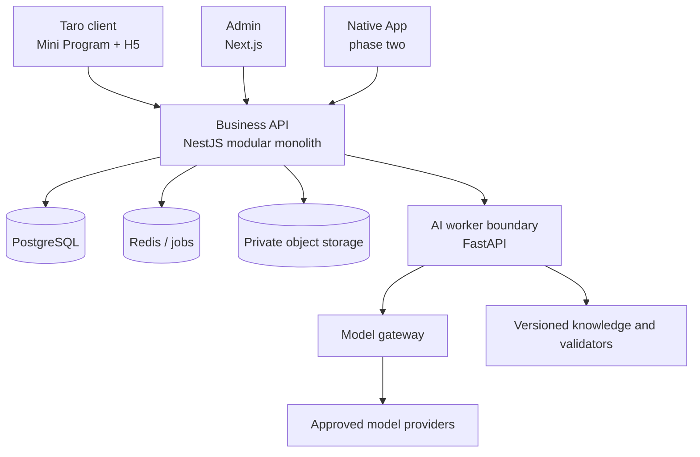

# Architecture baseline

Status: accepted and implemented through the iteration-010 revocable food-photo proposal loop; changes require an ADR.

## System shape

## Repository boundaries

| Path                     | Responsibility                                               | Must not own                                         |
| ------------------------ | ------------------------------------------------------------ | ---------------------------------------------------- |
| `apps/client`            | End-user Mini Program/H5 rendering and interaction           | Health formulas, model prompts, server authorization |
| `apps/admin`             | Support, content, audit and operational workflows            | Direct database mutation from the browser            |
| `apps/api`               | Authentication, authorization, record lifecycle, plans, jobs | Provider-specific AI code in controllers             |
| `apps/mobile`            | Native UI and platform health/device adapters                | Independent business schema                          |
| `services/ai`            | Model gateway, image pipeline, prompt/evaluation versions    | Final authority to persist confirmed user facts      |
| `packages/contracts`     | API schemas, enums, serialization                            | Database clients or UI styling                       |
| `packages/domain`        | Units, metrics, plan and deterministic safety rules          | Network or framework dependencies                    |
| `packages/design-tokens` | Cross-client visual primitives                               | Product data or business logic                       |

## Delivery architecture

Start as a pnpm monorepo and modular monolith. A single API deployable keeps transactions, authorization, migrations, and local development clear. AI work runs behind a queue/worker boundary because it has different runtimes, latency, cost, retry, and observability needs. Extract more services only after a measured scaling or ownership constraint.

Implemented foundation:

- `apps/api` is a NestJS 11 process exposing readiness and health-record routes.
- `packages/contracts` owns Zod request/response schemas and emits OpenAPI 3.0 JSON Schema.
- `packages/domain` owns measurement units, canonical conversion, plausible ranges and integer score rules.
- PostgreSQL 18.4 stores measurements through parameterized `pg`; ordered SQL migrations run transactionally and record a SHA-256 checksum to detect drift.
- Protected routes resolve an opaque Bearer session to a server-owned user principal. Only SHA-256 token hashes are persisted; the local issuer is disabled in production and can later be replaced by verified WeChat/phone adapters without changing resource ownership.
- Adult profile, training goal, risk eligibility and immutable purpose/version consent events persist transactionally. Profile updates use optimistic revision checks.
- Body/recovery record creation, replacement and soft deletion run in database transactions. Each accepted state is copied to an append-only revision table; writes use expected revisions and lists exclude deleted records while owner history remains available.
- Workout session, ordered exercise and ordered set rows form one bounded relational aggregate. Server-side domain rules normalize load and calculate completed-only summaries; each accepted aggregate state is also stored as an immutable JSON snapshot.
- Nutrition meal/item rows snapshot food composition and display/canonical portions. Server-side rules calculate nutrient totals; owner favorites are independent snapshots and each meal revision retains the full accepted aggregate.
- A read-only insights projection queries confirmed source rows for the requested timezone and produces Today evidence, nullable three-day readiness and 7/30/90-day totals without persisted duplicate state.
- A deterministic weekly-plan aggregate snapshots onboarding revision and evidence, stores the current JSONB plan plus immutable revisions, and re-checks current eligibility before an accept/modify transition.
- A FastAPI worker exposes an authenticated provider-neutral explanation endpoint. Local fixture and OpenAI Responses adapters share a strict schema; the business API owns consent, authorization, idempotency, validation, fallback and persistence.
- AI explanation runs are minimized, fingerprinted and bound to the exact plan revision plus prompt/model/validator/consent provenance. Raw prompts and input payloads are not persisted.
- Food-photo reservations keep the raw upload in memory, sanitize to a private expiring JPEG, send only that JPEG plus a catalog allow-list to the worker, validate candidates deterministically and delete media on confirm/failure/reject/delete/expiry.

## Data rules

All health-domain events store:

- Stable user and record identifiers.
- Numeric value and canonical/display unit.
- Source: manual, device, imported, or AI estimate.
- Confidence and candidate alternatives for estimates.
- Occurrence time, timezone, creation time, update time, and revision actor.
- Consent/purpose reference when the source requires sensitive-data permission.

AI output is a proposal. Only an explicit user action or deterministic system process with a documented contract can create a confirmed record.

The implemented measurement subset and field-level invariants are documented in [HEALTH_RECORD_MODEL.md](HEALTH_RECORD_MODEL.md). ADR-0002 records why contract validation, deterministic normalization and database checks deliberately overlap.

The implemented identity, profile, goal, risk and consent invariants are documented in [IDENTITY_PROFILE_MODEL.md](IDENTITY_PROFILE_MODEL.md). ADR-0003 records the replaceable provider identity and opaque session decision.

ADR-0004 records the health-record replacement, append-only snapshot, soft-delete and optimistic-concurrency decision.

The workout aggregate, derived-value rules and safe repeat semantics are documented in [WORKOUT_MODEL.md](WORKOUT_MODEL.md). ADR-0005 records the normalized current graph plus immutable-snapshot decision.

The meal snapshot, canonical-gram, catalog/favorite and photo-candidate boundaries are documented in [NUTRITION_MODEL.md](NUTRITION_MODEL.md). ADR-0006 records why mutable catalogs cannot be historical truth.

The deterministic weekly-plan rules, evidence provenance, revision lifecycle and limitations are documented in [PLAN_MODEL.md](PLAN_MODEL.md). ADR-0008 records why the structured rule path precedes model orchestration.

The review-only AI boundary, minimization, provider contract, validation and fallback are documented in [AI_EXPLANATION_MODEL.md](AI_EXPLANATION_MODEL.md). ADR-0009 records why explanations cannot mutate plans or confirmed records.

The private media lifecycle, candidate contract, vision provider boundary and no-auto-write rule are documented in [FOOD_PHOTO_MODEL.md](FOOD_PHOTO_MODEL.md). ADR-0010 records why images and model output remain revocable proposals.

## API and event conventions

- HTTP JSON contracts are defined in `packages/contracts` and exposed as OpenAPI.
- Client-generated idempotency keys protect record creation and photo reservation.
- Mutations use optimistic concurrency or revision numbers where edits can conflict.
- Background jobs carry opaque media IDs, never public object URLs.
- Logs exclude raw health payloads, images, access tokens, full prompts, and direct identifiers.
- Domain events use past tense and versioned payloads, for example `workout.recorded.v1`.

## AI execution path

1. API verifies purpose-specific consent and creates a job.
2. Worker fetches the minimum required, short-lived input.
3. Deterministic preprocessing computes facts and removes disallowed metadata.
4. Provider returns structured candidates through the model gateway.
5. Schema and safety validators reject or repair output within a bounded policy.
6. API exposes an estimated proposal with model/prompt/validator versions.
7. User confirms or edits; only then is the formal record or plan version stored.

Provider outages fall back to manual recording and deterministic summaries; core records never depend on an available model.

## Security and privacy baseline

- TLS in transit; managed key encryption at rest; field-level or envelope encryption for selected sensitive values.
- Private object storage with short-lived signed access and isolated retention policies.
- Purpose-specific consent versions and revocation state.
- Tenant/user authorization enforced in the API, never inferred from client filters.
- Admin RBAC, just-in-time access for sensitive support actions, and immutable audit events.
- Export, correction, deletion, retention expiry, backup handling, and provider deletion are explicit workflows.
- China-region deployment is the default for China-user health data; any cross-border provider use requires a separate architecture and legal decision.

## Initial local and production targets

- Local: Node 24 runtime, pnpm 11, Docker Compose and PostgreSQL 18.4 today; Redis, mock object storage and fixture AI provider enter only with their consuming features.
- CI: install lockfile, format check, lint, typecheck, unit/integration tests, H5 build, Mini Program build, dependency audit, artifact upload.
- Production candidate: managed container/runtime, managed PostgreSQL and Redis, private object storage, KMS/secrets manager, CDN only for public static assets, centralized metrics and alerts.

Specific cloud vendor selection is deferred until expected China-region traffic, company entity, budget, filing owner, and operations capability are known.
