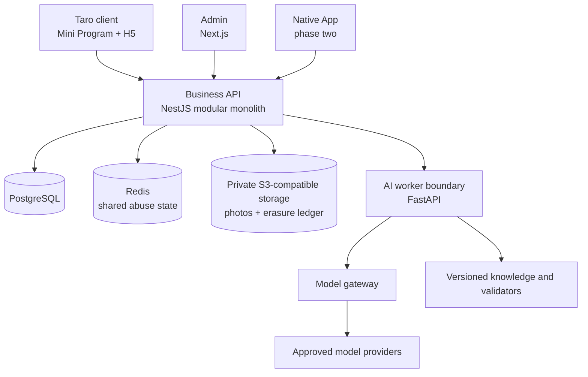

# Architecture baseline

Status: accepted and implemented through the iteration-027 immutable-workflow-supply-chain boundary; changes require an ADR.

## System shape

## Repository boundaries

| Path                     | Responsibility                                               | Must not own                                         |
| ------------------------ | ------------------------------------------------------------ | ---------------------------------------------------- |
| `apps/client`            | End-user Mini Program/H5 rendering and interaction           | Health formulas, model prompts, server authorization |
| `apps/admin`             | Operator login, bounded support evidence and audit reading   | User-content browsing or database mutation           |
| `apps/api`               | Authentication, authorization, record lifecycle, plans, jobs | Provider-specific AI code in controllers             |
| `apps/mobile`            | Native UI and platform health/device adapters                | Independent business schema                          |
| `services/ai`            | Model gateway, image pipeline, prompt/evaluation versions    | Final authority to persist confirmed user facts      |
| `packages/contracts`     | API schemas, enums, serialization                            | Database clients or UI styling                       |
| `packages/domain`        | Units, metrics, plan and deterministic safety rules          | Network or framework dependencies                    |
| `packages/design-tokens` | Cross-client visual primitives                               | Product data or business logic                       |

## Delivery architecture

Start as a pnpm monorepo and modular monolith. A single API deployable keeps transactions, authorization, migrations, and local development clear. AI work runs behind a queue/worker boundary because it has different runtimes, latency, cost, retry, and observability needs. Extract more services only after a measured scaling or ownership constraint.

Implemented foundation:

- `apps/api` is a NestJS 11 process exposing readiness and health-record routes.
- `packages/contracts` owns Zod request/response schemas and emits OpenAPI 3.0 JSON Schema.
- `packages/domain` owns measurement units, canonical conversion, plausible ranges and integer score rules.
- PostgreSQL 18.4 stores measurements through parameterized `pg`; ordered SQL migrations run transactionally and record a SHA-256 checksum to detect drift.
- Protected routes resolve a provider-bound opaque Bearer session to a server-owned user principal. Only SHA-256 token hashes are persisted. The production-disabled local issuer and server-verified WeChat `code2Session` adapter share the ownership boundary; WeChat `session_key` is never stored.
- Administrator routes use an independent operator/identity/role/session boundary and `adminBearer` OpenAPI scheme. The API verifies pre-provisioned OIDC subjects against remote JWKS, issuer, audience, age and nonce, rejects token replay, re-resolves roles per request and keeps the local operator issuer production-disabled.
- Adult profile, training goal, risk eligibility and immutable purpose/version consent events persist transactionally. Profile updates use optimistic revision checks.
- Body/recovery record creation, replacement and soft deletion run in database transactions. Each accepted state is copied to an append-only revision table; writes use expected revisions and lists exclude deleted records while owner history remains available.
- Workout session, ordered exercise and ordered set rows form one bounded relational aggregate. Server-side domain rules normalize load and calculate completed-only summaries; each accepted aggregate state is also stored as an immutable JSON snapshot.
- Nutrition meal/item rows snapshot food composition and display/canonical portions. Server-side rules calculate nutrient totals; owner favorites are independent snapshots and each meal revision retains the full accepted aggregate.
- A read-only insights projection queries confirmed source rows for the requested timezone and produces Today evidence, nullable three-day readiness and 7/30/90-day totals without persisted duplicate state.
- A deterministic weekly-plan aggregate snapshots onboarding revision and evidence, stores the current JSONB plan plus immutable revisions, and re-checks current eligibility before an accept/modify transition.
- A FastAPI worker exposes an authenticated provider-neutral explanation endpoint. Local fixture and OpenAI Responses adapters share a strict schema; the business API owns consent, authorization, idempotency, validation, fallback and persistence.
- AI explanation runs are minimized, fingerprinted and bound to the exact plan revision plus prompt/model/validator/consent provenance. Raw prompts and input payloads are not persisted.
- Plan explanations and food-photo display copy share a versioned deterministic safety policy. Validator v2 applies Unicode NFKC normalization, strips format controls, compacts separators for policy matching and normalizes numeric evidence without rewriting persisted copy; stored v1 provenance remains readable.
- Food-photo reservations keep the raw upload in memory, sanitize to a private expiring JPEG, write it conditionally with a checksum to S3-compatible storage, send only that JPEG plus a catalog allow-list to the worker, validate candidates deterministically and enqueue media deletion on confirm/failure/reject/delete/expiry.
- Food-photo prompt v2 treats all image text as untrusted data: the provider must not follow, repeat or reveal image-borne instructions, prompts or secrets, and instruction-dominant images are rejected instead of becoming nutrition candidates.
- PostgreSQL data-operation jobs are transactionally enqueued with lifecycle changes and claimed atomically using `FOR UPDATE SKIP LOCKED`, leases, bounded exponential retry, attempt evidence and dead-letter state. Successful jobs clear payload and sensitive dedupe material.
- The authenticated privacy boundary inventories owned data, creates a no-store repeatable-read portable JSON export, records renewed consent cycles, revokes optional processing and closes account access before asynchronous media/primary erasure.
- `durable-erasure-v2` receipts require a separate status token and expose independent primary/media/provider/backup dispositions. An external HMAC erasure ledger is replayed before a restored database can serve traffic, preventing known deleted accounts from being resurrected by an older backup.
- Outer request middleware validates UUIDv4 correlation and records final status/duration from stable route templates. A Redis-backed IP guard runs before authentication; a second actor/route limiter runs after authentication. HMAC actor keys expire atomically, business traffic fails closed without Redis, and liveness stays separate from PostgreSQL+Redis+object-storage readiness.
- Exact administrator support lookup requires an account UUID, bounded ticket and enumerated reason, then returns lifecycle/aggregate evidence only. Every accepted/not-found lookup and authorization decision is correlated into an append-only audit table whose target identifiers are HMAC references and whose update/delete trigger fails closed.
- `apps/admin` is a Next.js 16 App Router BFF/UI. Authorization Code + PKCE/state/nonce remains server-side, administrator API tokens stay in secure-by-default HttpOnly cookies, and the Evidence Rail renders only the bounded support/audit contract.
- API, administrator and AI runtime boundaries have non-root OCI images with pinned base manifests, health checks and source/revision labels. API production output is a pruned pnpm deploy directory; administrator output is Next.js standalone; Python runtime dependencies are fully pinned.
- A one-shot API-image migration task gates container traffic. The disposable deployment topology proves container networking, migrations, PostgreSQL/Redis/object readiness, AI health and administrator security headers, while remaining explicitly non-production.
- API binding defaults to loopback outside production and all interfaces in production, with an explicit IP-only override. GitHub Actions defines source gates, image smoke, multi-architecture GHCR publishing and provenance attestations; managed infrastructure remains vendor-neutral.
- Every external GitHub Action is selected by a reviewed full commit in a strict lock rather than a branch or tag. Offline workflow discovery rejects drift, exact SemVer comments preserve review intent, weekly Dependabot proposals expose updates and repository policy requires SHA pins after the baseline reaches `main`.
- Candidate publication begins with dependency-free hosted qualification: the remote lightweight/annotated tag must resolve to the workflow commit, that commit must remain in current `main`, and the exact SHA must have a completed successful `main` push run of `.github/workflows/ci.yml`. The strict qualification record is checked again before manifest assembly and retained with the immutable Release.
- Parent-qualified pnpm overrides place audited floors only on affected Taro 4.2.1 edges: client Vite 6.4.3, webpack 5.104.1, Swiper 12.1.2 and lodash-es 4.18.1. Root Vite 8.1.5 stays isolated for Vitest; frozen install, peer checks, dual builds, E2E and the zero-critical/high audit gate control every graph change.

## Data rules

All health-domain events store:

- Stable user and record identifiers.
- Numeric value and canonical/display unit.
- Source: manual, device, imported, or AI estimate.
- Confidence and candidate alternatives for estimates.
- Occurrence time, timezone, creation time, update time, and revision actor.
- Consent/purpose reference when the source requires sensitive-data permission.

AI output is a proposal. Only an explicit user action or deterministic system process with a documented contract can create a confirmed record.

The implemented measurement subset and field-level invariants are documented in [HEALTH_RECORD_MODEL.md](HEALTH_RECORD_MODEL.md). ADR-0002 records why contract validation, deterministic normalization and database checks deliberately overlap.

The implemented identity, profile, goal, risk and consent invariants are documented in [IDENTITY_PROFILE_MODEL.md](IDENTITY_PROFILE_MODEL.md). ADR-0003 records the replaceable provider identity and opaque session decision.

ADR-0004 records the health-record replacement, append-only snapshot, soft-delete and optimistic-concurrency decision.

The workout aggregate, derived-value rules and safe repeat semantics are documented in [WORKOUT_MODEL.md](WORKOUT_MODEL.md). ADR-0005 records the normalized current graph plus immutable-snapshot decision.

The meal snapshot, canonical-gram, catalog/favorite and photo-candidate boundaries are documented in [NUTRITION_MODEL.md](NUTRITION_MODEL.md). ADR-0006 records why mutable catalogs cannot be historical truth.

The deterministic weekly-plan rules, evidence provenance, revision lifecycle and limitations are documented in [PLAN_MODEL.md](PLAN_MODEL.md). ADR-0008 records why the structured rule path precedes model orchestration.

The review-only AI boundary, minimization, provider contract, validation and fallback are documented in [AI_EXPLANATION_MODEL.md](AI_EXPLANATION_MODEL.md). ADR-0009 records why explanations cannot mutate plans or confirmed records.

The private media lifecycle, candidate contract, vision provider boundary and no-auto-write rule are documented in [FOOD_PHOTO_MODEL.md](FOOD_PHOTO_MODEL.md). ADR-0010 records why images and model output remain revocable proposals.

The inventory/export/consent/erasure boundary is documented in [PRIVACY_OWNERSHIP_MODEL.md](PRIVACY_OWNERSHIP_MODEL.md). ADR-0011 records the user-scoped media, renewed consent and unlinkable primary-store receipt decisions.

The request-correlation, shared-rate-limit, health and metric boundary is documented in [OPERATIONS_PERIMETER.md](OPERATIONS_PERIMETER.md). ADR-0012 records why ingress protection precedes authentication and administrator access.

ADR-0013 records the parent-qualified Taro security floors, separate compiler/test Vite lanes, high-severity audit gate and override removal conditions.

The independent operator identity, evidence-only lookup and immutable audit boundary is documented in [ADMIN_SUPPORT_MODEL.md](ADMIN_SUPPORT_MODEL.md). ADR-0014 records why it cannot reuse end-user identity or expose generic administration.

The S3-compatible media boundary, durable deletion jobs, status-token receipt and restore ledger are documented in [PRIVACY_OWNERSHIP_MODEL.md](PRIVACY_OWNERSHIP_MODEL.md), [FOOD_PHOTO_MODEL.md](FOOD_PHOTO_MODEL.md) and the [data custody runbook](../operations/DATA_CUSTODY_RUNBOOK.md). ADR-0015 records why cross-system erasure uses transactional enqueue plus an external HMAC restore control.

## API and event conventions

- HTTP JSON contracts are defined in `packages/contracts` and exposed as OpenAPI.
- Client-generated idempotency keys protect record creation and photo reservation.
- Mutations use optimistic concurrency or revision numbers where edits can conflict.
- Background jobs carry validated logical storage keys or scoped user IDs, never public object URLs; successful jobs clear their payload.
- Logs exclude raw health payloads, images, access tokens, full prompts, and direct identifiers.
- Every routed response carries a bounded request ID. Metrics/logs use stable route templates and actor class, never raw URLs, queries, IPs, users or request bodies.
- Domain events use past tense and versioned payloads, for example `workout.recorded.v1`.

## AI execution path

1. API verifies purpose-specific consent and creates a job.
2. Worker fetches the minimum required, short-lived input.
3. Deterministic preprocessing computes facts and removes disallowed metadata.
4. Provider returns structured candidates through the model gateway.
5. Schema and safety validators reject or repair output within a bounded policy.
6. API exposes an estimated proposal with model/prompt/validator versions.
7. User confirms or edits; only then is the formal record or plan version stored.

Provider outages fall back to manual recording and deterministic summaries; core records never depend on an available model.

## Security and privacy baseline

- TLS in transit; managed key encryption at rest; field-level or envelope encryption for selected sensitive values.
- Private object storage with short-lived signed access, checksummed conditional writes and production-required encryption; lifecycle/versioning/replication remain provider configuration gates.
- Purpose-specific consent versions and revocation state.
- Tenant/user authorization enforced in the API, never inferred from client filters.
- Independent administrator identity, least-privilege RBAC, exact support purpose and primary-database immutable audit events; just-in-time approval and external retention remain release gates.
- Export, correction, durable deletion, retention expiry, restore-ledger replay and conservative provider disposition are explicit workflows. `policy_bound` is not a remote-delete claim.
- China-region deployment is the default for China-user health data; any cross-border provider use requires a separate architecture and legal decision.

## Initial local and production targets

- Local: Node 24 runtime, pnpm 11, Docker Compose, PostgreSQL 18.4, Redis 8.8, pinned MinIO and the fixture AI provider.
- CI: install lockfile, format check, lint, typecheck, unit/integration tests, H5 build, Mini Program build, dependency audit, artifact upload.
- Production candidate: managed container/runtime, managed PostgreSQL and Redis, private object storage, KMS/secrets manager, CDN only for public static assets, centralized metrics and alerts.
- Deployment artifacts: immutable API/admin/AI image digests, separate migration job, secret-manager environment injection and black-box post-deploy verification. Application rollback selects the prior digest and never reverses the database.

Specific cloud vendor selection is deferred until expected China-region traffic, company entity, budget, filing owner, and operations capability are known.
