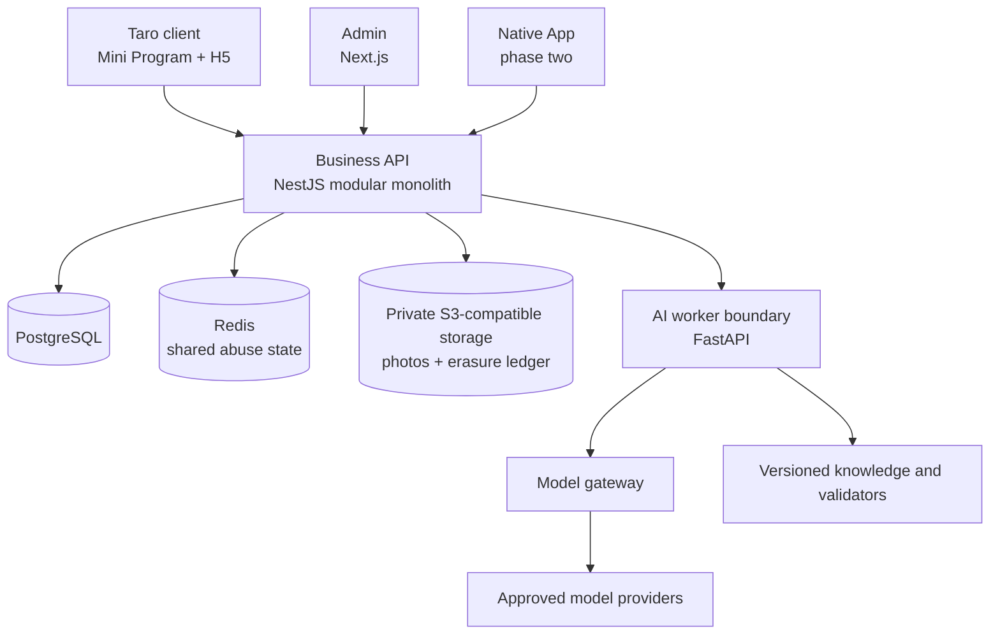

# 架构基线

状态：已接受并实现至第 093 轮交付路线图正文中文化；架构变更必须新增 ADR。

## 系统形态

```mermaid
flowchart TB
  C["Taro client<br/>Mini Program + H5"] --> G["Business API<br/>NestJS modular monolith"]
  A["Admin<br/>Next.js"] --> G
  M["Native App<br/>phase two"] --> G
  G --> P[("PostgreSQL")]
  G --> R[("Redis<br/>shared abuse state")]
  G --> O[("Private S3-compatible storage<br/>photos + erasure ledger")]
  G --> W["AI worker boundary<br/>FastAPI"]
  W --> V["Model gateway"]
  W --> K["Versioned knowledge and validators"]
  V --> E["Approved model providers"]
```

## 仓库边界

| Path                     | Responsibility                                               | Must not own                                         |
| ------------------------ | ------------------------------------------------------------ | ---------------------------------------------------- |
| `apps/client`            | End-user Mini Program/H5 rendering and interaction           | Health formulas, model prompts, server authorization |
| `apps/admin`             | Operator login, bounded support evidence and audit reading   | User-content browsing or database mutation           |
| `apps/api`               | Authentication, authorization, record lifecycle, plans, jobs | Provider-specific AI code in controllers             |
| `apps/mobile`            | Native UI and platform health/device adapters                | Independent business schema                          |
| `services/ai`            | Model gateway, image pipeline, prompt/evaluation versions    | Final authority to persist confirmed user facts      |
| `packages/contracts`     | API schemas, enums, serialization                            | Database clients or UI styling                       |
| `packages/domain`        | Units, metrics, plan and deterministic safety rules          | Network or framework dependencies                    |
| `packages/design-tokens` | Cross-client visual primitives                               | Product data or business logic                       |

## 交付架构

Start as a pnpm monorepo and modular monolith. A single API deployable keeps transactions, authorization, migrations, and local development clear. AI work runs behind a queue/worker boundary because it has different runtimes, latency, cost, retry, and observability needs. Extract more services only after a measured scaling or ownership constraint.

Implemented foundation:

- 中文项目记录由无第三方运行时依赖的 `myfitness-chinese-documentation/v2` 门禁约束。四份活跃权威文档保留中文导航契约；权威项目状态和交付路线图还要求各自整体中文占比不低于 72%，且不得存在纯英文叙述行；第 090 轮起的迭代档案和 ADR-0085 起的决策记录必须使用中文标题、元数据与以中文为主的正文。仓库状态仍是唯一权威来源，Obsidian 只保存逐字节镜像，其他活跃正文和历史英文档案按受控批次迁移。

- `apps/api` is a NestJS 11 process exposing readiness and health-record routes.
- `packages/contracts` owns Zod request/response schemas and emits OpenAPI 3.0 JSON Schema.
- `packages/domain` owns measurement units, canonical conversion, plausible ranges and integer score rules.
- PostgreSQL 18.4 stores measurements through parameterized `pg`; ordered SQL migrations run transactionally and record a SHA-256 checksum to detect drift.
- Protected routes resolve a provider-bound opaque Bearer session to a server-owned user principal. Only SHA-256 token hashes are persisted. The production-disabled local issuer and server-verified WeChat `code2Session` adapter share the ownership boundary; WeChat `session_key` is never stored.
- The workout, meal and health-record create/correction editors share a dependency-free `myfitness-sensitive-draft/v1` vault over platform application storage. Exact per-editor guards accept incomplete form input but reject unknown fields; envelopes are owner-scoped, capped at 96 KiB, expire after 24 hours and require explicit restore/discard. Correction payloads carry only aggregate ID and base revision; restore performs one exact owner-visible current-aggregate read and proceeds only on an exact revision match. Missing/stale targets clear without submitting, and a change after restore still reaches the API with the previously rechecked expected revision. Save, cancel, logout and erasure initiation clear the relevant scope. Photos, authorization material, erasure receipts and AI candidate sheets are outside the draft contract.
- The three record editors share a dependency-free local occurrence resolver. A calendar minute plus explicit IANA timezone is round-tripped through platform `Intl` data; nonexistent DST minutes fail and repeated minutes require an explicit offset choice. Client validation and shared write contracts reject future instants, while untouched corrections retain the exact original timestamp rather than truncating seconds to the editor's minute precision.
- Administrator routes use an independent operator/identity/role/session boundary and `adminBearer` OpenAPI scheme. The API verifies pre-provisioned OIDC subjects against remote JWKS, issuer, audience, age and nonce, rejects token replay, re-resolves roles per request and keeps the local operator issuer production-disabled.
- Adult profile, training goal, risk eligibility and immutable purpose/version consent events persist transactionally. Profile updates use optimistic revision checks.
- A lost profile/goal PUT response replaces save with one current-profile GET. The client retains only the exact submitted request and nullable base revision in page memory and locks its controls until resolution. A first/advanced revision is accepted only when every response-visible profile, goal, ordered constraint, risk flag and required consent version matches; same-revision/confirmed-absence evidence restores only a later explicit-save boundary. Changed or missing current evidence reuses the existing no-silent-rebase resolution while preserving local input. Explicit refusal terminates the attempt, and reconciliation never sends PUT, polls or persists a command.
- Body/recovery record creation, replacement and soft deletion run in database transactions. Each accepted state is copied to an append-only revision table; writes use expected revisions and lists exclude deleted records while owner history remains available.
- Current health/workout/meal lists use revision-backed keyset pagination ordered by occurrence time, aggregate creation time and UUID descending. Versioned base64url cursors contain only aggregate UUID/revision; the API recovers the immutable owner sort boundary from revision tables, so anchor correction/deletion cannot invalidate continuation. No-query limits remain 100/50/50 for compatibility, editors load 20 at a time, and exact current-resource reads support off-page correction recovery without exposing deleted or foreign targets.
- Health/workout/meal aggregate histories use revision-keyset pagination with the same minimal cursor envelope, a 20-row default and 50-row maximum. The API requires the path UUID, owner and exact anchor revision to agree before querying the strictly older suffix; editors load 10 at a time, new head revisions do not disturb continuation and soft-deleted aggregates retain owner-visible audit history.
- Their three client sheets share a page-memory audit-read authority. Requested aggregate context survives an unknown first page, successful empty is distinct from unread, and failed continuation retains the accepted newest-first prefix under a frozen-cursor receipt. Retry repeats only the failed read; close, parent refresh and unmount invalidate late responses. An optional H5 focus boundary stores only the initiating control ID, focuses a safe close action after guarded keyboard/pointer opening, allows read failure to move focus to retry and restores the exact trigger or stable ledger fallback after Escape, explicit close or scrim dismissal. Programmatic parent close never steals focus. The sheets do not poll, persist audit snapshots, expose raw transport copy or borrow mutation authority from their parent ledgers.
- Destructive confirmation for current health records, workouts and meals uses a separate page-memory focus boundary. Guarded row activation enters on safe cancel; Escape and explicit cancel restore the exact trigger. After submission, dismissal freezes until the expected-revision DELETE resolves. Failure refocuses cancel; success focuses a stable ledger refresh after the removed row disappears. The focus boundary neither persists state nor changes server soft-delete, revision or history semantics.
- Both focus boundaries delegate acquisition to one H5-only finite scheduler. It makes at most four attempts at an 80 ms default interval, accepts explicit cancellation/caller authority and stops when another interactive control owns focus. After one successful `focus()`, it verifies stable element identity once; if Taro replaces the custom element and focus falls to the page body, the replacement may be reacquired inside the remaining budget. Dialog generations supersede enter/restore/complete work, while history focus also requires the current read token and a committed non-busy failure phase. Primary-before-fallback selection remains exact; no global event listener, persistence, unbounded polling or WeApp DOM claim is introduced.
- A lost aggregate-delete response enters a shared read-side recovery receipt outside the closed modal. Network/retryable/unknown outcomes retain only the target aggregate/revision in page memory and freeze all delete triggers; explicit 4xx refusal is terminal. The exact owner-visible resource read resolves absence without another DELETE, allows a later user-confirmed attempt only for the identical revision, and replaces changed revision evidence while invalidating the old intent. Reconciliation read failure keeps the receipt, while a successful full-ledger refresh clears it as equivalent current evidence. No automatic replay or persistent deletion queue exists.
- A lost aggregate-correction response replaces the health/workout/meal primary save with exact-resource reconciliation instead of replaying PUT. The client keeps the target ID, base revision, exact submitted payload and draft signature only in page memory. An advanced revision is accepted only when a dependency-free projection compares every submitted field equal; the same revision restores a later explicit-save boundary, while changed content/revision updates the comparison base without overwriting the draft. Missing current evidence removes the stale ledger row and freezes the correction until cancel so it cannot become an accidental create. Any input mutation invalidates the old recovery action before another callback can use it. No correction idempotency promise, request persistence or background replay exists.
- A lost meal-favorite PUT/DELETE response replaces all favorite toggles with current favorite-list reconciliation. The client retains the operation, food key and exact submitted save snapshot only in page memory. Save evidence requires the key and complete food/default-serving projection to match; delete evidence requires key absence, while a changed snapshot is divergent and an unchanged list only permits a later explicit toggle. The accepted list can refresh independently without mutating the current meal snapshot or selected source tab. Explicit refusal terminates the attempt, and reconciliation never sends another mutation, polls, persists a request or creates a background queue.
- A lost optional-consent revocation response replaces every custody action with current-overview reconciliation. The client retains only the target purpose in page memory and keeps the accepted inventory visible under an explicit receipt. One GET accepts only an explicit `revoked` state as applied; `active` permits a later fresh confirmation, while missing/never-granted evidence is divergent. Reconciled completion never claims removed-analysis/photo counts because the overview cannot reconstruct the lost POST result. Explicit refusal is terminal, and reconciliation never POSTs, polls, persists the purpose/request or creates a queue.
- Workout session, ordered exercise and ordered set rows form one bounded relational aggregate. Server-side domain rules normalize load, calculate completed-only summaries and derive `completed` only when every persisted set is complete; deprecated client status hints are ignored. Each accepted aggregate state is also stored as an immutable JSON snapshot.
- A dependency-free versioned starter catalog and owner-scoped custom exercise directory provide aliases, explicit tracking modes and equipment. Catalog create/correct/archive has immutable revisions, while workouts snapshot the selected definition fields instead of live-joining mutable directory content.
- Exercise/food definition histories use a 20-row default, 50-row maximum and the same minimal UUID/revision cursor envelope. Exact route/owner/anchor checks precede revision-keyset continuation; archived definitions retain owner audit access and both clients render a shared 10-row progressive definition ledger. The ledger reuses the page-memory audit reader: unread differs from accepted-empty, a failed suffix keeps the exact immutable prefix under a frozen cursor and close/unmount invalidates late results. Definition correction/archive remain governed by the independently accepted owner register and are not frozen by an audit-only outage.
- A versioned starter food catalog plus owner-scoped custom definitions provide searchable aliases, required user-confirmed nutrition provenance, idempotent create, optimistic correction/archive and immutable definition revisions. Nutrition meal/item rows snapshot the selected composition and display/canonical portions; server-side rules calculate totals, owner favorites remain independent snapshots and definition edits cannot rewrite either fact boundary.
- Read-only insight projections query confirmed/current source rows without persisted duplicate state. The dashboard produces Today evidence, nullable three-day readiness and cross-domain totals; exercise groups one stable key/completed sets; nutrition generates 90 local dates with null missing evidence; health groups one exact confirmed metric in its canonical unit while retaining display/source/timezone/revision provenance. Every projection recomputes after source correction/deletion.
- The cross-domain history calendar is a separate bounded read model: PostgreSQL generates exactly 28 local dates in the requested IANA timezone and left-joins owner-visible current health, workout and meal occurrence facts no later than the reference instant. It returns counts and `hasRecords`, never zero-behavior/adherence claims, and persists no duplicate calendar state. The client accepts the complete range/timezone/series atomically: unread totals remain unknown, while a failed refresh retains one labeled page-memory snapshot with date selection and all backfill navigation frozen. One explicit foreground retry restores authority without polling or persistent projection cache. A backfill intent carries only a validated local date (at most 90 days old) and timezone; editors keep that date incomplete until the user supplies a real minute and the existing occurrence resolver maps it to an instant.
- A deterministic weekly-plan aggregate snapshots onboarding revision and evidence, stores the current JSONB plan plus immutable revisions, and re-checks current eligibility before an accept/modify transition. Its history uses the common 20-default/50-maximum UUID/revision cursor boundary over the existing owner/plan/revision index; Week Fold renders 10 newest-first decisions before an explicit older-page request. A failed continuation retains that accepted prefix under a frozen-cursor receipt and retries only the suffix. Current-plan and AI-explanation evidence remain independent, accepted-empty explanation history is explicit and no history retry can invoke generation or a model write.
- A FastAPI worker exposes an authenticated provider-neutral explanation endpoint. Local fixture and OpenAI Responses adapters share a strict schema; the business API owns consent, authorization, idempotency, validation, fallback and persistence.
- AI explanation runs are minimized, fingerprinted and bound to the exact plan revision plus prompt/model/validator/consent provenance. Raw prompts and input payloads are not persisted.
- Plan explanations and food-photo display copy share a versioned deterministic safety policy. Validator v2 applies Unicode NFKC normalization, strips format controls, compacts separators for policy matching and normalizes numeric evidence without rewriting persisted copy; stored v1 provenance remains readable.
- Food-photo reservations keep the raw upload in memory, sanitize to a private expiring JPEG, write it conditionally with a checksum to S3-compatible storage, send only that JPEG plus a catalog allow-list to the worker, validate candidates deterministically and enqueue media deletion on confirm/failure/reject/delete/expiry.
- Food-photo prompt v2 treats all image text as untrusted data: the provider must not follow, repeat or reveal image-borne instructions, prompts or secrets, and instruction-dominant images are rejected instead of becoming nutrition candidates.
- Progress-photo reservations keep raw uploads in memory, sanitize into the separate private `progress` object scope and perform only deterministic orientation/resolution/brightness/contrast checks. Analysis-only media expires after 24 hours; long-term comparison requires separate retention consent, uses the user's declared view and calculates no body/posture score.
- PostgreSQL data-operation jobs are transactionally enqueued with lifecycle changes and claimed atomically using `FOR UPDATE SKIP LOCKED`, leases, bounded exponential retry, attempt evidence and dead-letter state. Successful jobs clear payload and sensitive dedupe material.
- The authenticated privacy boundary inventories owned data, creates a no-store repeatable-read portable JSON export, records renewed consent cycles, revokes optional processing and closes account access before asynchronous media/primary erasure.
- Optional-consent response-loss recovery binds current custody authority to the exact target purpose. Until one overview read resolves that purpose, export, all revocation and erasure preparation are frozen; current `revoked` evidence proves only inactive authorization, not the mutation's cleanup counts.
- Portable-export client handling keeps the server artifact temporary until a privacy-only adapter verifies its JSON media type, exact v4 envelope/collection topology, identifiers, time and 50 MiB boundary. H5 creates a download and WeApp persists a file only after verification; page state receives only version, generation time and byte length.
- Consent-receipt history remains separate from current authorization. A strict owner-scoped endpoint pages append-oriented acceptance intervals by database-native `(accepted_at, id)` order, exposes no current-status/user/provider/health fields and keeps one UUID-only opaque cursor; the client labels accepted/revoked history as read-only evidence and stores it only in page memory.
- `durable-erasure-v2` receipts require a separate status token and expose independent primary/media/provider/backup dispositions. An external HMAC erasure ledger is replayed before a restored database can serve traffic, preventing known deleted accounts from being resurrected by an older backup.
- Outer request middleware validates UUIDv4 correlation and records final status/duration from stable route templates. A Redis-backed IP guard runs before authentication; a second actor/route limiter runs after authentication. HMAC actor keys expire atomically, business traffic fails closed without Redis, and liveness stays separate from PostgreSQL+Redis+object-storage readiness.
- Exact administrator support lookup requires an account UUID, bounded ticket and enumerated reason, then returns lifecycle/aggregate evidence only. Every accepted/not-found lookup and authorization decision is correlated into an append-only audit table whose target identifiers are HMAC references and whose update/delete trigger fails closed.
- `apps/admin` is a Next.js 16 App Router BFF/UI. Authorization Code + PKCE/state/nonce remains server-side, administrator API tokens stay in secure-by-default HttpOnly cookies, and the Evidence Rail renders only the bounded support/audit contract.
- API, administrator and AI runtime boundaries have non-root OCI images with pinned base manifests, health checks and source/revision labels. API production output is a pruned pnpm deploy directory; administrator output is Next.js standalone; Python runtime dependencies are fully pinned.
- A one-shot API-image migration task gates container traffic. The disposable deployment topology proves container networking, migrations, PostgreSQL/Redis/object readiness, AI health and administrator security headers, while remaining explicitly non-production.
- API binding defaults to loopback outside production and all interfaces in production, with an explicit IP-only override. GitHub Actions defines source gates, image smoke, multi-architecture GHCR publishing and provenance attestations; managed infrastructure remains vendor-neutral.
- Every external GitHub Action is selected by a reviewed full commit in a strict lock rather than a branch or tag. Offline workflow discovery rejects drift, exact SemVer comments preserve review intent, weekly Dependabot proposals expose updates and repository policy requires SHA pins after the baseline reaches `main`.
- Candidate publication begins with dependency-free hosted qualification: the remote lightweight/annotated tag must resolve to the workflow commit, that commit must remain in current `main`, and the exact SHA must have a completed successful `main` push run of `.github/workflows/ci.yml`. The strict qualification record is checked again before manifest assembly and retained with the immutable Release.
- 本地 OIDC 浏览器套件另有 `myfitness-oidc-e2e-artifact/v1` 测试收据：构建包装器先清除旧收据，成功后对 `dist-h5` 中按相对路径排序的全部普通文件生成 SHA-256，并在外部 `.taro` 目录记录固定 `oidc` 模式和测试 API 基址。Playwright 全局预检重新计算摘要、检查静态回调桥并要求 API 基址完全一致。收据不进入客户端树、质量预算或候选 TAR，也不包含发布来源/版本/交付级别，因此不能扩大为发布或真实身份声明。
- Parent-qualified pnpm overrides place audited floors only on affected Taro 4.2.1 edges: client Vite 6.4.3, webpack 5.104.1, Swiper 12.1.2 and lodash-es 4.18.1. Root Vite 8.1.5 stays isolated for Vitest; frozen install, peer checks, dual builds, E2E and the zero-critical/high audit gate control every graph change.

## 数据规则

All health-domain events store:

- Stable user and record identifiers.
- Numeric value and canonical/display unit.
- Source: manual, device, imported, or AI estimate.
- Confidence and candidate alternatives for estimates.
- Occurrence time, timezone, creation time, update time, and revision actor.
- Consent/purpose reference when the source requires sensitive-data permission.

AI output is a proposal. Only an explicit user action or deterministic system process with a documented contract can create a confirmed record.

The implemented measurement subset and field-level invariants are documented in [HEALTH_RECORD_MODEL.md](HEALTH_RECORD_MODEL.md). ADR-0002 records why contract validation, deterministic normalization and database checks deliberately overlap.

The implemented identity, profile, goal, risk and consent invariants are documented in [IDENTITY_PROFILE_MODEL.md](IDENTITY_PROFILE_MODEL.md). ADR-0003 records the replaceable provider identity and opaque session decision; ADR-0076 requires exact current evidence before any profile/goal PUT can follow an ambiguous response.

ADR-0004 records the health-record replacement, append-only snapshot, soft-delete and optimistic-concurrency decision.

The exact-metric confirmed-only health observation is documented in [HEALTH_RECORD_MODEL.md](HEALTH_RECORD_MODEL.md). ADR-0039 keeps canonical statistics separate from recorded display provenance and prohibits cross-metric or candidate aggregation.

Recoverable local editor state is documented in ADR-0040. It is a short-lived client recovery copy, not a fourth persistence authority: PostgreSQL remains authoritative after save, while receipt storage remains separate for erasure recovery.

Conflict-safe correction recovery is documented in ADR-0042. A local correction draft is only an editing intention against one base revision; it does not authorize a write, bypass ownership or replace the server's current aggregate.

Explicit occurrence editing is documented in ADR-0041. Local civil time is never persisted as an assumed instant: the client resolves it with the named timezone and DST choice, and the API accepts only an unambiguous offset timestamp that is not in the future.

The workout aggregate, derived-value rules, exercise-catalog boundary, exercise observation and safe repeat semantics are documented in [WORKOUT_MODEL.md](WORKOUT_MODEL.md). ADR-0005 records the normalized current graph plus immutable-snapshot decision; ADR-0030 makes set evidence authoritative for workout completion status; ADR-0035 keeps mutable exercise definitions separate from workout fact snapshots; ADR-0036 defines stable-key completed-only insight projection.

The meal snapshot, canonical-gram, owner-catalog/favorite, daily-observation and photo-candidate boundaries are documented in [NUTRITION_MODEL.md](NUTRITION_MODEL.md). ADR-0006 records why mutable catalogs cannot be historical truth; ADR-0037 applies that rule to owner-created food definitions and their privacy lifecycle; ADR-0038 defines timezone-safe nutrition observation and explicit missing evidence; ADR-0075 keeps favorite mutation uncertainty separate from meal facts and requires current-list evidence before another toggle.

The deterministic weekly-plan rules, evidence provenance, bounded revision lifecycle and limitations are documented in [PLAN_MODEL.md](PLAN_MODEL.md). ADR-0008 records why the structured rule path precedes model orchestration; ADR-0047 binds history continuation to an exact owner plan revision.

The review-only AI boundary, minimization, provider contract, validation and fallback are documented in [AI_EXPLANATION_MODEL.md](AI_EXPLANATION_MODEL.md). ADR-0009 records why explanations cannot mutate plans or confirmed records.

The private media lifecycle, candidate contract, vision provider boundary and no-auto-write rule are documented in [FOOD_PHOTO_MODEL.md](FOOD_PHOTO_MODEL.md). ADR-0010 records why images and model output remain revocable proposals.

The purpose-separated progress-photo lifecycle, bounded capture-quality method, two-consent withdrawal semantics and user-controlled same-view overlay are documented in [PROGRESS_PHOTO_MODEL.md](PROGRESS_PHOTO_MODEL.md). ADR-0029 records why this boundary excludes posture diagnosis, body-composition inference and external datasets.

The inventory/export/consent/erasure boundary is documented in [PRIVACY_OWNERSHIP_MODEL.md](PRIVACY_OWNERSHIP_MODEL.md). ADR-0011 records the user-scoped media, renewed consent and unlinkable primary-store receipt decisions; ADR-0077 requires exact current-purpose evidence before another optional-consent mutation can follow an ambiguous response; ADR-0078 requires local artifact evidence before H5 download or WeApp persistent save; ADR-0079 keeps bounded historical consent evidence separate from current mutation authority; ADR-0080 keeps failed first/history-suffix reads distinct from empty history and freezes accepted cursors until one explicit retry succeeds; ADR-0081 binds the new history states to a 320 px exact synthetic 2× component-text and explicit Space/Enter matrix without conflicting with Taro's root sizing; ADR-0082 makes collapse, unmount and parent disablement monotonic request-generation boundaries so stale asynchronous history results cannot commit; ADR-0083 carries the same mounted/current-custody authority through local export verification and the final H5/WeApp file side effect. ADR-0084 makes deferred H5 focus finite, cancellable and stable across Taro node replacement without overriding a different user-selected control.

The request-correlation, shared-rate-limit, health and metric boundary is documented in [OPERATIONS_PERIMETER.md](OPERATIONS_PERIMETER.md). ADR-0012 records why ingress protection precedes authentication and administrator access.

ADR-0013 records the parent-qualified Taro security floors, separate compiler/test Vite lanes, high-severity audit gate and override removal conditions.

The independent operator identity, evidence-only lookup and immutable audit boundary is documented in [ADMIN_SUPPORT_MODEL.md](ADMIN_SUPPORT_MODEL.md). ADR-0014 records why it cannot reuse end-user identity or expose generic administration.

The S3-compatible media boundary, durable deletion jobs, status-token receipt and restore ledger are documented in [PRIVACY_OWNERSHIP_MODEL.md](PRIVACY_OWNERSHIP_MODEL.md), [FOOD_PHOTO_MODEL.md](FOOD_PHOTO_MODEL.md) and the [data custody runbook](../operations/DATA_CUSTODY_RUNBOOK.md). ADR-0015 records why cross-system erasure uses transactional enqueue plus an external HMAC restore control.

## API 与事件约定

- HTTP JSON contracts are defined in `packages/contracts` and exposed as OpenAPI.
- Client-generated idempotency keys protect record creation and photo reservation.
- Mutations use optimistic concurrency or revision numbers where edits can conflict.
- Background jobs carry validated logical storage keys or scoped user IDs, never public object URLs; successful jobs clear their payload.
- Logs exclude raw health payloads, images, access tokens, full prompts, and direct identifiers.
- Every routed response carries a bounded request ID. Metrics/logs use stable route templates and actor class, never raw URLs, queries, IPs, users or request bodies.
- Domain events use past tense and versioned payloads, for example `workout.recorded.v1`.

## AI 执行路径

1. API verifies purpose-specific consent and creates a job.
2. Worker fetches the minimum required, short-lived input.
3. Deterministic preprocessing computes facts and removes disallowed metadata.
4. Provider returns structured candidates through the model gateway.
5. Schema and safety validators reject or repair output within a bounded policy.
6. API exposes an estimated proposal with model/prompt/validator versions.
7. User confirms or edits; only then is the formal record or plan version stored.

Provider outages fall back to manual recording and deterministic summaries; core records never depend on an available model.

## 安全与隐私基线

- TLS in transit; managed key encryption at rest; field-level or envelope encryption for selected sensitive values.
- Private object storage with short-lived signed access, checksummed conditional writes and production-required encryption; lifecycle/versioning/replication remain provider configuration gates.
- Purpose-specific consent versions and revocation state.
- Tenant/user authorization enforced in the API, never inferred from client filters.
- Independent administrator identity, least-privilege RBAC, exact support purpose and primary-database immutable audit events; just-in-time approval and external retention remain release gates.
- Export, correction, durable deletion, retention expiry, restore-ledger replay and conservative provider disposition are explicit workflows. `policy_bound` is not a remote-delete claim.
- China-region deployment is the default for China-user health data; any cross-border provider use requires a separate architecture and legal decision.

## 初始本地与生产目标

- Local: Node 24 runtime, pnpm 11, Docker Compose, PostgreSQL 18.4, Redis 8.8, pinned MinIO and the fixture AI provider.
- CI: install lockfile, format check, lint, typecheck, unit/integration tests, H5 build, Mini Program build, dependency audit, artifact upload.
- Production candidate: managed container/runtime, managed PostgreSQL and Redis, private object storage, KMS/secrets manager, CDN only for public static assets, centralized metrics and alerts.
- Deployment artifacts: immutable API/admin/AI image digests, separate migration job, secret-manager environment injection and black-box post-deploy verification. Application rollback selects the prior digest and never reverses the database.

Specific cloud vendor selection is deferred until expected China-region traffic, company entity, budget, filing owner, and operations capability are known.
