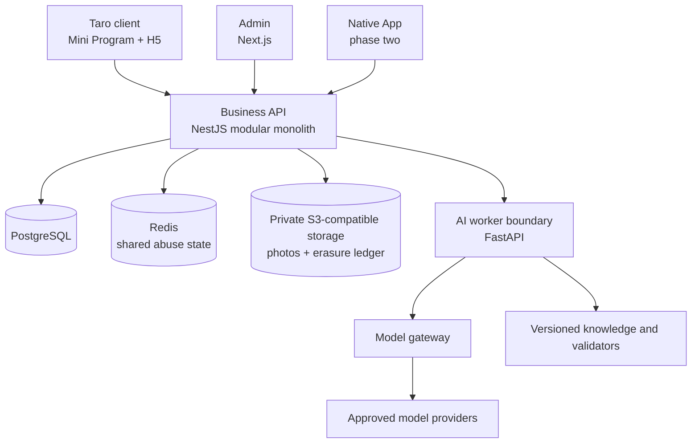

# 架构基线

状态：已实现至第 186 轮 Personal Model P2c 不可变证据投影首片；来源权威/撤回、回顾、API、派生与客户端闭环仍未实现；架构变更必须新增 ADR。

## 系统形态

```mermaid
flowchart TB
  C["Taro client<br/>Mini Program + H5"] --> G["Business API<br/>NestJS modular monolith"]
  A["Admin<br/>Next.js"] --> G
  M["Native App<br/>phase two"] --> G
  G --> P[("PostgreSQL")]
  G --> R[("Redis<br/>shared abuse state")]
  G --> O[("Private S3-compatible storage<br/>photos + erasure ledger")]
  G --> W["AI worker boundary<br/>FastAPI"]
  W --> V["Model gateway"]
  W --> K["Versioned knowledge and validators"]
  V --> E["Approved model providers"]
```

## 仓库边界

| 路径                     | 职责                                     | 不得负责                           |
| ------------------------ | ---------------------------------------- | ---------------------------------- |
| `apps/client`            | 最终用户小程序/H5 的渲染与交互           | 健康公式、模型提示词、服务端授权   |
| `apps/admin`             | 操作员登录、有界支持证据与审计读取       | 浏览用户内容或变更数据库           |
| `apps/api`               | 身份验证、授权、记录生命周期、计划与任务 | 在控制器中实现提供方特定的 AI 代码 |
| `apps/mobile`            | 原生 UI 与平台健康/设备适配器            | 独立的业务 Schema                  |
| `services/ai`            | 模型网关、图像流水线、提示词/评估版本    | 持久化用户已确认事实的最终权限     |
| `packages/contracts`     | API Schema、枚举与序列化                 | 数据库客户端或 UI 样式             |
| `packages/domain`        | 单位、指标、计划与确定性安全规则         | 网络或框架依赖                     |
| `packages/design-tokens` | 跨客户端视觉基础元素                     | 产品数据或业务逻辑                 |

## 交付架构

项目从 pnpm 单体仓库和模块化单体架构起步。单一 API 部署单元让事务、授权、迁移和本地开发保持清晰。AI 工作位于队列/工作进程边界之后，因为其运行时、延迟、成本、重试和可观测性需求不同。只有在发现经过测量的扩展压力或所有权约束后才拆分更多服务。

已实现基础：

- 中文项目记录由无第三方运行时依赖的 `myfitness-chinese-documentation/v2` 门禁约束。四份活跃权威文档都要求整体中文占比不低于 72%，且不得存在纯英文叙述行；第 090 轮起的迭代档案和 ADR-0085 起的决策记录必须使用中文标题、元数据与以中文为主的正文。仓库状态仍是唯一权威来源，Obsidian 只保存逐字节镜像，历史英文档案按受控批次迁移。
- 中文项目记录由无第三方运行时依赖的 `myfitness-chinese-documentation/v2` 门禁约束。七份活跃权威文档都要求整体中文占比不低于 72%，且不得存在纯英文叙述行；产品简报锁定 13 个导航标题，风险登记册锁定审阅元数据、控制职责和关闭条件，并拒绝英文风险等级。第 090 轮起的迭代档案和 ADR-0085 起的决策记录必须使用中文标题、元数据与以中文为主的正文。仓库状态仍是唯一权威来源，Obsidian 只保存逐字节镜像。
- 独立的 `myfitness-documentation-migration-index/v1` 递归扫描 `docs/` 下全部 Markdown，并把每份文件恰好归入活跃权威、治理、待迁移专题、待迁移历史或连续受保护编号序列。显式路径当前负责 17 份专题，六个闭区间负责迭代 000–089 与 ADR-0001–0084；第 090 轮及 ADR-0085 以后按连续编号自动受保护。检查器拒绝漏项、重复归类、登记缺失、编号缺口、陈旧活跃文档/待办总量、批次 ID 或专题链接，并在 CI 中紧随中文正文门禁执行；范围完整性不替代逐份语义、风险时效和技术字面量审阅。

- `apps/api` 是一个 NestJS 11 进程，提供就绪状态与健康记录路由。
- `packages/contracts` 负责 Zod 请求/响应 Schema，并生成 OpenAPI 3.0 JSON Schema。
- `packages/domain` 负责测量单位、规范转换、合理范围与整数评分规则。
- PostgreSQL 18.4 通过参数化 `pg` 存储测量值；有序 SQL 迁移在事务中执行，并记录 SHA-256 校验和以检测漂移。
- 受保护路由把与提供方绑定的不透明 Bearer 会话解析为服务端拥有的用户主体。持久化内容只有 SHA-256 令牌哈希。生产环境禁用的本地签发方与服务端验证的微信 `code2Session` 适配器共享同一所有权边界；永不存储微信 `session_key`。
- 训练、餐食和健康记录的新建/更正编辑器在平台应用存储上共享无依赖的 `myfitness-sensitive-draft/v1` 保管库。各编辑器的精确守卫允许不完整表单输入，但拒绝未知字段；信封按所有者限定，最大 96 KiB，24 小时后过期，并要求显式恢复或丢弃。更正载荷只携带聚合 ID 和基础修订；恢复时执行一次精确的、所有者可见的当前聚合读取，并且只在修订完全匹配时继续。目标缺失或过期时清理草稿且不提交；恢复后发生的修改仍以此前复核的预期修订发送到 API。保存、取消、登出和发起擦除会清理相关范围。照片、授权材料、擦除收据和 AI 候选表不属于草稿契约。
- 三个记录编辑器共享无依赖的本地发生时间解析器。日历分钟与显式 IANA 时区通过平台 `Intl` 数据往返解析；不存在的 DST 分钟会失败，重复分钟必须显式选择偏移量。客户端校验与共享写入契约拒绝未来时刻；未改动的更正保留精确原始时间戳，不会按编辑器的分钟精度截断秒数。
- 管理员路由采用独立的操作员/身份/角色/会话边界和 `adminBearer` OpenAPI 方案。API 针对远程 JWKS、签发方、受众、时效与 nonce 验证预配置 OIDC 主体，拒绝令牌重放，每次请求重新解析角色，并在生产环境禁用本地操作员签发方。
- 成人档案、训练目标、风险资格与不可变的用途/版本同意事件在事务中持久化。档案更新使用乐观修订检查。
- 档案/目标 PUT 响应丢失时，保存流程改为执行一次当前档案 GET。客户端只在页面内存保留精确提交的请求和可空基础修订，并锁定控件直至解析完成。只有响应中可见的档案、目标、有序约束、风险标志和必需同意版本全部匹配，才接受首个/更高修订；相同修订或已确认不存在的证据只恢复到稍后显式保存的边界。当前证据变化或缺失时，复用现有的“禁止静默变基”处理并保留本地输入。显式拒绝会终止尝试；对账绝不发送 PUT、轮询或持久化命令。
- 身体/恢复记录的新建、替换与软删除都在数据库事务中执行。每个接受状态复制到只追加修订表；写入使用预期修订，列表排除已删除记录，但所有者历史仍可访问。
- 当前健康/训练/餐食列表使用修订支撑的键集分页，按发生时间、聚合创建时间和 UUID 降序排列。版本化 base64url 游标只包含聚合 UUID/修订；API 从修订表恢复不可变的所有者排序边界，因此锚点更正或删除不会使续页失效。为兼容性保留无查询参数时的 100/50/50 上限，编辑器每次加载 20 条；精确当前资源读取支持页外更正恢复，且不会暴露已删除或外部所有者目标。
- 健康/训练/餐食聚合历史使用带同一最小游标信封的修订键集分页，默认 20 行，最大 50 行。API 在查询严格更旧的后缀前，要求路径 UUID、所有者和精确锚点修订一致；编辑器每次加载 10 条，新头部修订不扰动续页，软删除聚合仍保留所有者可见的审计历史。
- 三个客户端面板共享页面内存中的审计读取权限。请求的聚合上下文可以经受首个页面未知；成功空结果与未读取明确区分；续页失败时，在冻结游标收据下保留已接受的最新优先前缀。重试只重复失败的读取；关闭、父级刷新和卸载会使迟到响应失效。可选 H5 焦点边界只保存发起控件 ID，在受保护的键盘/指针打开后聚焦安全关闭动作，读取失败时允许焦点移到重试，并在 Escape、显式关闭或遮罩关闭后恢复精确触发器或稳定账本回退。父级程序化关闭绝不窃取焦点。面板不轮询、不持久化审计快照、不暴露原始传输文案，也不借用父账本的变更权限。
- 当前健康记录、训练和餐食的破坏性确认使用独立的页面内存焦点边界。受保护的行激活会先进入安全取消；Escape 和显式取消恢复精确触发器。提交后冻结关闭，直到带预期修订的 DELETE 完成。失败时重新聚焦取消；成功时在已删除行消失后聚焦稳定的账本刷新。焦点边界既不持久化状态，也不改变服务端软删除、修订或历史语义。
- 两种焦点边界都把焦点获取委托给同一个仅 H5 有限调度器。它按默认 80 ms 间隔最多尝试四次，接受显式取消/调用方权限，并在另一个交互控件持有焦点时停止。一次 `focus()` 成功后会再次验证稳定元素身份；如果 Taro 替换自定义元素且焦点落到页面主体，可在剩余预算内重新获取替代元素。对话框代次会取代进入/恢复/完成任务；历史焦点还要求当前读取令牌和已提交的非忙碌失败阶段。主目标优先于回退目标的选择保持精确；不引入全局事件监听器、持久化、无界轮询或 WeApp DOM 声明。
- 聚合删除响应丢失时，在已关闭模态框之外进入共享读取侧恢复收据。网络/可重试/未知结果只在页面内存保留目标聚合/修订并冻结全部删除触发器；显式 4xx 拒绝为终态。精确的所有者可见资源读取无需再次 DELETE 即可确认不存在；只有修订相同才允许稍后的用户确认尝试，修订变化时替换证据并使旧意图失效。对账读取失败会保留收据；完整账本刷新成功则作为等价当前证据清除它。不存在自动重放或持久删除队列。
- 聚合更正响应丢失时，健康/训练/餐食主保存流程改用精确资源对账，而不重放 PUT。客户端只在页面内存保留目标 ID、基础修订、精确提交载荷和草稿签名。只有无依赖投影比较每个提交字段都相等时，才接受更高修订；相同修订恢复到稍后显式保存的边界；内容/修订变化则更新比较基础而不覆盖草稿。当前证据缺失时移除过期账本行，并冻结更正直到取消，防止意外变为新建。任何输入变化都会在其他回调使用旧恢复动作前使其失效。不承诺更正幂等性，也不持久化请求或后台重放。
- 餐食收藏 PUT/DELETE 响应丢失时，所有收藏切换都改用当前收藏列表对账。客户端只在页面内存保留操作、食物键和精确提交的保存快照。保存证据要求键以及完整食物/默认份量投影匹配；删除证据要求键不存在；变化的快照属于分歧，未变化列表只允许稍后显式切换。已接受列表可以独立刷新，不改变当前餐食快照或所选来源标签。显式拒绝终止尝试；对账绝不发送另一项变更、轮询、持久化请求或创建后台队列。
- 可选同意撤销响应丢失时，每项数据保管操作都改用当前概览对账。客户端只在页面内存保留目标用途，并在显式收据下保持已接受清单可见。一次 GET 只有看到明确 `revoked` 状态才认定已应用；`active` 允许稍后重新确认，缺失/从未授予的证据属于分歧。对账完成绝不声称移除了多少分析或照片，因为概览无法重建丢失的 POST 结果。显式拒绝为终态；对账绝不再次 POST、轮询、持久化用途/请求或创建队列。
- 训练课次、有序动作与有序组行组成一个有界关系聚合。服务端领域规则规范化负荷，计算仅已完成摘要，并且只有每个持久化组都完成时才派生 `completed`；已弃用的客户端状态提示会被忽略。每个接受的聚合状态还会保存为不可变 JSON 快照。
- 无依赖的版本化起始目录和按所有者限定的自定义动作目录提供别名、显式跟踪模式与器械。目录的新建/更正/归档具有不可变修订；训练会快照所选定义字段，而不是实时关联可变目录内容。
- 动作/食物定义历史使用默认 20 行、最大 50 行和同一最小 UUID/修订游标信封。修订键集续页前先执行精确路由/所有者/锚点检查；已归档定义仍保留所有者审计访问，两个客户端都渲染共享的 10 行渐进定义账本。账本复用页面内存审计读取器：未读与已接受空结果不同，后缀失败时在冻结游标下保留精确不可变前缀，关闭/卸载会使迟到结果失效。定义更正/归档仍受独立接受的所有者登记册控制，不会因仅审计中断而冻结。
- 版本化起始食物目录与按所有者限定的自定义定义提供可搜索别名、必需的用户确认营养来源凭据、幂等新建、乐观更正/归档和不可变定义修订。饮食餐食/条目行快照所选组成及展示/规范份量；服务端规则计算总计，所有者收藏仍是独立快照，定义编辑不能重写任一事实边界。
- 只读洞察投影查询已确认/当前来源行，不持久化重复状态。仪表板生成“今日”证据、`subjective-recovery-state-v1` 主观恢复估计和跨领域总计。恢复估计按本地日期和指标去重，用 7 天近期窗口对比此前 28 天个人基线，并公开记录 UUID、修订、发生时间、来源、覆盖、方向一致性、置信度与限制；覆盖不足保持 Unknown，缺少基线或方向冲突保持低置信，只有中等置信且方向一致的估计可进入确定性计划证据。Dashboard 趋势、动作洞察与健康洞察的三个窗口共享精确 `[7, 30, 90]` 身份顺序，重复、缺失替代或错序会在对应 `days` 路径失败。动作按一个稳定键/已完成组进行分组；饮食只接受截至参考时刻本地日的连续 90 日，以空值表示缺失证据，并把固定顺序的 7/30/90 日计数、覆盖和营养总计逐字段绑定到该序列；错序、重复、未来、缺日或偏移失败关闭，不自动补零。健康在规范单位中按一个精确已确认指标分组，同时保留展示/来源/时区/修订凭据。健康/动作查询已由 SQL 使用 `<= at`、按发生时刻/创建时刻/UUID 降序并精确限制 181 行；公开纯构造器先要求参考 `Date` 与全部原始 `occurred_at` 有限，再执行响应时区、本地日、非递增顺序、聚合 UUID、未来过滤、181 行合格上界、180 点截断、首点身份/单位和 `hasMore` 推导。无效时刻因此不能用 `NaN` 绕过排序或静默变成缺失证据。健康构造器只对未来过滤后的全部合格点验证同一规范单位，因此未发生点不影响当前摘要，隐藏第 181 点仍受保护。共享 Schema 独立拒绝无效响应时区、逐点日期错位、公开序列升序断点、重复 `workoutId`/`recordId`、`occurredAt > generatedAt`、顶层动作身份/健康单位与首点错位、健康点单位漂移，以及没有满 180 点公开前缀却声明 `hasMore: true`；空序列的顶层摘要必须为 `null`。动作与健康的精确 90 日计数收据进一步关闭 `hasMore: false + 180 点` 的歧义。相同发生时刻允许，因为公开响应不含 `createdAt`，健康记录自身的 `recordTimezone` 也不替代响应时区。重复身份失败关闭而不静默去重。窗口聚合没有逐点时间，仍由数据库查询资格保证，不从有限点序列反推。来源更正/删除后，每个投影都会重新计算。
- 动作与健康纯构造器在点序列校验前检查全部来源窗口行：只接受唯一的 7、30、90 日身份。来源数组可稀疏且可乱序，缺失身份继续生成明确的空窗口，未知或重复身份则失败关闭；公开窗口仍由固定身份序列生成，不从来源数组顺序推断语义。参考时刻和响应时区保持更高的错误优先级。
- 动作与健康构造器在任何 `Number(...)` 转换前扫描全部来源窗口与点数值。计数只接受 PostgreSQL 十进制文本表示的安全非负整数，点总组数与原生修订必须为正安全整数；训练负荷、秒数和距离只接受有限非负十进制文本。健康统计与规范/展示值只要求有限十进制，允许负值且可空统计保持 `null`，避免把数据表示门禁扩展为医疗范围判断。检查覆盖隐藏第 181 点；公开 Schema 继续独立验证转换后的数字。
- 健康 90 日窗口和点查询共享所有者、精确指标、confirmed/current、参考时刻与 90 日资格边界。纯构造器在未来过滤与 181 行上界后绑定窗口 `recordCount`：不超过 180 时来源行数必须相等，超过 180 时必须收到恰好 181 行。公开 Schema 独立要求 `series.length = min(recordCount,180)` 且 `hasMore = (recordCount > 180)`；缺失 90 日来源行只在没有合格点时继续生成空窗口。该收据不从 181 行前缀臆测更多记录。
- 当健康 90 日记录数不超过 180 时，来源点已被证明完整，窗口 minimum、maximum 与 average 必须由全部规范值点集合支持。来源十进制转成 `Number` 后只容纳按幅度、绝对值和与点数计算的 IEEE 表示/求和误差；公开 Schema 对四位小数窗口统计容纳半个末位单位再叠加同形式浮点误差。超过 180 条时两层都跳过完整统计收据，不从 180 点前缀推断窗口，也不加入范围、趋势或医疗解释。
- 同一完整性前提下，健康 90 日 `recordedDays` 必须精确等于全部点按响应 IANA 时区投影后的去重本地日数量。来源复用一个日期格式器对 `occurred_at` 去重；公开 Schema 在逐点日期收据之后对 `localDate` 去重。夏令时重复或跳过的本地小时不改变自然日身份；超过 180 条时不从有限前缀复算记录日。健康公开点生成也按请求复用格式器，避免点数路径线性重复初始化 `Intl`。
- 当健康 90 日点集完整时，7/30 日窗口必须按 `occurredAt >= generatedAt - days×24h` 的闭区间从该集合重建，并分别核对记录数、响应时区记录日和三项规范值统计。来源十进制与响应四位统计继续使用既有有界误差；计数和记录日精确比较。恰好边界点被包含、边界前 1 ms 被排除，空子集保持零计数/空统计；90 日截断时全部短窗口收据跳过。
- 动作 90 日窗口和点查询共享所有者、精确动作键、未删除训练、至少一组已完成、参考时刻与 90 日资格边界；窗口按训练 ID 去重计数，点查询按训练 ID 生成一行。纯构造器在未来过滤与 181 行上界后绑定窗口 `sessionCount`：不超过 180 时来源行数必须相等，超过 180 时必须收到恰好 181 行。公开 Schema 独立要求 `series.length = min(sessionCount,180)` 且 `hasMore = (sessionCount > 180)`；缺失 90 日来源行只在没有合格点时继续生成空窗口。该收据不把完成组数当课次数，也不从有限前缀重算窗口聚合。
- 当动作 90 日课次数不超过 180 时，来源点已被证明完整，窗口完成组与次数分别通过 `BigInt` 精确等于逐点总和；负荷、活动秒数和距离的来源十进制求和只允许由 `Number` 表示与非负加法产生的有界 IEEE 误差。公开 Schema 对整数继续精确比较，对已逐点舍入的负荷、活动分钟和距离使用 `(点数+1)×半个显示单位` 加浮点误差的上界。超过 180 个课次时两层都跳过完整聚合收据，不从 180 点前缀推断窗口。
- 当动作 90 日点集完整时，7/30 日窗口必须按 `startedAt >= generatedAt - days×24h` 的闭区间从该集合重建，并核对课次、完成组、次数、负荷、活动时间和距离。来源整数精确、十进制测量只容纳有界 IEEE 误差；公开响应的测量误差上界按各短窗口子集点数和显示精度独立计算。恰好边界训练被包含、边界前 1 ms 被排除；空短窗口和有完成组但零测量的训练保持合法，90 日截断时全部短窗口收据跳过。
- 动作与健康洞察的数据库资格明确采用绝对小时窗口：三窗口下界为 `reference timestamptz - windows.days * INTERVAL '24 hours'`，90 日点下界为 `reference timestamptz - INTERVAL '2160 hours'`。不使用会随 PostgreSQL 会话时区在 DST 两侧保持本地墙钟时间的日历日间隔；因此 7/30/90 日 SQL 与 TypeScript `days×86_400_000` 收据在 UTC 和非 UTC 会话中同义。下界继续包含，上界继续为 `<= reference`，请求的响应时区只参与本地日期投影。
- 健康三窗口在来源稀疏回退为空后仍必须保持嵌套集合单调性：7→30→90 日的记录数与记录日非递减；较短窗口非空时，较长窗口 minimum 不得升高、maximum 不得降低。公开 Schema 对固定三窗口独立检查并定位较长窗口字段。average 可以随新增样本任意变化，明确不受单调约束；该门禁只证明集合边界，不解释数值改善、异常或医疗意义。
- 动作三窗口在来源稀疏回退为全零后同样保持嵌套集合单调性：7→30→90 日的课次、完成组、次数、负荷、活动时间和距离都必须非递减。六个字段来自同一非负已完成组资格，来源构造器与公开 Schema 分别比较相邻窗口并定位较长窗口字段。该门禁不从有限点前缀重算聚合、不补造活动，也不解释训练效果或动作质量。
- 单字段数值通过后，来源关系门禁验证 SQL 聚合本应保证的同一行关系：动作窗口 `session_count <= completed_set_count`，零课次不得携带完成组，零完成组时次数、负荷、活动时间和距离必须全零；有完成组时这些测量仍可合法为零。动作点满足 `0 < completed_set_count <= total_set_count`；健康窗口把记录数、记录日、统计存在性绑定，并要求 `minimum <= average <= maximum`。共享动作窗口/点和健康窗口 Schema 对转换后的响应重复验证相同关系；错误不被修复、排序或解释为趋势，健康负值仍合法。
- 动作与健康点的来源聚合 ID 在顺序和唯一性检查前必须匹配标准 UUID 版本/变体格式；检查覆盖全部输入而非公开前缀，因此隐藏第 181 点不能携带无效身份。格式错误和重复错误保持可区分，公开 Schema 的 `uuid()` 继续独立保护传输表示。
- 动作点的来源身份快照在未来过滤、顺序、截断与映射前通过共享 `exerciseInsightIdentitySchema` 全量验证。名称、类别、可空追踪模式、器械和可空备注沿用公开边界；重复器械与 `other` 缺备注同时由共享 Schema 拒绝。构造器只判定快照表示是否有效，不修整文本、不查询当前目录，也不把历史身份替换成最新定义；隐藏第 181 点同样受检。
- 健康点来源先以原始 `source_kind + source_metadata` 通过共享 confirmed 来源 Schema，防止非对象容器在公开映射中被折叠为空；记录时区和单位分别复用公开点所组合的精确子 Schema。该边界验证单位枚举、严格有界元数据、有效 IANA 记录时区，并拒绝 `ai_estimate` 进入 confirmed-only 洞察，无需为每点重复运行 UUID、日期和数值格式化。全部原始点在顺序、未来过滤与截断前受检；公开完整点仍组合相同 Schema。记录时区不替代响应时区，负值不据此解释为医疗异常。
- 九个健康指标的规范单位与允许展示单位由无依赖 `metricUnitDefinitions` 统一定义；九个单位到规范单位的换算因子、四位持久化小数精度和一致性判断同样是 contracts/domain 共用纯规则。领域 `metricDefinitions` 在其上增加范围与整数规则，并复用换算函数保持既有四位规范值写入。健康点 SQL 同时选择行自身的 `metric`；来源构造器先要求全部原始行等于请求指标，再拒绝不属于该指标的单位，并按 `NUMERIC(14,4)` 的规范值半量化误差加换算后展示值半量化误差判断两个值是否代表同一测量。公开点重复同一非敏感指标枚举，响应 Schema 逐点核对顶层指标后独立执行单位和换算检查。身份与换算检查覆盖未来点和隐藏第 181 点，错误证据失败关闭而不从单位/数值反推指标、不自动修复历史输入或执行健康范围判断。
- 同一仪表板原子响应附带非持久化 `personal-state-ledger-v1`。账本只投影四个既有权威：同所有者且精确 `accepted` 修订的最新计划体验、恢复估计实际引用的已确认记录、七天趋势窗口和确定性恢复估计。Dashboard 的健康/餐食 `occurred_at`、训练 `started_at` 与计划体验 `updated_at` 共用不晚于参考时刻的资格边界；参数化 SQL、纯投影和共享 Schema 分别阻断未来事实。共享 Schema 还独立解析响应 `timezone`，要求 `today.date` 等于 `generatedAt` 的参考本地日，并要求三个趋势窗口精确为 `[7, 30, 90]`，避免错误日期或时域身份驱动首页标签、七天账本和当前周计划选择。该 `at` 只表示发生时间截止，不按 `created_at` 或修订 `changed_at` 重建事务时间历史。严格契约把 `user_confirmed`、`confirmed`、`observed`、`estimated`/`unknown` 分开，并逐字段核对计数、最近证据、来源类型、状态、置信度和快照时间；每项 `validUntil` 固定为空，记录/时间/反思变化被声明为失效原因。仪表板返回 `private, no-store`，来源更正或删除后重新计算，不保存派生账本，也不产生 AI、因果、医疗或计划适应结论。
- 计划中的长期 Personal Model 不替代上述账本。账本继续回答“当前快照读到什么”；Personal Model 以独立聚合回答“某项认识何时形成、哪些精确证据支持或反对、用户如何校准、为何被修订或失效”。它严格区分 Goal、Constraint、Preference、Baseline、Behavior、State、Pattern 与 Hypothesis，使用结构化 claim、不可变修订和可复算置信收据；原始记录、资料、计划和反思仍是权威来源。第 182–183 轮建立 P1 契约，第 184–185 轮建立 item/revision/feedback 持久链。第 186 轮新增 `personal_model_evidence_refs`：create、普通 append 与 feedback revised 在同一事务按顺序投影完整引用 JSON；复合 owner/revision 外键和双侧延迟门禁核对数组、资格计数与不可变快照，晚加、漏加或改写均失败。该表目前只证明模型修订内部的证据投影保真，不证明 `onboarding_goal_revision` 或 `workout_revision` 来源仍存在、仍为当前或已经撤回；回顾、公开 API 和客户端能力也仍不存在。
- 首页教练工作台是“今日”路由内的只读标签，复用同一次原子接受的仪表板和计划列表，不发起第二套读取。首段把本人确认、已确认恢复记录、七天系统观察和恢复估计/Unknown 并列，并公开快照无保证有效期；四张卡通过统一激活契约成为可聚焦来源入口：本人反思进入精确计划结果页或计划列表，确认记录/估计进入记录账本，七天观察进入历史日历。URL 不携带健康内容，目标页独立取得权限；返回首页由 `useDidShow` 刷新，旧快照在成功替换前保持刷新/过期标签。当前计划仍只选择包含本地日期的周范围，只统计与精确计划修订和课次日期同时匹配的显式训练关联。确认无计划、未读取和保留旧快照是不同状态；AI 档案入口在计划存在后才出现，且仍受计划页的同意、新鲜度和确定性安全校验约束。
- 首页“我的”工作台是同一路由内的静态所有权目录，不读取或复制资料/目标登记册和隐私保管清单。目录只使用受测试的固定配置，把资料、目标、单位/时区与风险边界交给建档页面，把授权历史、导出和销户交给隐私页面；它不声明任一状态已完成、为空、已授权或可执行。敏感页面继续独立取得当前读取权限，目录不持久化个人数据，也不提供破坏性快捷入口。来源无关的返回文案使这些页面可以从多个已知入口进入，而不误报导航目标。
- 跨领域历史日历是独立有界读取模型：PostgreSQL 在请求的 IANA 时区中精确生成 28 个本地日期，并左关联不晚于参考时刻且所有者可见的当前健康、训练和餐食发生事实。纯构造器先以 `at + timezone` 生成参考本地日及此前 27 个自然日，输入长度或任一日期不精确匹配就失败关闭；共享 Schema 独立重建同一序列，定位首个错位点，并要求范围标签等于预期两端。它不排序、去重或补行，返回计数与 `hasRecords`，从不声称零行为或依从性，也不持久化重复日历状态。客户端原子接受完整范围/时区/序列：未读总计保持未知；刷新失败时保留一个带标签的页面内存快照，并冻结日期选择与全部回填导航。一次显式前台重试可恢复权限，无需轮询或持久投影缓存。回填意图只携带已验证的本地日期（最多 90 天前）和时区；在用户提供真实分钟且现有发生时间解析器把它映射为时刻前，编辑器都保持该日期未完成。
- 确定性周计划聚合会快照引导修订与证据；新计划还保存实际参与安排的完整主观恢复状态及记录引用。当前 JSONB 计划与每次决定形成不可变修订，并在接受/修改转换前重新检查资格。其历史在既有所有者/计划/修订索引上使用通用的默认 20/最大 50 UUID/修订游标边界；“周折叠”在显式请求更旧页面前渲染最新优先的 10 项决策。续页失败时，在冻结游标收据下保留已接受前缀，只重试后缀。当前计划与 AI 解释证据保持独立；已接受空解释历史明确可见，任何历史重试都不能触发生成或模型写入。
- 当前采用计划和精确历史采用修订具有非持久化 `plan-outcome-review-v1`：从目标采用修订时刻开始观察七天，比较最近生成快照与采用快照的稳定选择，只连接同修订、采用后且仍活动的显式训练关联，以及采用后当前已确认的非 AI 恢复记录。精确路由按认证所有者、计划 UUID 与正整数 `accepted` 修订读取，统一隐藏外部/非采用目标并返回 `private, no-store`；周计划列表不再计算或携带完整结果投影。解除关联、训练删除或恢复删除从证据中移除并以撤销计数说明；Unknown 与 Observed 仍只描述当前合格证据是否存在，不计算依从性、效果、因果或下一计划调整。周计划同步页只保留精确修订导航，独立结果页拥有单次加载/失败/聚焦重试权限和页面内存代次，不把初始失败发布为空结果，也不接受无效参数或卸载后的迟到响应；查询参数只携带计划标识，不携带健康内容。
- `plan_experience_reflections` 为所有者、计划与精确 `accepted` 修订保存至多一条当前用户确认体验，只允许“比预期轻松、安排合适、不适合我、还不能判断”及固定 `user_confirmed` 来源，不接收自由文本。独立 GET 对象信封把成功不存在与传输失败分开；PUT 以预期修订、事务和行锁完成首次写入或覆盖式纠正，DELETE 以精确修订硬删除内容。反思与系统结果在客户端使用独立读取权限，反思失败不能显示成未填写；当前值进入隐私清单/便携导出，账号擦除依所有者级联。它不改变 Unknown/Observed、不触发 AI 或计划适应，也不构成效果、因果或依从性结论。
- FastAPI 工作进程提供经过身份验证且与提供方无关的解释端点。本地固定测试实现与 OpenAI Responses 适配器共享严格 Schema；业务 API 负责同意、授权、幂等、校验、回退与持久化。
- AI 解释运行经过最小化和指纹化，并绑定到精确计划修订及提示词/模型/校验器/同意来源凭据。不持久化原始提示词和输入载荷。
- 计划解释与食物照片展示文案共享版本化确定性安全策略。校验器 v2 执行 Unicode NFKC 规范化，移除格式控制字符，压缩分隔符用于策略匹配，并规范数字证据而不重写持久文案；已存储的 v1 来源凭据仍可读取。
- 食物照片预留把原始上传保留在内存中，净化为私有且会过期的 JPEG，使用校验和有条件写入 S3 兼容存储；只向工作进程发送该 JPEG 和目录允许列表，确定性校验候选，并在确认/失败/拒绝/删除/过期时将媒体删除入队。
- 食物照片提示词 v2 把所有图像文字视为不可信数据：提供方不得遵循、复述或泄露图像中的指令、提示词或秘密；以指令为主的图像会被拒绝，而不会变成营养候选。
- 进度照片预留把原始上传保留在内存中，净化到独立私有 `progress` 对象范围，并且只执行确定性的方向/分辨率/亮度/对比度检查。仅分析媒体在 24 小时后过期；长期比较要求独立保留同意，使用用户声明的视角，且不计算身体或体态分数。
- 客户端把食物照片与进度照片注册为两个独立 Taro 延迟页面，避免任一用途的实现静态进入另一用途的页面块。H5 只把至少被两个异步页面共同使用的运行时、共享组件和工具抽入 `client-async-shared`，再把 Taro 组件运行时抽成优先级更高的 `taro-components` 缓存块；发生时间字段保留最高优先级专用块，应用入口只加载轻量时区探测器。该拆包不合并照片同意、保留、API 或读取权限。WeApp 仍由页面边界独立产出，只通过 Taro 内建 XML 空白折叠减少模板格式字节，不降低递归层级或删除无障碍、安全与隐私语义。
- 十一种客户端读取表面把相同的离线/拒绝/服务/未知判定收敛到无框架依赖的 `read-authority`；其中九种标准快照读取还复用同一个初始加载、就绪、刷新、初始错误和保留旧数据纯函数。各页面保留原导出名、类型名、文案和失败关闭权限，聚合续页与同意历史的不同阶段仍独立。生产实测后，H5 最大异步 JavaScript 与 WeApp 总量预算分别收紧到 152,000 与 1,107,000 字节。
- PostgreSQL 数据操作任务随生命周期变更在事务中入队，并使用 `FOR UPDATE SKIP LOCKED`、租约、有界指数重试、尝试证据和死信状态进行原子领取。成功任务会清除载荷和敏感去重材料。
- 经身份验证的隐私边界盘点所有者数据，创建禁止存储的可重复读便携 JSON 导出，记录续期同意周期，撤销可选处理，并在异步媒体/主存储擦除前关闭账号访问。
- 可选同意响应丢失恢复把当前数据保管权限绑定到精确目标用途。在一次概览读取解析该用途前，导出、全部撤销和擦除准备都会冻结；当前 `revoked` 证据只证明授权已停用，不证明变更的清理数量。
- 便携导出的 API 与客户端共享 50 MiB（52,428,800 字节）边界。API 在 repeatable-read 事务取得所有者数据和两类照片元数据后，先把每个 `media` 设为 `null`，用最终 v4 结构、同一生成时刻、缩进和末尾换行计算精确 UTF-8 下界；下界超限时在任何私有对象读取、base64 或附件 `Buffer` 前返回固定 413 `portable_export_too_large`。下界通过后，以真实 Buffer 长度的 `4 * ceil(n / 3)` base64 字符数和同层级规范 JSON 包装增量维护单调字节下界；当前对象使结果超限时在 base64 前停止，后续对象不读取，整个过程每媒体 O(1) 且不重复序列化完整载荷。实际 `ENOENT` 使用不可用标记增量，没有存储键保持零增量；数据库 `byte_size` 不作为拒绝权威。控制器仍检查最终字符串并在成功时发送相同字节数的 `Content-Length`。隐私专用客户端适配器继续独立验证媒体类型、精确 v4 信封/集合拓扑、标识符、时间和同一边界，只有通过后 H5 才创建下载、WeApp 才持久保存，页面状态只接收版本、生成时间和字节长度。非成功响应只以 HTTP 413 状态进入固定的产品自有 50 MiB 说明，不读取、展示或保存响应正文；该路径释放 H5 临时 Blob，不触发下载、WeApp 保存、自动重试或删除前导出选择推进。
- 本地规模测量通过 `pnpm ops:measure-portable-export` 复用正式迁移、Nest 隐私服务和最终序列化，只允许回环 PostgreSQL，并在随机合成账号下构造有界的无媒体已确认健康记录。`myfitness-portable-export-measurement/v1` strict 收据不包含账号标识或健康正文，只记录规模、接受字节数或固定拒绝、耗时、同进程内存快照、运行时与不可外推限制；`finally` 删除合成账号及级联数据。65,000 条本地记录产生 49,168,658 字节附件并伴随约 349.16 MiB RSS 快照增长，70,000 条被固定 413 拒绝；这些是 R-013 的本地风险证据，不是生产容量或异步归档实现。
- 异步归档使用共享最小收据、六状态单调转换、迁移 0029–0036、只读 `REPEATABLE READ` 流事务、递归增量 JSON、AES-256-GCM 信封与有界 multipart writer。描述驱动协调器只校验一次 active owner，并按 v4 顺序交付前三个简单 keyset 源、两个条目/history 分层目录、完整七层 workouts、完整 nutritionMeals 和当前 nutritionFavorites。workout 与餐食会话通过内部现有 `PoolClient` 适配器复用协调事务并跳过重复 owner 校验；收藏则直接按既有 `(user_id,food_key)` 复合主键 keyset。全部来源保持同步字段键序、64 KiB 单元素门禁与同一失败权威；普通数组提前结束也必须抛出已登记根错误。根物理 EOF 才提交。weeklyPlans、AI/照片集合、媒体、KMS lease、执行器、下载授权和 UI 仍未实现。
- 训练导出不是简单集合迁移。内部 `createWorkoutRevisionSnapshotLayerSnapshot()` 保留关系图优先的数据库消费语义；新增 `createWorkoutRevisionSnapshotJsonLayerSnapshot()` 在同一共享状态机中采用 PostgreSQL JSONB 的真实 `history→exercises` workout 键序。JSON 模式的 workout 和当前 exercise 分别由数据库交付 `history: []`/`exercises: []` 与 `sets: []` 骨架，revision 继续交付 `snapshot: null`；`createPortableExportWorkoutJsonSource()` 只原位替换现有属性为递归懒数组。history 中每个 snapshot 仍按 JSON ordinality 交付动作和组，随后当前关系图才开始。所有层保持父级 UUID 唯一、64 KiB 单元素门禁、一次性消费、显式完成与最深层取消。真实 PostgreSQL 已证明完整 `workouts` 数组与同步 v4 逐字节相同；该来源已复用六字段协调事务，但仍未接入公开 v4。
- JSON 来源类型以递归条件映射保留 `PrivacyExport` 根结构，并只接受私有 Symbol 标记的懒数组。八字段适配器递归包装两个目录 history、workout history/snapshot/current 关系与餐食 `items/history/snapshot.items`，并把 nutritionFavorites 作为普通私有懒数组挂在同一协调数据库根生命周期。`createPortableExportConsentHealthCatalogWorkoutNutritionFavoriteJsonSource()` 复用既有嵌套适配器，不预取子流，也不创建第二完成权威；完整 EOF 完成协调根，任意嵌套或普通字段早停取消同一根。真实数据库以 43 字节块证明完整八字段懒正文与同步 v4 逐字节相同，活动收藏早停在迭代器、JSON 与数据库收据间保持同一错误。
- weeklyPlans 的同步顶层顺序由 owner 唯一 `week_start` 固定，history 与体验反思分别由唯一 revision/plan_revision 固定；workout links 原先只按 `linked_at`，现在补 UUID 尾序并由迁移 0036 的 `(user_id,plan_id,linked_at,id)` 非部分索引服务全历史扫描。`inspectWeeklyPlanShape()` 只输出计数、UTF-8 字节、时间碰撞数和结构布尔。真实数据库以共享 Schema 合法夹具证明当前 payload 与单 revision 自身即可超过 64 KiB，history 与 closed links 总量也无界；因此本轮不创建第九字段，下一步必须递归拆分当前/修订计划内容并为 history、links、reflections 建立独立生命周期。
- 周计划保存的 `subjective-recovery-state-v1` 仍是确定性证据快照，不是用户事实或医疗判断。共享契约对 factor label、state label、note 和单条 limitation 分别固定 60、80、320、240 字符上限；不截断，不提升策略版本。最大 148 条引用和全部多字节中文上界组成的合法计划证据低于 64 KiB，异常超长持久值失败关闭，OpenAPI 与运行时使用同一上限。
- 同意收据历史与当前授权保持分离。严格按所有者限定的端点依数据库原生 `(accepted_at, id)` 顺序分页只追加的接受区间，不暴露当前状态/用户/提供方/健康字段，并只保留一个仅 UUID 的不透明游标；客户端把接受/撤销历史标为只读证据，且只存于页面内存。
- `durable-erasure-v2` 收据要求独立状态令牌，并暴露相互独立的主存储/媒体/提供方/备份处置。恢复后的数据库对外服务前会重放外部 HMAC 擦除账本，防止已知删除账号被较旧备份复活。
- 外层请求中间件校验 UUIDv4 关联，并从稳定路由模板记录最终状态/持续时间。Redis 支撑的 IP 守卫在身份验证前运行；第二个参与者/路由限制器在身份验证后运行。HMAC 参与者键原子过期；缺少 Redis 时业务流量失败关闭；存活状态与 PostgreSQL+Redis+对象存储的就绪状态保持分离。
- 精确管理员支持查询要求账号 UUID、有界工单和枚举原因，然后只返回生命周期/聚合证据。每项接受/未找到查询与授权决策都关联到只追加审计表；目标标识符使用 HMAC 引用，其更新/删除触发器失败关闭。
- `apps/admin` 是 Next.js 16 App Router BFF/UI。Authorization Code + PKCE/state/nonce 保持在服务端，管理员 API 令牌保存在默认安全的 HttpOnly Cookie 中，证据栏只渲染有界支持/审计契约。
- API、管理员与 AI 运行时边界具有固定基础清单、健康检查和源码/修订标签的非 root OCI 镜像。API 生产输出是裁剪后的 pnpm 部署目录；管理员输出是 Next.js standalone；Python 运行时依赖全部固定版本。
- 一次性 API 镜像迁移任务为容器流量设置门禁。可丢弃部署拓扑证明容器网络、迁移、PostgreSQL/Redis/对象就绪状态、AI 健康和管理员安全响应头，同时明确保持非生产性质。
- API 在非生产环境默认绑定回环地址，在生产环境绑定全部接口，并提供显式仅 IP 覆盖。GitHub Actions 定义源码门禁、镜像冒烟、多架构 GHCR 发布和来源证明；托管基础设施保持供应商中立。
- 每项外部 GitHub Action 都由严格锁中的已审阅完整提交选定，而不是分支或标签。离线工作流发现会拒绝漂移，精确 SemVer 注释保留审阅意图，每周 Dependabot 提案暴露更新；基线进入 `main` 后，仓库策略要求固定 SHA。
- 候选发布从无依赖的托管资格校验开始：远程轻量/附注标签必须解析到工作流提交，该提交必须仍位于当前 `main`，且精确 SHA 必须具有一次已完成且成功的 `.github/workflows/ci.yml` `main` push 运行。严格资格记录在组装清单前再次检查，并随不可变 Release 一起保留。
- 本地 OIDC 浏览器套件另有 `myfitness-oidc-e2e-artifact/v1` 测试收据：构建包装器先清除旧收据，成功后对 `dist-h5` 中按相对路径排序的全部普通文件生成 SHA-256，并在外部 `.taro` 目录记录固定 `oidc` 模式和测试 API 基址。Playwright 全局预检重新计算摘要、检查静态回调桥并要求 API 基址完全一致。收据不进入客户端树、质量预算或候选 TAR，也不包含发布来源/版本/交付级别，因此不能扩大为发布或真实身份声明。
- 父级限定的 pnpm 覆盖只在受影响依赖边上设置已审计最低版本或移除未使用的可选解析器：客户端 Vite 6.4.3、webpack 5.104.1、Swiper 12.1.2、lodash-es 4.18.1 和 nanoid 3.3.17；未使用的 Less `image-size` 可选依赖被移除。根 Vite 8.1.5 继续与 Vitest 隔离；冻结安装、对等依赖检查、双端构建、E2E 和 critical/high 零值审计门禁控制每次依赖图变更。

## 数据规则

所有健康领域事件都存储：

- 稳定的用户与记录标识符。
- 数值以及规范/展示单位。
- 来源：手工、设备、导入或 AI 估计。
- 估计的置信度与候选替代项。
- 发生时间、时区、创建时间、更新时间与修订参与者。
- 来源需要敏感数据权限时使用的同意/用途引用。

AI 输出属于提议。只有显式用户操作，或具有已记录契约的确定性系统流程，才能创建已确认记录。

已实现的测量子集与字段级不变量记录在 [HEALTH_RECORD_MODEL.md](HEALTH_RECORD_MODEL.md)。ADR-0002 说明契约校验、确定性规范化与数据库检查为何有意重叠。

已实现的身份、档案、目标、风险与同意不变量记录在 [IDENTITY_PROFILE_MODEL.md](IDENTITY_PROFILE_MODEL.md)。ADR-0003 记录可替换提供方身份与不透明会话决策；ADR-0076 要求在模糊响应后再次发送任何档案/目标 PUT 前，必须先取得精确当前证据。

ADR-0004 记录健康记录替换、只追加快照、软删除与乐观并发决策。

精确指标且仅含已确认值的健康观察记录在 [HEALTH_RECORD_MODEL.md](HEALTH_RECORD_MODEL.md)。ADR-0039 将规范统计与已记录展示来源凭据分开，并禁止跨指标或候选聚合。

可恢复本地编辑器状态记录在 ADR-0040。它是短期客户端恢复副本，而不是第四个持久化权威来源：保存后仍以 PostgreSQL 为准；用于擦除恢复的收据存储保持独立。

冲突安全的更正恢复记录在 ADR-0042。本地更正草稿只是针对一个基础修订的编辑意图；它不授权写入、不绕过所有权，也不替代服务端当前聚合。

显式发生时间编辑记录在 ADR-0041。本地民用时间绝不会作为假定时刻持久化：客户端使用具名时区与 DST 选择进行解析，API 只接受无歧义且不在未来的带偏移时间戳。

训练聚合、派生值规则、动作目录边界、动作观察与安全重复语义记录在 [WORKOUT_MODEL.md](WORKOUT_MODEL.md)。ADR-0005 记录规范化当前关系图与不可变快照决策；ADR-0030 将组证据定为训练完成状态的权威来源；ADR-0035 使可变动作定义与训练事实快照分离；ADR-0036 定义稳定键且仅含已完成值的洞察投影。

餐食快照、规范克数、所有者目录/收藏、每日观察与照片候选边界记录在 [NUTRITION_MODEL.md](NUTRITION_MODEL.md)。ADR-0006 说明可变目录为何不能作为历史事实；ADR-0037 将该规则应用于所有者创建的食物定义及其隐私生命周期；ADR-0038 定义时区安全的饮食观察与显式缺失证据；ADR-0075 使收藏变更不确定性与餐食事实分离，并要求再次切换前取得当前列表证据。

确定性周计划规则、证据来源凭据、有界修订生命周期与限制记录在 [PLAN_MODEL.md](PLAN_MODEL.md)。ADR-0008 说明结构化规则路径为何先于模型编排；ADR-0047 将历史续页绑定到精确的所有者计划修订；ADR-0097 要求主观恢复估计先通过个人基线、覆盖、方向一致性和置信度门槛，才可改变计划边界；ADR-0098 把状态证据、采用调整和后续确认记录连成修订绑定的非因果回看；ADR-0099 使历史采用修订按所有者与精确版本实时重算，并把撤销证据与 Unknown 分开；ADR-0103 以非持久化证据账本并列本人确认、确认记录、系统观察和估计/Unknown，同时保持既有权威与失效边界；ADR-0104 只把账本卡片映射到既有计划、记录和历史权威表面，并保持导航、刷新和证据新鲜彼此独立。

长期个人认知镜子的领域边界记录在 [PERSONAL_MODEL.md](PERSONAL_MODEL.md)。ADR-0175 决定把它建模为记录之上的可追溯、可校准、可修订派生层；ADR-0176/0177 固定 P1 claim、证据、反馈、完整修订与结构化回顾契约；ADR-0178/0179 固定 P2a/P2b item/revision/feedback 持久边界；ADR-0180 固定 P2c 首个证据投影内核，并明确在 onboarding goal 不可变历史出现前不得伪造来源外键。下一步补齐 goal source revision，再绑定 goal/workout 资格与撤回传播，不创建大而全 Agent、公开 API 或自动适应路径。

仅审阅 AI 边界、最小化、提供方契约、校验与回退记录在 [AI_EXPLANATION_MODEL.md](AI_EXPLANATION_MODEL.md)。ADR-0009 说明解释为何不能变更计划或已确认记录。

私有媒体生命周期、候选契约、视觉提供方边界与禁止自动写入规则记录在 [FOOD_PHOTO_MODEL.md](FOOD_PHOTO_MODEL.md)。ADR-0010 说明图像和模型输出为何始终是可撤销提议。

按用途分离的进度照片生命周期、有界采集质量方法、双同意撤回语义与用户控制的同视角叠加记录在 [PROGRESS_PHOTO_MODEL.md](PROGRESS_PHOTO_MODEL.md)。ADR-0029 说明该边界为何排除体态诊断、身体组成推断与外部数据集。

清单/导出/同意/擦除边界记录在 [PRIVACY_OWNERSHIP_MODEL.md](PRIVACY_OWNERSHIP_MODEL.md)。ADR-0011 记录按用户限定的媒体、续期同意与不可关联主存储收据决策；ADR-0077 要求在模糊响应后再次变更可选同意前取得精确当前用途证据；ADR-0078 要求 H5 下载或 WeApp 持久保存前取得本地产物证据；ADR-0079 使有界历史同意证据与当前变更权限分离；ADR-0080 使首次/历史后缀读取失败与空历史保持不同，并冻结已接受游标直至一次显式重试成功；ADR-0081 将新历史状态绑定到精确 320 px、合成 2× 组件文字和显式 Space/Enter 矩阵，且不与 Taro 根尺寸冲突；ADR-0082 把折叠、卸载和父级禁用设为单调请求代次边界，使过期异步历史结果无法提交；ADR-0083 让同一已挂载/当前数据保管权限贯穿本地导出验证和最终 H5/WeApp 文件副作用。ADR-0084 使延迟 H5 焦点在 Taro 节点替换时保持有限、可取消且稳定，不覆盖用户选择的其他控件。

请求关联、共享速率限制、健康与指标边界记录在 [OPERATIONS_PERIMETER.md](OPERATIONS_PERIMETER.md)。ADR-0012 说明入口保护为何先于身份验证与管理员访问。

ADR-0013 记录父级限定的 Taro 安全最低版本、分离的编译器/测试 Vite 通道、高严重性审计门禁与覆盖移除条件。

独立操作员身份、仅证据查询与不可变审计边界记录在 [ADMIN_SUPPORT_MODEL.md](ADMIN_SUPPORT_MODEL.md)。ADR-0014 说明它为何不能复用最终用户身份或暴露通用管理能力。

S3 兼容媒体边界、持久删除任务、状态令牌收据与恢复账本记录在 [PRIVACY_OWNERSHIP_MODEL.md](PRIVACY_OWNERSHIP_MODEL.md)、[FOOD_PHOTO_MODEL.md](FOOD_PHOTO_MODEL.md) 和[数据保管运行手册](../operations/DATA_CUSTODY_RUNBOOK.md)。ADR-0015 说明跨系统擦除为何使用事务入队与外部 HMAC 恢复控制。

## API 与事件约定

- HTTP JSON 契约在 `packages/contracts` 中定义，并通过 OpenAPI 暴露。
- 客户端生成的幂等键保护记录新建与照片预留。
- 可能发生编辑冲突的变更使用乐观并发或修订号。
- 后台任务携带已验证的逻辑存储键或有范围的用户 ID，绝不携带公开对象 URL；成功任务会清除载荷。
- 日志排除原始健康载荷、图像、访问令牌、完整提示词和直接标识符。
- 每个经过路由的响应都携带有界请求 ID。指标/日志使用稳定路由模板与参与者类别，绝不使用原始 URL、查询、IP、用户或请求正文。
- 领域事件使用过去时态与版本化载荷，例如 `workout.recorded.v1`。

## AI 执行路径

1. API 验证特定用途同意并创建任务。
2. 工作进程获取最少必需的短期输入。
3. 确定性预处理计算事实并移除不允许的元数据。
4. 提供方通过模型网关返回结构化候选。
5. Schema 与安全校验器在有界策略内拒绝或修复输出。
6. API 暴露带模型/提示词/校验器版本的估计提议。
7. 用户确认或编辑；只有此后才存储正式记录或计划版本。

提供方中断时回退到手工记录和确定性摘要；核心记录绝不依赖模型可用性。

## 安全与隐私基线

- 传输中使用 TLS；静态数据使用托管密钥加密；选定敏感值使用字段级或信封加密。
- 私有对象存储采用短期签名访问、带校验和的条件写入及生产必需加密；生命周期/版本控制/复制仍是提供方配置门禁。
- 特定用途的同意版本与撤销状态。
- 租户/用户授权由 API 强制执行，绝不从客户端筛选器推断。
- 独立管理员身份、最小权限 RBAC、精确支持用途与主数据库不可变审计事件；即时审批和外部保留仍是发布门禁。
- 导出、更正、持久删除、保留过期、恢复账本重放与保守提供方处置都是显式流程。`policy_bound` 不表示远程删除声明。
- 面向中国用户的健康数据默认部署在中国区域；使用任何跨境提供方都必须另行作出架构与法律决策。

## 初始本地与生产目标

- 本地：Node 24 运行时、pnpm 11、Docker Compose、PostgreSQL 18.4、Redis 8.8、固定版本 MinIO 与固定测试 AI 提供方。
- CI：按锁文件安装、格式检查、代码检查、类型检查、单元/集成测试、H5 构建、小程序构建、依赖审计与产物上传。
- 生产候选：托管容器/运行时、托管 PostgreSQL 与 Redis、私有对象存储、KMS/秘密管理器、仅用于公开静态资源的 CDN、集中指标与告警。
- 部署产物：不可变 API/管理员/AI 镜像摘要、独立迁移任务、秘密管理器环境注入和部署后黑盒验证。应用回滚选择前一个摘要，绝不逆转数据库。

具体云供应商选择推迟到中国区域预期流量、公司主体、预算、备案责任人与运维能力明确之后。
