# 衡迹数据库设计文档

状态：内部 Alpha 当前结构

基线日期：2026-08-10

数据库：PostgreSQL，`public` Schema

## 1. 文档范围与实测基线

本文根据 `infra/postgres/migrations`、服务端仓储 SQL 和正在运行的本地 PostgreSQL `information_schema` 交叉整理。基线实例已应用 `0001` 至 `0030` 共 30 个迁移，当前有 40 张基础表/业务表、2 个业务触发器和 2 个触发函数。

本地实例中的行数只反映自动化与演示运行产生的临时数据，不是生产容量指标，也不能用于推断真实用户行为。结构、约束和关系才是本文的长期设计事实。

## 2. 设计原则

### 2.1 用户所有权

几乎所有健康业务表都直接持有 `user_id`，并通过外键归属 `users.id`。读取和写入 SQL 同时使用实体 ID 与 user_id，防止仅凭 UUID 越权。用户删除时，主体业务数据沿外键级联清理；必须在删除后保留的最小恢复证据使用去标识的 `subject_ref` 或 receipt，不保留可读取健康内容。

### 2.2 当前态与不可变修订

- `health_records`、`workout_sessions`、`nutrition_meals`、两个用户目录和 `weekly_plans` 保存当前聚合状态。
- 对应 revision 表保存每次 created/updated/deleted 或 generated/accepted/modified/skipped 的不可变快照。
- 当前表 `revision` 从 1 开始单调增加；更新以 expectedRevision 条件执行。
- 软删除/归档只影响当前列表，历史快照继续存在，直到用户执行账户级永久删除。

### 2.3 来源、单位和时间

- 健康记录同时保存 display value/unit 与 canonical value/unit；训练负重同样保存输入单位和标准公斤。
- 每个健康事实保存 source、发生时间 `timestamptz`、IANA timezone 和 revision。
- 餐食和目录使用“选择时快照”，后续目录纠正不会改变过去餐食或训练的语义。

### 2.4 幂等和请求指纹

创建型聚合保存 `idempotency_key` 和 `request_hash`/`input_fingerprint`。核心唯一约束为 `(user_id,idempotency_key)`；同键不同内容由服务层和数据库唯一性共同拒绝。AI 与照片工作流也使用相同模式，使响应丢失后可以精确协调原请求。

### 2.5 私有媒体

数据库只保存私有对象的 `storage_key`、净化后元数据、摘要、保留/过期状态和删除状态。客户端不能据此直接访问对象；预览由服务签发短期令牌。删除是持久任务，`deleted_at` 或列表移除与 `media_deletion_status` 分开表达，避免把逻辑状态冒充物理删除完成。

## 3. 领域关系总览

```mermaid
erDiagram
  users ||--o{ auth_identities : owns
  users ||--o{ auth_sessions : owns
  users ||--o{ privacy_export_archives : restricts_until_disposed
  users ||--o| user_profiles : has
  users ||--o| user_goals : has
  user_goals ||--o{ user_goal_revisions : revises
  users ||--o{ consent_events : grants
  users ||--o{ health_records : records
  health_records ||--o{ health_record_revisions : revises
  users ||--o{ workout_sessions : records
  workout_sessions ||--o{ workout_exercises : contains
  workout_exercises ||--o{ workout_sets : contains
  workout_sessions ||--o{ workout_revisions : revises
  users ||--o{ nutrition_meals : records
  nutrition_meals ||--o{ nutrition_meal_items : contains
  nutrition_meals ||--o{ nutrition_meal_revisions : revises
  users ||--o{ weekly_plans : owns
  weekly_plans ||--o{ weekly_plan_revisions : revises
  weekly_plans ||--o{ plan_workout_links : links
  workout_sessions ||--o{ plan_workout_links : links
  weekly_plans ||--o{ plan_experience_reflections : reflects
  weekly_plans ||--o{ ai_explanation_runs : explains
  users ||--o{ personal_model_items : owns
  personal_model_items ||--o{ personal_model_item_revisions : revises
  consent_events ||--o{ ai_explanation_runs : authorizes
  consent_events ||--o{ nutrition_photo_candidates : authorizes
  consent_events ||--o{ progress_photos : authorizes
  privacy_erasure_receipts ||--o{ data_operation_jobs : tracks
  data_operation_jobs ||--o{ data_operation_attempts : attempts
```



管理员表是独立身份域，不与 users 建立普通权限关系；支持查询只在应用服务中产生受限摘要和审计事件。

## 4. 当前表清单与本地行数

本地实例执行 `ANALYZE` 后的 `n_live_tup` 如下。0 表示当前开发实例无活动行，不表示功能或表未实现。

| 领域     | 表                                                                                                                           |        本地活动行 |
| -------- | ---------------------------------------------------------------------------------------------------------------------------- | ----------------: |
| 迁移     | `schema_migrations`                                                                                                          |                40 |
| 用户身份 | `users` / `auth_identities` / `auth_sessions` / `auth_identity_suppressions`                                                 |  60 / 60 / 60 / 0 |
| 资料授权 | `user_profiles` / `user_goals` / `user_goal_revisions` / `consent_events`                                                    |    3 / 3 / 3 / 15 |
| 健康     | `health_records` / `health_record_revisions`                                                                                 |             0 / 0 |
| 训练     | `workout_sessions` / `workout_exercises` / `workout_sets` / `workout_revisions`                                              |     2 / 2 / 6 / 2 |
| 动作目录 | `user_exercise_catalog_entries` / `user_exercise_catalog_revisions`                                                          |             0 / 0 |
| 营养     | `nutrition_meals` / `nutrition_meal_items` / `nutrition_meal_revisions` / `nutrition_favorites`                              |     0 / 0 / 0 / 0 |
| 食物目录 | `user_food_catalog_entries` / `user_food_catalog_revisions`                                                                  |             0 / 0 |
| 餐食照片 | `nutrition_photo_candidates`                                                                                                 |                 0 |
| 进度照   | `progress_photos`                                                                                                            |                 2 |
| 计划     | `weekly_plans` / `weekly_plan_revisions` / `plan_workout_links` / `plan_experience_reflections`                              |     3 / 4 / 0 / 0 |
| AI       | `ai_explanation_runs`                                                                                                        |                 2 |
| 个人模型 | `personal_model_items` / `personal_model_item_revisions` / `personal_model_feedback_events` / `personal_model_evidence_refs` |     0 / 0 / 0 / 0 |
| 隐私     | `privacy_erasure_intents` / `privacy_erasure_receipts` / `privacy_export_archives`                                           |         0 / 0 / 0 |
| 持久任务 | `data_operation_jobs` / `data_operation_attempts`                                                                            |         179 / 179 |
| 管理身份 | `admin_operators` / `admin_identities` / `admin_operator_roles` / `admin_sessions` / `admin_oidc_exchanges`                  | 0 / 0 / 0 / 0 / 0 |
| 管理审计 | `admin_audit_events`                                                                                                         |                 0 |

## 5. 用户身份、资料与授权

### 5.1 `users`

账户根表。

| 列                        | 类型        | 可空 | 说明         |
| ------------------------- | ----------- | ---- | ------------ |
| `id`                      | uuid        | 否   | 主键         |
| `status`                  | text        | 否   | `active      | disabled | deletion_pending` |
| `created_at`,`updated_at` | timestamptz | 否   | 生命周期时间 |

`status=deletion_pending` 会关闭普通访问；账户永久删除后该根行及级联业务数据移除。

### 5.2 `auth_identities`

| 列                 | 类型        | 可空 | 说明                               |
| ------------------ | ----------- | ---- | ---------------------------------- |
| `id`               | uuid        | 否   | 主键                               |
| `user_id`          | uuid        | 否   | FK → users，级联删除               |
| `provider`         | text        | 否   | `dev                               | wechat | oidc | phone` 的持久身份类型 |
| `provider_subject` | text        | 否   | 提供方稳定 subject，不向客户端导出 |
| `verified_at`      | timestamptz | 是   | 提供方验证时间                     |
| `created_at`       | timestamptz | 否   | 创建时间                           |

唯一 `(provider,provider_subject)` 防止一个外部身份绑定多个账户；`user_id` 有查询索引。

### 5.3 `auth_sessions`

`id,user_id,token_hash,expires_at,last_used_at,revoked_at,created_at,provider`。`token_hash char` 唯一，永不保存明文 token。部分索引 `(user_id,expires_at desc)` 和 `(provider,expires_at desc)` 只覆盖 `revoked_at is null` 的活动会话。

### 5.4 `auth_identity_suppressions`

主键 `(provider,subject_ref)`；另有 `erasure_receipt_id,suppressed_at,created_at`。`subject_ref` 是不可逆引用，用于销户后阻止已删除外部身份被静默重新建立，同时不保留 provider subject 明文。它属于最小反复注册抑制证据。

### 5.5 `user_profiles`

| 列组       | 类型                                                                | 说明                      |
| ---------- | ------------------------------------------------------------------- | ------------------------- |
| 主键       | `user_id uuid`                                                      | PK/FK → users，一用户一行 |
| 显示与计算 | `display_name,age_band,sex_for_calculations`                        | 个人资料                  |
| 身高       | `height_cm numeric,display_height numeric,display_height_unit text` | 标准值与原展示值并存      |
| 区域       | `unit_system,timezone`                                              | 显示与本地日边界          |
| 安全       | `adult_confirmed_at,risk_status,risk_flags text[]`                  | 成年与资格门禁            |
| 并发       | `revision integer`                                                  | 乐观锁基线                |
| 审计       | `created_at,updated_at`                                             | 时间戳                    |

### 5.6 `user_goals`

一用户一行：`user_id` 主键/FK，稳定 `goal_id` 唯一；`primary_goal,experience,available_days[],session_minutes,equipment[],dietary_preferences[],revision,created_at,updated_at`。资料与目标在建档写事务中共同维护，目标 revision 通过延迟复合外键与 profile revision 保持相同。更新只能把 revision 精确增加一，不能改变 owner、goal ID 或创建时刻；直接物理删除被拒绝，账户级 owner 级联仍可清理。

### 5.7 `user_goal_revisions`

每次成功建档写入都在同一事务追加一行：`user_id,goal_id,revision,previous_revision,action,history_coverage`、全部目标字段、严格 `snapshot jsonb` 与 `changed_at`。`onboarding-goal-snapshot-v1` 同时保存 owner、稳定聚合、revision、动作、覆盖范围、完整目标和变化时刻，并由共享 Zod Schema 与数据库快照相等约束共同保护。

新账号从 revision 1 写 `created + complete`，后续只能用精确前驱写 `updated` 并继承覆盖范围。迁移前 revision 已大于 1 的旧账号无法恢复被覆盖内容，只回填一条 `migration_checkpoint + checkpoint_only`；以后历史从该真实检查点继续，不把缺失版本伪装成已保存。双侧延迟触发器要求事务结束时当前行与新历史精确相等，阻止只改当前、只写未来历史或漏写快照。历史 UPDATE/直接 DELETE 均失败，账户删除级联已实测。

### 5.8 `consent_events`

`id,user_id,purpose,version,accepted_at,revoked_at`。每次同意独立插入，不覆盖旧回执；撤回只填写该事件 revoked_at。索引覆盖 `(user_id,accepted_at desc,id desc)` 和 `(user_id,purpose,accepted_at desc)`，支持总历史和某用途最新状态。

purpose：`terms,privacy,health_data,ai_plan_explanation,food_photo_analysis,progress_photo_analysis,progress_photo_retention`。

## 6. 健康记录

### 6.1 `health_records`

| 列组      | 列                                                            | 说明                                    |
| --------- | ------------------------------------------------------------- | --------------------------------------- |
| 标识/归属 | `id,user_id`                                                  | PK；user FK                             |
| 指标      | `metric`                                                      | 身体或恢复指标码                        |
| 标准值    | `canonical_value numeric(14,4),canonical_unit text`           | 聚合与跨单位比较                        |
| 原展示值  | `display_value numeric(14,4),display_unit text`               | 保留用户当时输入                        |
| 来源      | `source_kind,source_metadata jsonb,confidence numeric,status` | 区分手动、设备、导入、AI 估计与确认状态 |
| 时间      | `occurred_at timestamptz,timezone text`                       | 精确时间和本地日依据                    |
| 并发/幂等 | `revision,idempotency_key,request_hash char`                  | 乐观锁和创建去重                        |
| 生命周期  | `created_at,updated_at,deleted_at`                            | deleted_at 为软删除                     |

唯一 `(user_id,idempotency_key)`。当前列表索引 `(user_id,occurred_at desc,created_at desc,id desc) WHERE deleted_at IS NULL` 支持稳定游标；`(user_id,metric,occurred_at desc)` 支持单指标窗口。

主表与修订表的规范/展示值列都固定为 `NUMERIC(14,4)`。共享 `measurementPersistenceDecimalPlaces` 驱动只读换算一致性容差，迁移漂移测试同时锁定两张表的精度；容差只吸收两列持久化舍入和浮点计算余量，不放宽健康范围，也不把错误历史值自动重写。

### 6.2 `health_record_revisions`

包含 `id,record_id,user_id,action,revision`，再复制 metric、标准/展示值、来源、置信度、状态、发生时间、时区和原 created/updated 时间，最后以 `changed_at` 标记修订写入。唯一 `(record_id,revision)`；FK → health_records 并随聚合删除。

## 7. 训练

### 7.1 `workout_sessions`

`id,user_id,title,status,source_kind,source_metadata,started_at,ended_at,timezone,pain_level,fatigue,note,revision,idempotency_key,request_hash,deleted_at,created_at,updated_at`。

关键约束：status 只为 completed/partial；疲劳 1–5、疼痛 0–10；ended_at 不早于 started_at。唯一 `(id,user_id)` 供跨聚合复合外键，唯一 `(user_id,idempotency_key)`。当前列表部分索引按 started_at/created_at/id 倒序。

### 7.2 `workout_exercises`

`id,workout_id,position,exercise_key,name,category,notes,tracking_mode,equipment[],equipment_notes`。FK → workout_sessions 级联删除；唯一 `(workout_id,position)`，并有 `(workout_id,exercise_key)` 洞察索引。字段是加入训练时的动作定义快照。

### 7.3 `workout_sets`

`id,exercise_id,position,kind,reps,display_load,display_load_unit,canonical_load_kg,duration_seconds,distance_meters,rpe,completed`。FK → workout_exercises 级联删除；唯一 `(exercise_id,position)`。按 tracking_mode 允许不同可空测量组合，completed 是训练汇总权威事实。

### 7.4 `workout_revisions`

`id,workout_id,user_id,action,revision,snapshot jsonb,changed_at`。snapshot 保存整个 session/exercises/sets 聚合，避免历史读取依赖已经变化的当前子表。唯一 `(workout_id,revision)`，索引 `(user_id,workout_id,revision desc)`。

## 8. 用户动作目录

### 8.1 `user_exercise_catalog_entries`

`id,user_id,name,aliases text[],category,tracking_mode,equipment text[],equipment_notes,revision,idempotency_key,request_hash,archived_at,created_at,updated_at`。

活动名称唯一索引为 `(user_id,lower(btrim(name))) WHERE archived_at IS NULL`；允许归档旧定义后重新建立同名新定义。`(id,user_id)` 唯一供所有权复合引用；当前列表按 user/updated_at 部分索引。迁移 0033 另建 `(user_id,created_at,id)` 非部分索引，服务包含归档条目的稳定隐私导出。

### 8.2 `user_exercise_catalog_revisions`

`id,entry_id,user_id,action,revision,snapshot jsonb,changed_at`。action 为 created/updated/archived；唯一 `(entry_id,revision)`。训练中的动作快照不会通过此表反向更新。

## 9. 营养与食物目录

### 9.1 `nutrition_meals`

`id,user_id,meal_type,title,source_kind,source_metadata,occurred_at,timezone,note,revision,idempotency_key,request_hash,deleted_at,created_at,updated_at`。唯一 `(user_id,idempotency_key)`；当前列表部分索引与健康记录同样支持稳定游标。

### 9.2 `nutrition_meal_items`

| 列组     | 列                                                                                                          |
| -------- | ----------------------------------------------------------------------------------------------------------- |
| 关系     | `id,meal_id,position`                                                                                       |
| 食物快照 | `food_key,food_name,food_category`                                                                          |
| 每 100g  | `energy_kcal_per_100g,protein_g_per_100g,carbohydrate_g_per_100g,fat_g_per_100g,fiber_g_per_100g,reference` |
| 份量     | `display_amount,display_unit,canonical_grams`                                                               |

FK → nutrition_meals 级联删除；唯一 `(meal_id,position)`。fiber 可空，表示没有参考证据而非 0。

### 9.3 `nutrition_meal_revisions`

`id,meal_id,user_id,action,revision,snapshot jsonb,changed_at`；snapshot 保存完整餐食与项目。唯一 `(meal_id,revision)`。

### 9.4 `nutrition_favorites`

复合主键 `(user_id,food_key)`。保存 `food_name,food_category`、五类每 100g 营养、reference、`default_amount,default_unit,default_grams,created_at,updated_at`。收藏是独立快照，不外键到目录定义，防止目录纠正改写收藏。

### 9.5 `user_food_catalog_entries`

`id,user_id,name,aliases[],category`，五类每 100g 营养，`reference,default_amount,default_unit,default_grams,revision,idempotency_key,request_hash,archived_at,created_at,updated_at`。

活动名称唯一规则、幂等规则和 `(id,user_id)` 所有权规则与动作目录一致。迁移 0034 另建 `(user_id,created_at,id)` 非部分索引，不能用只覆盖活动定义的 updated_at 部分索引替代。

### 9.6 `user_food_catalog_revisions`

`id,entry_id,user_id,action,revision,snapshot jsonb,changed_at`；唯一 `(entry_id,revision)`，索引按 user/entry/revision 倒序。

## 10. 餐食照片候选

### 10.1 `nutrition_photo_candidates`

共 30 列，分为：

- 标识与状态：`id,user_id,status`。
- 私有媒体：`storage_key,content_type,byte_size,width,height,media_sha256`。
- AI 追溯：`prompt_version,validator_version,source,provider,model,content jsonb,selection jsonb,failure_code,provider_response_id,latency_ms,input_tokens,output_tokens`。
- 请求与授权：`input_fingerprint,idempotency_key,consent_event_id`。
- 生命周期：`expires_at,created_at,completed_at,confirmed_at,deleted_at,media_deletion_status`。

唯一 `(user_id,idempotency_key)`；活动清单和过期扫描仅索引 reserved/processing/ready。consent_event_id FK 保证每个工作流绑定一条明确授权。content 是模型候选，selection 是用户确认，两者不能混为一列事实。

## 11. 进度照片

### 11.1 `progress_photos`

共 26 列：

- 所有权/状态：`id,user_id,status,view,retention_mode`。
- 发生时间：`captured_at,timezone`。
- 私有媒体：`storage_key,content_type,byte_size,width,height,media_sha256`。
- 机器拍摄条件：`quality_method_version,quality jsonb`。
- 双授权：`analysis_consent_event_id` 必填，`retention_consent_event_id` 仅长期保留需要。
- 幂等：`input_fingerprint,idempotency_key`。
- 到期/删除：`upload_expires_at,retention_expires_at,media_deletion_status,analysis_revoked_at,created_at,completed_at,deleted_at`。

唯一 `(user_id,idempotency_key)`。reserved 预约按 upload_expires_at 扫描；ready 且有 retention_expires_at 的照片按到期扫描；用户清单按 `(user_id,captured_at desc) WHERE status='ready'`。

quality 只允许保存画幅/方向、分辨率、亮度和对比度等确定性检查，不应扩展为疾病、姿态或身体成分推断。

## 12. 周计划、关联与反思

### 12.1 `weekly_plans`

`id,user_id,week_start date,timezone,engine_version,status,payload jsonb,revision,idempotency_key,request_hash,created_at,updated_at`。

唯一 `(user_id,week_start)` 保证一用户一周只有一个计划聚合；重新生成增加 revision。唯一 `(id,user_id)` 用于关联所有权。payload 保存 7 天、营养关注、理由和生成证据的严格结构快照。

### 12.2 `weekly_plan_revisions`

`id,plan_id,user_id,action,revision,snapshot jsonb,decision_note,changed_at`。action 为 generated/accepted/modified/skipped；唯一 `(plan_id,revision)`。

### 12.3 `plan_workout_links`

`id,user_id,plan_id,plan_revision,session_date,workout_id,workout_revision,revision,linked_at,unlinked_at,unlink_reason`。

复合 FK `(plan_id,user_id)` → weekly_plans，`(workout_id,user_id)` → workout_sessions，保证关联两端属于同一用户。两个部分唯一索引在 `unlinked_at IS NULL` 时生效：

- `(user_id,plan_id,plan_revision,session_date)`：一个计划版本的一天最多一个实际训练。
- `(user_id,workout_id)`：一条实际训练最多一个活动计划关联。

关闭关联不删除行，保留解除时间和原因。

### 12.4 `plan_experience_reflections`

`id,user_id,plan_id,plan_revision,experience,source,revision,created_at,updated_at`。唯一 `(user_id,plan_id,plan_revision)`；source 固定 `user_confirmed`。该表与确定性回看证据分离，当前不作为自动计划适配输入。

## 13. AI 解释运行

### 13.1 `ai_explanation_runs`

共 24 列：`id,user_id,plan_id,plan_revision,status,source,provider,model,prompt_version,validator_version,input_fingerprint,idempotency_key,consent_event_id,content,safety_note,failure_code,provider_response_id,latency_ms,input_tokens,output_tokens,created_at,completed_at,recovery_content,expires_at`。

- pending 行可暂时没有 source/provider/content；completed 行必须形成通过验证的 content 或确定性 recovery_content。
- 唯一 `(user_id,idempotency_key)` 绑定原调用；完成历史索引 `(user_id,plan_id,created_at desc) WHERE status='completed'`。
- pending 过期索引 `(expires_at,created_at) WHERE status='pending'` 支持协调器。
- `consent_event_id` 指向逐次或当前有效授权；`plan_revision` 固定解释对象，计划后来变化不改写旧运行。

## 14. 隐私删除与持久任务

### 14.1 `privacy_erasure_intents`

`intent_id,user_id,token_hash,created_at,expires_at`。每用户最多一个活动 intent，token_hash 唯一，按 expires_at 索引。只保存秘密哈希；意图使用或账户清理后删除。

### 14.2 `privacy_erasure_receipts`

`receipt_id,scope_version,completed_at,status,status_token_hash,requested_user_id,subject_ref,primary_store_status,media_status,provider_status,backup_status,requested_at,updated_at,last_error_code`。

删除进行中可暂时保留 requested_user_id；主体删除后允许设空，继续以 subject_ref 和 status token hash 提供最小恢复。status token 仅在非空时唯一。回执不含健康记录、媒体键或身份 subject 明文。

### 14.3 `data_operation_jobs`

`id,kind,status,payload jsonb,receipt_id,dedupe_key,attempt_count,max_attempts,available_at,lease_token,lease_expires_at,last_error_code,created_at,updated_at,completed_at`。

kind 覆盖对象删除、提供方处置、备份日志等持久副作用。`dedupe_key` 唯一防止重复任务；claim 部分索引覆盖 queued/retry_wait/running，使用 lease 防止多个 worker 同时执行。receipt FK 在回执删除时可 SET NULL，不阻断队列取证。

### 14.4 `data_operation_attempts`

`id bigint,job_id,attempt_number,outcome,error_code,started_at,completed_at`。FK → jobs；唯一 `(job_id,attempt_number)`，记录每次执行，不覆盖上次失败；completed_at 倒序索引用于运维窗口。

## 14.5 Personal Model 持久内核

### 14.5.1 `personal_model_items`

当前聚合只保存 `id,user_id,subject_key,current_revision,created_at,updated_at`。`UNIQUE (user_id,subject_key)` 保持首批主题在一个所有者下只有一个稳定 item；`UNIQUE (user_id,id,subject_key)` 为 revision 提供复合 owner 外键。current revision 通过延迟复合外键指向同 owner、同 item 的精确历史行，因此创建和推进只能在事务提交时同时成立。

触发器禁止改变 owner、item、主题和创建时间，只允许 current revision 精确加一且更新时间不后退。直接物理删除 item 被拒绝；从 `users` 发起的账户级级联可以清理聚合及全部历史。当前没有普通 item 删除 API，失效和替代必须通过新 revision 表达。

当前行不是认识内容的第二份副本，也不单独保存置信、状态或证据摘要。读取当前内容必须沿精确指针取得完整历史快照，并再次经过共享契约校验。这样可以避免聚合行和历史行分别更新后出现两个不同答案，也让账户删除之外的任何物理清理都保持显式关闭。

### 14.5.2 `personal_model_item_revisions`

每行保存 `id,user_id,item_id,subject_key,schema_version,revision,previous_revision,action,snapshot,derivation_fingerprint,feedback_event_id,changed_at`。完整 JSONB 快照先由 P1b 严格 Schema 校验；数据库再次核对必要键、owner/item/subject/revision、时间、领域枚举、动作与状态。复合自引用外键要求非首修订的精确前驱真实存在，history 索引为 `(user_id,item_id,revision DESC)`。

revision 的 UPDATE 和直接 DELETE 由触发器拒绝；延迟 constraint trigger 还要求新 revision 在同一事务中被发布为 current，避免只写历史、不推进聚合。repository 先锁 item，再以新语句读取锁后的 current revision；expected revision 让普通竞争写入只有一个赢家。普通 append 拒绝任何带 `feedback_event_id` 的 revision，用户动作只能走反馈应用事务。

数据库重复保存所有者、主题、修订号和动作，是为了让关系约束在不解析全部业务对象时也能拒绝跨用户、错主题、断链和跳级发布。它不负责判断观察是否充分、置信是否合理或文字是否容易理解；这些规则仍由共享契约、确定性领域服务和后续用户研究负责。持久成功只证明结构与历史边界成立，不能被解释为个人认知结论已经真实或完整。

历史读取只服务内部仓储，按修订号从新到旧返回有限数量。第 193 轮另增加按 owner/subject 的当前代内部读取：单条语句从 active `users` 左连接唯一 `retired_at IS NULL` item 和精确 current revision，空主题、无 authority、歧义与残缺连接保持可区分且失败关闭。第 194 轮的应用投影不新增表、列或查询，只从已严格验证的同语句信封生成 owner-free 可见结构；第 195 轮的认证 HTTP 也不增加数据库查询，只把 Session principal 的 user ID 和严格 subject 交给同一读取原语。公开 lineage/证据分页仍需单独设计不可伪造游标、认证所有者错误隐藏、删除和导出行为；除当前主题最小视图外，Personal Model 表不得直接暴露给客户端，也不得成为自由查询的用户画像数据源。

### 14.5.3 `personal_model_feedback_events`

每行保存 `id,user_id,item_id,item_revision,choice,reason_code,note,context_valid_until,created_at,transition_schema_version,outcome,no_op_reason,result_revision,result_fingerprint`，并从四选一 choice 生成固定 `revision_action`。输入字段对应 P1b 反馈事件；结果字段把 revised 的下一修订或 no-op 的固定原因和结果指纹保存为不可变收据。note 经过首尾空白和 1–300 字符门禁，temporary 必须有晚于事件的时限，其余选择不得携带时限。

插入触发器要求事件命中同 owner、同 item 的精确 current 非终态 revision，且事件不能早于目标修订。no-op 还必须证明目标快照已经处于相同 feedback state，temporary 有效期相同，disagree 目标已经 disputed。事件的 UPDATE 和直接 DELETE 被拒绝，账户级级联仍可清理。

revised 使用两条可延迟关系形成事务闭环：事件的 `result_revision` 指向精确下一 revision；结果 revision 的 event/owner/item/previous/action/revision/fingerprint 复合外键反向引用同一事件。`UNIQUE (feedback_event_id)` 和结果 revision 唯一约束保证一个事件最多产生一个历史结果。no-op 明确保持 `result_revision IS NULL`，不能制造伪修订。repository 在 item 行锁内先检查不可变事件是否已存在：完全相同则从目标/结果历史重建并返回，内容不同则冲突。

双向关系不是为了增加两份结果权威，而是让事务提交时能够从任意一侧发现缺口。只有事件没有结果时，向前关系失败；只有用户修订没有事件时，反向关系失败；动作、前驱、结果编号或指纹不一致时，复合关系同样失败。数据库因此可以证明两行共同描述一次转换，而完整业务语义仍由共享契约负责。

事件重放也不会修改原行或重新执行转换。契约允许 RFC 3339 明确偏移，而 PostgreSQL `timestamptz` 回读会统一时区表示；仓储因此只在幂等比较副本中把条目、证据与反馈的绝对时间折算为 UTC 时刻，不改写指纹覆盖的 revision/evidence JSON。随后读取已经保存的目标历史和结果历史，重建当时的完整收据，再与同样折算的本次输入逐字段比较；安全重放返回本次已经通过 Schema 的表示。这样既能恢复响应丢失后的确定结果，又不会把语义相同的 `+08:00` 与 `Z` 误判为事件换内容，也不会让规范化悄悄改变快照或指纹。其余字段对不上时只返回冲突，不猜测用户真正想要哪一个版本。

反馈文字虽然长度有限，仍可能包含身体、训练安排或个人处境。数据库只为准确保存和本人后续复核而保留这些信息，不为搜索、画像或模型训练建立通用索引。以后进入导出和页面前，还必须补齐用途说明、最小展示、保留期限与删除传播证明。

### 14.5.4 `personal_model_evidence_refs`

每行保存 `user_id,item_id,item_revision,ordinal,reference_id,evidence_kind,aggregate_id,aggregate_revision,role,source_kind,qualification,withdrawn_reason,reference jsonb`。复合外键把它绑定到同 owner 的精确模型修订；ordinal、reference UUID 和 evidence kind/aggregate/revision 在单个模型修订内分别唯一。列级枚举、来源兼容、withdrawn 必须为 context、理由空值关系和 instant/interval 时间形状与 JSON 身份同时受 CHECK 保护。

repository 在插入 revision 后使用一次 JSON 数组展开，按原顺序写入全部引用；create、普通 append 和 feedback revised 共用这一条路径。revision 侧与 evidence 侧各有一个延迟约束触发器，提交时重新聚合 `reference`，要求行数、顺序和 JSON 与 `snapshot.evidenceSet.references` 完全一致，并复核 owner、证据指纹格式以及 included/supporting/contradicting/withdrawn 计数。只插 revision、只插部分引用、晚加额外引用或改变顺序都会整体回滚。

证据行本身不可 UPDATE 或直接 DELETE；账户删除引发的 revision 级联可以清理。迁移会从既有 revision JSON 前向回填，任何不满足当前关系的旧快照都会使迁移失败关闭，而不是静默截断证据。

0041 在原投影上增加四个生成列：goal evidence 只生成 `onboarding_goal_id/revision`，workout evidence 只生成 `workout_id/revision`，另一分支保持 null。两组复合外键分别命中 `user_goal_revisions(user_id,goal_id,revision)` 与 `workout_revisions(user_id,workout_id,revision)`；类型由原 evidence kind 决定，应用不能选择错误分支或只填写字符串身份。迁移会验证既有引用的精确来源，缺失或跨 owner 历史使整体回滚。

来源资格延迟触发器进一步核对不可变来源内容。goal 引用的 instant 时刻必须等于目标 revision 的 changed time；workout 引用必须与训练 snapshot 的 owner、聚合 ID、revision、source kind、起止时刻和时区相同。新 eligible 引用只能命中当前 goal 或当前未删除 workout；`source_corrected` 要求来源已经推进，`source_deleted` 只适用于随后软删除的 workout。`policy_changed` 与 `link_removed` 仍可作为显式业务撤回原因，但不会由这两个来源触发器自行产生。

读取仍要区分三层含义。第一层是历史陈述：某次模型修订在形成时引用了哪些材料，由完整快照和有序投影证明，之后不得改写。第二层是来源权威：目标或训练修订是否真实存在并属于同一账户，由生成式类型键和复合外键证明。第三层是当前资格：新 revision 写入时来源是否仍为当前、未删除，由延迟资格门禁证明。旧 revision 的当时标签不会因后续变化被反向改写；当前资格变化由下一节的 refresh 协议表达。

### 14.5.5 `personal_model_source_refresh_requests` 与 resolutions

request 每行保存 `id,user_id,item_id,affected_item_revision,affected_reference_id,evidence_kind,source_aggregate_id,withdrawn_source_revision,observed_source_revision,reason,created_at`。它复合绑定受影响 current item 的精确 eligible evidence，并使用与 evidence 相同的生成式 goal/workout 类型键同时外键绑定旧来源和新观察修订。goal 只产生 `source_corrected`；workout 的 updated/deleted revision 分别产生 `source_corrected` / `source_deleted`。owner、item、kind、聚合和旧修订唯一，使重复事件收敛而不覆盖首次义务。

goal/workout revision 的 AFTER INSERT 触发器只扫描当前模型 item 的 eligible 引用，并在同一来源事务追加 request。0041 还为迁移时已经过期的 current evidence 回填请求；旧 revision 中不是 current 的引用不会被误当作待处理状态。request 的精确延迟门禁要求受影响引用仍是 item current、来源新修订确实是当前、动作/删除状态与理由一致，创建时刻等于来源 history changed time。

resolution 保存 `request_id,user_id,item_id,resolved_item_revision,withdrawn_reference_id,resolved_at`。repository 写完下一 revision 的全部 evidence 后，从其中匹配同 kind、聚合、旧修订和理由的 withdrawn context 自动追加 resolution。延迟门禁要求解决 revision 晚于受影响 revision，引用为 context、理由一致且解决时间等于模型 revision changed time；另一个 revision 侧门禁拒绝任何跨过 pending request 却没有 resolution 的提交。request 与 resolution 均不可 UPDATE 或直接 DELETE，只有账户级 owner 级联清理。

请求保存的是来源变化发生时的精确责任边界。受影响模型修订和引用共同说明“哪个当前结论仍在依赖旧材料”，旧来源修订说明“哪一份历史材料退出当前资格”，新观察修订说明“哪一次权威变化触发处理”，理由则限定后续只能使用相符的撤回语义。任何字段都不能在消费后清空或覆盖，否则系统将无法区分真正处理、错误归因和运维手工改写。解决记录另表追加，正是为了让义务与处理证据同时长期可复核。

来源事务只负责产生请求，不锁定或修改模型条目的当前指针。这样目标和训练写入不需要等待尚未实现的派生计算，也不会把记录保存成败与认知更新服务可用性绑死。与此同时，请求在同一数据库事务生成，来源修订一旦提交就不会出现“权威已经变化但待处理义务尚未落盘”的窗口。若触发器或约束失败，来源写入整体回滚，调用方得到原有写入失败，而不是留下无法追踪的半完成状态。

消费事务应先锁定条目当前行，再读取该条目的全部未解决请求和最新来源修订。一个新模型修订可以共同处理同一条目的多个待办，但每个请求都要有独立解决记录和一条精确撤回引用。提交门禁按当前指针统一检查，因此两个执行者从同一前驱竞争时只有一个能够发布；另一个必须在冲突后重新读取最新修订和剩余请求，不能把等待前的快照当成仍然有效，也不能简单把唯一冲突解释为已经处理。

待处理读取应以所有者和条目为首要过滤条件，并排除已有解决关系；来源触发扫描则从当前模型引用按来源类型、聚合和修订定位受影响条目。两类方向不同：前者服务后续派生消费，后者服务来源变化入队。当前迁移分别为精确外键、请求唯一身份和解决查询提供索引；真实数据扩大后应观测扫描行数、锁等待和写放大，再决定是否增加局部索引，不能仅凭开发夹具提前复制冗余索引。

迁移回填只为当前条目仍标作合格、但来源事实上已经推进或删除的引用产生义务。它不会修改原模型快照，不会猜测中间漏失的来源版本，也不会自动生成解决记录。若旧引用根本无法命中权威历史，迁移在添加外键或验证来源事实时失败，要求先调查数据，而不是把悬空引用包装成撤回。这个顺序保证部署完成后，所有存量请求都至少拥有可审计的旧来源和明确变化事实。

账户擦除从所有者根节点级联移除模型、证据、请求与解决历史，日常业务路径则不提供物理删除。这样既保留用户仍持有账户期间的解释、争议和纠正链，也不会让新增内部账本逃离账户删除范围。公开导出尚未包含这些表，因此它们目前只能作为内部权威；开放用户读取前必须定义可理解的来源变化说明、分页边界、本人授权和便携导出结构，不能直接暴露内部队列字段。

该账本是可重试的待重算协议，本身不是派生器。training availability repository 已消费 goal 类请求；第 190 轮的 recorded training frequency repository 也能消费 workout 类请求。频率事务先锁 active owner，再读取目标 item/current 和全部未解决请求；随后用一条 SQL 从账户建立时刻、当前 profile 时区、当前未删除 workout 与精确 current history revision 生成最近至多 8 个完整本地周观察。纯派生器返回 Unknown/create/no-op/revised；revised 必须撤回匹配旧来源、加入仍在窗口中的当前来源并复用既有 resolution 写入。最后一条来源删除会追加 invalidated revision 与 Unknown 收据；终态条目收到迟到请求时追加同终态撤回历史而不复活。第二个并发执行者等待 owner 锁后重读，只会得到 no-op。仍没有控制器或调度器自动调用这些方法，因此“来源已排队”不能描述为“认知已自动更新”。

频率观察使用 READ COMMITTED，但 owner 锁后来源边界由同一条数据库语句计算和聚合，避免分段查询自行混合时区、窗口与训练快照。若训练在该语句之后、模型提交之前改变，精确来源资格的延迟门禁会拒绝旧引用；若训练在模型提交之后改变，来源 revision 触发器会生成新 refresh request。这样无需把整个事务提升为等待锁时容易保留旧快照的隔离级别，也没有通过应用时钟猜测数据库并发顺序。

第 191 轮把原 `(user_id,subject_key)` 永久唯一约束替换为 `(user_id,subject_key,generation)` 全历史唯一与 `retired_at IS NULL` 部分唯一。item 的正整数 `generation` 从 1 开始，generation>1 必须通过同 owner/subject 的 `predecessor_item_id` 连接直接前代；owner/predecessor 唯一禁止分叉，复合延迟外键保证前代真实存在。`retired_at` 为空表示当前代，非空表示历史代，且必须等于 item 最后 `updated_at`。

退役更新只能发生一次：旧代 current revision 必须终态、来源待办全部解决、退役时刻严格晚于最后修订，并且同一事务必须创建 generation+1 后继。后继从 revision 1 开始，created/updated/前代 retired 使用同一时刻，自身不能预先退役。退役代的身份、指针和退役时刻全部不可再改，feedback 原始 SQL 也失败关闭；普通 append 最终会在 item 更新门禁回滚。按 item ID 的 current/history 继续可读旧代，公开“按主题当前代/全部代”查询尚未开放。

来源触发器只扫描 `retired_at IS NULL` 当前代。另有两个延迟门禁处理来源事务与退役事务的交错：新 request 在提交时必须仍指向未退役 current revision；旧代退役在提交时必须仍无 unresolved request。无论哪方先写，冲突不会被静默提交，调用方需要重新读取并按当前代处理。账户删除沿 users 级联移除整个 predecessor 链、全部 revisions/evidence/feedback/request/resolution。

这类提交冲突表示观察到的代际或来源已经过期，不表示可以忽略。内部调用方必须回滚整个事务，重新取得账户锁，再读取当时唯一的当前代、当前来源和仍未解决义务；若旧代仍当前，就先完成撤回或重新评估后继资格；若新代已经存在，就只能针对新代重新派生或返回无变化。不得单独补写后继、伪造解决记录、把旧待办搬到新代，也不得把唯一冲突一律当作成功，因为这些做法都会切断审计链。

恢复和备份也必须保留代际整体关系。恢复校验不能只比较每个 item 的最新修订数量，还要证明每个主题的代次从一开始连续、直接前代唯一、只有最高未退役代是当前、每个退役时刻与直接后继创建时刻相等，并且旧代没有未解决来源义务。任一条件失败都应阻止该主题进入派生或展示，而不是自动选择编号最大的行掩盖关系损坏。

查询层区分三种意图：按明确 item 读取某一代当前修订，读取该代内部修订历史，以及按主题读取当前代或已退役代摘要。前两种已有内部能力；第三种现只完成唯一当前代信封，不返回全部 lineage。公开接口不能把 item revision 游标复用为代际游标，也不能把 retired 当成删除或隐藏用户曾经反馈的旧认识；分页顺序、来源摘要、失效原因和数据导出都需要单独契约。

## 15. 管理员身份与审计

### 15.1 `admin_operators`

`id,display_name,status,created_at,updated_at`。管理员主体与 users 完全分离。

### 15.2 `admin_identities`

`id,operator_id,provider,issuer,provider_subject,verified_at,created_at`。唯一 `(provider,issuer,provider_subject)`；FK → admin_operators。

### 15.3 `admin_operator_roles`

复合主键 `(operator_id,role)`，另有 granted_at；role 只允许 support_reader 或 audit_reader。

### 15.4 `admin_sessions`

`id,operator_id,identity_id,token_hash,expires_at,last_used_at,revoked_at,created_at`。token_hash 唯一；活动索引 `(operator_id,expires_at desc) WHERE revoked_at IS NULL`。

### 15.5 `admin_oidc_exchanges`

`token_hash` 主键，`identity_id,token_expires_at,exchanged_at`。用于保证已验证 OIDC 管理 token 只能交换一次，抵抗重放。

### 15.6 `admin_audit_events`

`id,operator_id,action,outcome,target_type,target_ref char,request_id,details jsonb,occurred_at`。target_ref 使用哈希引用，details 最多 8 个受限标量字段。

索引：全局 `(occurred_at desc,id desc)` 游标和按 operator 的时间索引。唯一业务触发器 `admin_audit_events_immutable` 在 UPDATE 或 DELETE 前调用 `reject_admin_audit_event_mutation()` 并拒绝变更，形成数据库级 append-only 边界。

## 16. 迁移账本

### 16.1 `schema_migrations`

`name text` 主键、`checksum char`、`applied_at timestamptz`。当前 41 行，名称从 `0001` 连续至 `0041_personal_model_source_qualification.sql`。checksum 用于检测已应用迁移文件被改写。

### 16.2 当前迁移演进主题

| 范围      | 主要结构                                                           |
| --------- | ------------------------------------------------------------------ |
| 0001–0004 | 用户、身份、资料、授权、健康记录与修订                             |
| 0005–0009 | 训练、餐食、周计划及各自历史                                       |
| 0010–0014 | AI 运行、照片、隐私删除、持久数据操作                              |
| 0015–0019 | 身份抑制、照片保留/删除证据、目录定义                              |
| 0020–0024 | 管理员支持与审计、OIDC、计划证据与关联                             |
| 0025–0030 | 洞察/回看数据、本人计划体验与归档保管/安全整数边界                 |
| 0031–0036 | 便携归档健康、训练、目录、餐食与计划关联全历史索引                 |
| 0037–0039 | Personal Model item/revision、feedback 与 evidence projection 内核 |
| 0040      | onboarding goal 稳定聚合、不可变修订与诚实迁移检查点               |
| 0041      | Personal Model 精确来源资格、refresh request 与 resolution         |

迁移只能前向追加；不得在共享历史中重写已应用 SQL。生产发布前应先在备份副本演练、核对 checksum、外键和索引，再滚动应用。

## 17. 外键删除策略

| 父实体                              | 子实体                                                            | 主要策略                                         |
| ----------------------------------- | ----------------------------------------------------------------- | ------------------------------------------------ |
| `users`                             | 资料、目标、会话、身份、授权、业务聚合、照片、AI                  | 账户级删除时级联清理                             |
| `user_goals`                        | `user_goal_revisions`                                             | 当前行直接删除拒绝；仅账户删除级联清理完整历史   |
| `users`                             | Personal Model item、revision、feedback、evidence 与 refresh 历史 | 账户级删除时级联；日常直接物理删除由触发器拒绝   |
| `users`                             | `privacy_export_archives`                                         | RESTRICT；先处置私有对象并删除保管行             |
| 当前聚合                            | 子项与 revision                                                   | 聚合物理删除时级联；普通用户删除只先软删         |
| `weekly_plans` / `workout_sessions` | `plan_workout_links`                                              | 复合所有权 FK；账户删除最终级联                  |
| `consent_events`                    | AI/照片运行                                                       | 保持明确授权引用；正常撤回不删除事件             |
| `privacy_erasure_receipts`          | data jobs                                                         | receipt 可被保留或解除引用；任务不会丢失尝试证据 |
| `admin_operators`                   | 管理身份、角色、会话、审计 operator 引用                          | 身份数据级联；审计需保持不可变语义               |

## 18. 关键索引策略

### 18.1 当前列表

健康、训练和餐食都使用 `(user_id,业务发生时间 desc,created_at desc,id desc) WHERE deleted_at IS NULL`，与稳定游标排序一致。目录使用 `(user_id,updated_at desc) WHERE archived_at IS NULL`。

### 18.2 历史

所有 revision 表有 `(aggregate_id,revision)` 唯一约束，并有 `(user_id,aggregate_id,revision desc)` 读取索引，防止跨用户历史查询。Goal history 使用 `(user_id,goal_id,revision desc)` 并以独立 `history_coverage` 区分完整链与迁移检查点。Personal Model revision 使用 `(user_id,item_id,revision desc)`；feedback 使用 `(user_id,item_id,created_at desc,id desc)`；evidence projection 使用 owner/item/revision/ordinal 与 owner/evidence kind/aggregate revision 两条索引，分别支持还原有序证据和来源影响查询。refresh request 使用 owner/item/affected revision/time/ID 索引读取待处理义务；source 唯一键负责重复事件收敛，pending 状态由 absence of resolution 推导，不维护可漂移状态列。

### 18.3 幂等

健康、训练、餐食、计划、目录、AI 和照片均以 `(user_id,idempotency_key)` 唯一；数据操作使用全局 dedupe_key。Personal Model feedback 以全局 event UUID 标识命令，同 owner/item 下完全相同的事件结果可以重放，同一 UUID 换内容会冲突。

### 18.4 活动态与到期任务

会话、照片、AI pending、队列 claim 和计划关联均使用部分索引，只覆盖可操作行，避免历史/关闭行扩大热索引。

### 18.5 目录和关联唯一性

目录活动名称规范化唯一；计划按 user+week 唯一；计划关联按活动 session 与活动 workout 双重唯一。所有唯一条件都与产品交互边界一致。

## 19. 数据生命周期

### 19.1 普通记录

创建 → 当前 revision 1 + revision 快照 → 更正增加 revision → 用户删除写 deleted_at 与 deleted 修订 → 当前列表/洞察排除 → 账户级删除时当前与历史物理清除。

Personal Model item 创建时在同一事务写入 revision 1、全部有序 evidence projection 并发布当前指针；后续普通更新与反馈 revised 都只追加完整快照和对应证据行，再把指针精确推进一位。反馈 no-op 只追加结果收据，不复制 revision 或证据。goal/workout 来源更新会为当前 eligible evidence 追加 refresh request；下一 revision 必须包含匹配 withdrawn context 并形成 resolution。当前阶段不支持普通物理删除，只有账户级 owner 级联可清理 item、revision、feedback、evidence、request 与 resolution；个人模型便携导出生命周期仍待后续迁移。

三个确定性刷新执行器都把账户行作为稳定串行点：锁定后才重新读取权威来源、当前模型修订与未解决义务，因此两个并发执行者不会同时观察到“尚未创建”，也不会沿等待前的旧快照重复发布。第一位执行者完成后，第二位只能得到语义无变化结果；若仍存在未解决义务，则无变化路径必须失败关闭，不能把待处理来源悄悄遗留。来源刷新只允许命中当前合格来源，解决记录与新模型修订在同一事务提交。训练频率和时长 Baseline 共享至多八个完整本地周及当前 workout revision 权威；时长只纳入开始与结束均位于窗口内、正数且不超过一天的历时，避免跨窗口课次和异常记录污染分位数。账户删除也沿同一账户行取得顺序，从而不会在删除过程中留下半条派生历史。

建档目标创建时写稳定聚合和完整 revision 1；以后每次资料/目标共同 revision 都追加一条目标快照，即使目标字段未改变也保存本次本人重新提交的精确来源版本。旧账号在 0040 只获得当前检查点，覆盖范围继续随新修订继承。同步便携导出的当前 goal 对象内含有序 `revision_history`；普通读取仍只返回当前建档，账户删除清除当前与全部历史。

### 19.2 临时餐食照片

reserved → processing → ready 或 failed → confirmed/deleted/expired → media deletion queued/running/deleted。确认只保存 selection 证据，不自动创建 meal。

### 19.3 进度照

reserved → ready → analysis-only 在 24 小时或 retention_expires_at 到期；retained 依赖独立保留授权 → 用户删除或撤权 → 持久对象删除完成。分析撤权可只移除 quality，而保留明确长期保存的净化照片。

### 19.4 账户删除

intent 创建 → 验证一次性 token 与确认短语 → users 状态关闭 → receipt + durable jobs → 媒体/提供方/备份处置 → 主体表删除、身份抑制写入 → receipt completed 或 dead_letter。status token hash 允许注销后恢复最小状态。

### 19.5 便携归档保管

`privacy_export_archives` 保存 owner、幂等 UUID、请求哈希、v4 格式、状态、确定性 `.json.enc` 键、非秘密密钥引用、SHA-256/大小、生成/下载期限和受控失败/处置。主路径为 queued → generating → available → deletion_pending → disposed；queued/generating 可进入 failed 或 deletion_pending。数据库触发器阻止跳级、回滚、同状态替换证据和时间倒退。available 必须同时具备对象键、密钥引用、摘要、正且不超过 `Number.MAX_SAFE_INTEGER` 的字节数及晚于 available_at 的 download_expires_at；disposed 清除对象键/密钥引用但可保留聚合摘要收据。内部预约服务在事务中锁定 active owner，以 `INSERT ... ON CONFLICT DO NOTHING` 收敛并发；相同请求指纹只读取现有状态，不同请求指纹冲突，读取同时限定 active owner 与 archive UUID。对象键和一小时生成期限均由服务端产生。内部只读流事务按稳定锚点分页同意事件、健康记录、健康修订、两个 owner 自定义目录与 nutritionFavorites；数据库子查询恢复完整排序元组，避免客户端时间精度损失并固定总序。简单源与两个条目/history 分层目录源都由 PostgreSQL 编码 JSON 文本，并按 `octet_length` 实施最大 64 KiB 的 UTF-8 单元素交付门禁。描述驱动协调器在同一只读 `REPEATABLE READ` 事务中只校验一次 active owner，按 v4 顺序交付 `consentEvents`、`healthRecords`、`healthRecordRevisions`、`exerciseCatalog`、`foodCatalog`、`workouts`、`nutritionMeals` 与 `nutritionFavorites`。workout 和餐食嵌套状态机通过当前 `PoolClient` 注入根事务，跳过重复身份查询而不复制分页、门禁或取消逻辑；收藏使用 `food_key` 身份和普通懒数组。每个字段及全部子流都必须恰好一次完整结束。最后边界之后事务保持打开，只有 JSON 根物理 EOF 才显式推进事务 EOF 并提交；活动字段、字段之间或后续 JSON 取消都会以同一具体根错误回滚。统一收据报告八个顶层字段、两个目录 history、训练七段和餐食五段批次/行数。真实 PostgreSQL 已证明跨 owner/starter 排除、跨字段并发隔离、八字段 eager/lazy 字节相同，以及嵌套与普通数组取消同根失败。weeklyPlans、AI/照片集合、媒体、公开路由、租约执行器和归档状态协调仍未接入该根事务。

训练同步投影按 `(started_at,created_at,id)` 升序输出顶层 workout；`UNIQUE (workout_id,position)`、`UNIQUE (exercise_id,position)` 与 `UNIQUE (workout_id,revision)` 分别保证当前关系表动作、组和修订内部顺序。活动列表继续使用部分降序索引；迁移 0032 另建非部分 `(user_id,started_at,created_at,id)` 索引，服务包含软删除记录的便携导出全历史扫描。内部 `createWorkoutRevisionHeaderLayerSnapshot()` 在一次 active-owner、只读 repeatable-read 根事务中读取 workout 头，为每个头依次暴露一次性动作/组关系图和 revision 头子流。revision 查询通过 `workout_revisions → workout_sessions` 同时绑定父 workout、冗余 history owner 与认证 owner，只选择 `id,action,revision,changed_at`；应用只保留末 revision UUID，锚点子查询在同 owner/workout 内恢复唯一 `revision`。真实数据库已证明软删除 workout 的 history 可读、其他 owner 排除、打开根快照后的并发修订追加不可见，实际 SQL 可使用既有非部分 `(user_id,workout_id,revision desc)` 或唯一 `(workout_id,revision)` 索引。关系图必须先完整结束，history 才能启动；最后边界后仍须显式 `complete()` 才提交，乱序、跳过、重复、提前停止和取消按最深活动子流优先回滚同一根事务。数据库实测还证明 API 合法的 30 个动作 × 50 组关系图在不含 history 时单项 JSON 已超过 64 KiB，且 `workout_revisions.snapshot` 保存完整聚合、修订数量没有上限。

`inspectWorkoutRevisionSnapshotShape()` 用一个精确 target CTE 沿 `workout_revisions → workout_sessions` 绑定 active owner、workout 和 revision，再以 `jsonb_array_elements(... WITH ORDINALITY)` 检查 snapshot。查询不返回 snapshot 或 UUID，只聚合 revision 数字、`legacy|extended|mixed`、根头/最大动作头/最大 set UTF-8 字节数、元素计数、存储顺序是否与 position 一致及 `decomposable`。严格允许键、根身份、对象数组、父级数量和 position 唯一必须同时成立；任一元素超过 64 KiB 或出现未知字段时失败关闭。现有契约不要求输入数组按 position 排序，修订写入又保留原数组，因此 position `[2,1]` 仍可能是合法可分解证据；下一步必须用元素 UUID 恢复 JSON ordinality 分页，不能用 position 重排历史。

`createWorkoutRevisionSnapshot()` 让 shape 与正文共享同一只读 repeatable-read 事务。shape 还要求 exercise `id` 在 revision 内唯一、set `id` 在父 exercise 内唯一；ID 只需符合规范 UUID 文本结构，不锁定特定版本。根页以 `jsonb_set(snapshot,'{exercises}','[]')` 形成一个有界骨架，动作页以 `jsonb_set(exercise_json,'{sets}','[]')` 形成骨架，set 页交付原对象；三者都在 PostgreSQL 内编码并执行 64 KiB UTF-8 门禁。动作和组页面只携上一元素 UUID，在相同 target CTE 内恢复 ordinality 后继续读取，应用和收据不暴露 ordinality。空数组键在 Node 中原地替换为懒数组，保留 JSONB 解析键序；真实数据库证明反序 position 快照物化后与直接 `SELECT snapshot` 的 JSON 字节相同。

数据库训练来源提供关系优先与 JSONB `history→exercises` 两种共享字段顺序；完整 JSON 模式现在通过内部现有 `PoolClient` 适配器复用六字段协调根，不另开事务或重复 active-owner 查询。七层状态机与各层统计不复制，完成时把 workout 头、当前动作/组、修订和快照三层收据合并进统一根收据；最深层失败先关闭 workout 会话，再以同一错误关闭协调事务。真实 PostgreSQL 已证明前五字段结束后的并发训练新增不可见、六字段逐字节对账和活动不可变 set 同根取消。

餐食同步导出按 `(occurred_at,created_at,id)` 固定覆盖软删除记录的顶层总序；迁移 0035 的非部分 `(user_id,occurred_at,created_at,id)` 索引支持该保管读取。`inspectNutritionMealShape()` 在 active-owner、只读 repeatable-read 会话内分别统计 meal 空数组骨架、当前 item payload 和每条 revision payload，只返回计数、字节数及 snapshot items 形状布尔，不聚合或返回餐食正文。真实 PostgreSQL 的 30-item、4-revision 合法夹具证明 revision payload 总量超过 64 KiB，而 meal 头、当前 items 总量和单 revision 分别低于门禁。因此正文按 meal→当前 items→history 头→revision snapshot items 分层，保留当前 item position、history revision 与不可变 JSON ordinality，并作为第七字段复用协调根已有的 `PoolClient` 和 active-owner 结论。

这些统计只回答存储与传输结构能否安全拆分，不判断餐食是否健康、营养数据是否准确，也不能成为删除或截断用户历史的依据。

`createNutritionMealLayerSnapshot()` 已实现该四层读取：meal 头使用迁移 0035 三元 keyset，当前 item 使用 `(meal_id,position)` 唯一索引，revision 头使用既有 owner/meal/revision 索引，snapshot items 直接按 JSON ordinality 分页。数据库先交付 meal 双空数组、revision 空 snapshot 和 snapshot 空 items 骨架，再逐元素执行 64 KiB 门禁；非数组 snapshot 在正文前返回固定不可分解错误。五段收据只含批次与行数，不含 owner、meal、revision 或 food 内容。独立入口仍可单独建立事务；七字段入口则把同一状态机注入协调根当前 `PoolClient`，跳过重复 owner 校验并把五段统计合并到统一收据。两种入口共享正文、顺序、门禁和最深失败逻辑。

`nutrition_favorites` 没有软删除或历史表；取消收藏会物理删除当前快照。因此异步来源只导出当前 owner 行，精确复用同步十四字段投影，并按 `food_key` 升序 keyset。复合主键 `(user_id,food_key)` 同时提供 owner 隔离、唯一总序和实际查询计划，无需新增迁移。通用 64 KiB payload 校验器接受显式身份键，内部用 `food_key` 定位错误，但不会给公开 JSON 增加伪造的 `id` 字段。最大契约字段行仍低于门禁，一字节不足时在正文交付前失败；第八字段复用协调根事务，根开始后的并发新增不可见。

周计划没有软删除；owner 唯一 `(user_id,week_start)` 固定顶层顺序，`UNIQUE (plan_id,revision)` 与 `UNIQUE (user_id,plan_id,plan_revision)` 分别固定 history 和体验反思顺序。已关闭 workout link 会保留，原同步 `ORDER BY linked_at` 在同时间行上没有总序；现补为 `(linked_at,id)`，迁移 0036 新增非部分 `(user_id,plan_id,linked_at,id)` 索引。`inspectWeeklyPlanShape()` 在 active-owner、只读 repeatable-read 事务中统计头、当前 payload、history、links 与 reflections，不返回 UUID 或正文。共享 Schema 合法的 7×8×6 夹具证明当前 payload 与单 revision 均超过 64 KiB，四条 history 和 400 条同时间 closed links 的聚合也超过门禁；空 payload 头、单日、evidence、单 link 和单 reflection 仍低于门禁。weeklyPlans 因此必须分解当前/revision 内容，并对三个子集合分别 keyset，不能整体 `jsonb_agg` 或提高单 payload 门禁。

这种分层读取把大餐记录拆成可中断的小批次，同时保持同一数据库快照中的顺序与内容一致；即使取消发生在最深层，外层游标和事务也会随之关闭，不遗留半开的读取资源。

边界检查只验证结构、顺序和字节上限，不推断营养结论，也不把历史估算值改写成用户确认事实。这样既能降低导出时的内存峰值，又能保留来源、时间与修订证据，便于用户复核和纠正。

## 20. 安全与隐私控制

- 所有访问 token、intent token 和 receipt token 只保存哈希。
- 对象存储 key 不属于普通 API；媒体预览必须签名且有到期时间。
- health/photos/location-like timezone/device metadata 都按敏感数据处理；日志和指标禁止写用户内容。
- 管理支持查询不直接 JOIN 返回健康内容，只做有上限的计数和状态摘要。
- admin 审计表有数据库级不可变触发器；普通 revision 表通过应用只追加策略和唯一 revision 约束保护。
- JSONB 用于需要版本化的聚合快照或提供方详情；进入 JSONB 前仍由严格 Zod Schema 校验，不接受任意模型原文直接持久化。
- Personal Model 仓储在写入和读取时都执行共享完整 Schema 校验；数据库再负责 owner、subject、revision 链、核心枚举、原子发布及证据 JSON/顺序/计数投影，仍不能替代 claim、IANA 时区或来源资格的完整契约校验。
- Personal Model feedback 的 note、reason 和 temporary 时限属于敏感用户校准信息；日志与指标不得记录正文。事件 ID 只用于仓储幂等和内部关联，不是公开授权凭据。

## 21. 当前限制与后续设计风险

- 当前为模块化单体单库，尚未基于真实压力拆分服务；不应提前按微服务复制健康数据。
- goal、Personal Model 与管理员审计历史已有数据库不可变触发器；其余 revision 表仍主要依赖应用只追加策略、唯一 revision、生产最小权限与备份审计。
- JSONB 快照便于保真，但大规模历史会增加存储与导出成本；需要真实规模数据后再决定分区、归档或压缩。
- 当前本地数据操作表有 179 个 job/attempt，来自测试和演示；应通过状态分布、失败码和死信而不是总行数判断健康。
- 归档表与状态机已存在，但请求仓储、执行任务、加密对象、下载授权和到期扫描尚未实现；表结构不能被描述为用户可用的异步导出。
- 没有设备原生同步表、社交表、支付表或医疗病历表；这些不属于当前实现。
- `personal_model_items`、revision、feedback、evidence、source refresh 与 `user_goal_revisions` 已建立 owner 复合键、不可变历史、原子当前指针、精确来源和撤回解决；training availability、recorded training frequency 与 recorded session duration 都有内部确定性事务，同主题终态也能以唯一当前 generation 原子接续。current-subject 信封与认证最小视图已能严格选择并返回唯一当前代，但 Weekly Cognitive Review、公开 lineage/证据读取、导出和客户端仍未完成；在这些语义通过验证前，不得把一个当前主题 API 描述为完整用户“认知镜子”，也不得建立任意 JSON“用户画像”旁路。
- 备份物理删除时限属于生产保留政策和演练证据，不能只由主数据库 receipt 状态推断。

## 22. 运行核对查询

以下只读 SQL 可用于确认部署结构，不返回健康内容：

```sql
SELECT name, checksum, applied_at
FROM schema_migrations
ORDER BY name;

SELECT table_name
FROM information_schema.tables
WHERE table_schema = 'public'
  AND table_type = 'BASE TABLE'
ORDER BY table_name;

SELECT event_object_table, trigger_name, action_timing, event_manipulation
FROM information_schema.triggers
WHERE trigger_schema = 'public'
ORDER BY event_object_table, trigger_name;
```

任何生产数据行数、用户分布或照片状态统计都应走经批准的聚合运维查询，不应把开发实例查询复制到生产并导出敏感标识。

## 23. 参考

- [架构基线](ARCHITECTURE.md)
- [隐私所有权模型](PRIVACY_OWNERSHIP_MODEL.md)
- [健康记录模型](HEALTH_RECORD_MODEL.md)
- [训练模型](WORKOUT_MODEL.md)
- [饮食模型](NUTRITION_MODEL.md)
- [计划模型](PLAN_MODEL.md)
- [个人认知模型](PERSONAL_MODEL.md)
- [接口参考文档](../api/API_REFERENCE.md)
- [已实现产品需求文档](../product/IMPLEMENTED_PRD.md)
