# 衡迹数据库设计文档

状态：内部 Alpha 当前结构

基线日期：2026-08-10

数据库：PostgreSQL，`public` Schema

## 1. 文档范围与实测基线

本文根据 `infra/postgres/migrations`、服务端仓储 SQL 和正在运行的本地 PostgreSQL `information_schema` 交叉整理。基线实例已应用 `0001` 至 `0030` 共 30 个迁移，当前有 40 张基础表/业务表、2 个业务触发器和 2 个触发函数。

本地实例中的行数只反映自动化与演示运行产生的临时数据，不是生产容量指标，也不能用于推断真实用户行为。结构、约束和关系才是本文的长期设计事实。

## 2. 设计原则

### 2.1 用户所有权

几乎所有健康业务表都直接持有 `user_id`，并通过外键归属 `users.id`。读取和写入 SQL 同时使用实体 ID 与 user_id，防止仅凭 UUID 越权。用户删除时，主体业务数据沿外键级联清理；必须在删除后保留的最小恢复证据使用去标识的 `subject_ref` 或 receipt，不保留可读取健康内容。

### 2.2 当前态与不可变修订

- `health_records`、`workout_sessions`、`nutrition_meals`、两个用户目录和 `weekly_plans` 保存当前聚合状态。
- 对应 revision 表保存每次 created/updated/deleted 或 generated/accepted/modified/skipped 的不可变快照。
- 当前表 `revision` 从 1 开始单调增加；更新以 expectedRevision 条件执行。
- 软删除/归档只影响当前列表，历史快照继续存在，直到用户执行账户级永久删除。

### 2.3 来源、单位和时间

- 健康记录同时保存 display value/unit 与 canonical value/unit；训练负重同样保存输入单位和标准公斤。
- 每个健康事实保存 source、发生时间 `timestamptz`、IANA timezone 和 revision。
- 餐食和目录使用“选择时快照”，后续目录纠正不会改变过去餐食或训练的语义。

### 2.4 幂等和请求指纹

创建型聚合保存 `idempotency_key` 和 `request_hash`/`input_fingerprint`。核心唯一约束为 `(user_id,idempotency_key)`；同键不同内容由服务层和数据库唯一性共同拒绝。AI 与照片工作流也使用相同模式，使响应丢失后可以精确协调原请求。

### 2.5 私有媒体

数据库只保存私有对象的 `storage_key`、净化后元数据、摘要、保留/过期状态和删除状态。客户端不能据此直接访问对象；预览由服务签发短期令牌。删除是持久任务，`deleted_at` 或列表移除与 `media_deletion_status` 分开表达，避免把逻辑状态冒充物理删除完成。

## 3. 领域关系总览

```mermaid
erDiagram
  users ||--o{ auth_identities : owns
  users ||--o{ auth_sessions : owns
  users ||--o{ privacy_export_archives : restricts_until_disposed
  users ||--o| user_profiles : has
  users ||--o| user_goals : has
  users ||--o{ consent_events : grants
  users ||--o{ health_records : records
  health_records ||--o{ health_record_revisions : revises
  users ||--o{ workout_sessions : records
  workout_sessions ||--o{ workout_exercises : contains
  workout_exercises ||--o{ workout_sets : contains
  workout_sessions ||--o{ workout_revisions : revises
  users ||--o{ nutrition_meals : records
  nutrition_meals ||--o{ nutrition_meal_items : contains
  nutrition_meals ||--o{ nutrition_meal_revisions : revises
  users ||--o{ weekly_plans : owns
  weekly_plans ||--o{ weekly_plan_revisions : revises
  weekly_plans ||--o{ plan_workout_links : links
  workout_sessions ||--o{ plan_workout_links : links
  weekly_plans ||--o{ plan_experience_reflections : reflects
  weekly_plans ||--o{ ai_explanation_runs : explains
  consent_events ||--o{ ai_explanation_runs : authorizes
  consent_events ||--o{ nutrition_photo_candidates : authorizes
  consent_events ||--o{ progress_photos : authorizes
  privacy_erasure_receipts ||--o{ data_operation_jobs : tracks
  data_operation_jobs ||--o{ data_operation_attempts : attempts
```



管理员表是独立身份域，不与 users 建立普通权限关系；支持查询只在应用服务中产生受限摘要和审计事件。

## 4. 当前表清单与本地行数

本地实例执行 `ANALYZE` 后的 `n_live_tup` 如下。0 表示当前开发实例无活动行，不表示功能或表未实现。

| 领域     | 表                                                                                                          |        本地活动行 |
| -------- | ----------------------------------------------------------------------------------------------------------- | ----------------: |
| 迁移     | `schema_migrations`                                                                                         |                30 |
| 用户身份 | `users` / `auth_identities` / `auth_sessions` / `auth_identity_suppressions`                                |  60 / 60 / 60 / 0 |
| 资料授权 | `user_profiles` / `user_goals` / `consent_events`                                                           |        3 / 3 / 15 |
| 健康     | `health_records` / `health_record_revisions`                                                                |             0 / 0 |
| 训练     | `workout_sessions` / `workout_exercises` / `workout_sets` / `workout_revisions`                             |     2 / 2 / 6 / 2 |
| 动作目录 | `user_exercise_catalog_entries` / `user_exercise_catalog_revisions`                                         |             0 / 0 |
| 营养     | `nutrition_meals` / `nutrition_meal_items` / `nutrition_meal_revisions` / `nutrition_favorites`             |     0 / 0 / 0 / 0 |
| 食物目录 | `user_food_catalog_entries` / `user_food_catalog_revisions`                                                 |             0 / 0 |
| 餐食照片 | `nutrition_photo_candidates`                                                                                |                 0 |
| 进度照   | `progress_photos`                                                                                           |                 2 |
| 计划     | `weekly_plans` / `weekly_plan_revisions` / `plan_workout_links` / `plan_experience_reflections`             |     3 / 4 / 0 / 0 |
| AI       | `ai_explanation_runs`                                                                                       |                 2 |
| 隐私     | `privacy_erasure_intents` / `privacy_erasure_receipts` / `privacy_export_archives`                          |         0 / 0 / 0 |
| 持久任务 | `data_operation_jobs` / `data_operation_attempts`                                                           |         179 / 179 |
| 管理身份 | `admin_operators` / `admin_identities` / `admin_operator_roles` / `admin_sessions` / `admin_oidc_exchanges` | 0 / 0 / 0 / 0 / 0 |
| 管理审计 | `admin_audit_events`                                                                                        |                 0 |

## 5. 用户身份、资料与授权

### 5.1 `users`

账户根表。

| 列                        | 类型        | 可空 | 说明         |
| ------------------------- | ----------- | ---- | ------------ |
| `id`                      | uuid        | 否   | 主键         |
| `status`                  | text        | 否   | `active      | disabled | deletion_pending` |
| `created_at`,`updated_at` | timestamptz | 否   | 生命周期时间 |

`status=deletion_pending` 会关闭普通访问；账户永久删除后该根行及级联业务数据移除。

### 5.2 `auth_identities`

| 列                 | 类型        | 可空 | 说明                               |
| ------------------ | ----------- | ---- | ---------------------------------- |
| `id`               | uuid        | 否   | 主键                               |
| `user_id`          | uuid        | 否   | FK → users，级联删除               |
| `provider`         | text        | 否   | `dev                               | wechat | oidc | phone` 的持久身份类型 |
| `provider_subject` | text        | 否   | 提供方稳定 subject，不向客户端导出 |
| `verified_at`      | timestamptz | 是   | 提供方验证时间                     |
| `created_at`       | timestamptz | 否   | 创建时间                           |

唯一 `(provider,provider_subject)` 防止一个外部身份绑定多个账户；`user_id` 有查询索引。

### 5.3 `auth_sessions`

`id,user_id,token_hash,expires_at,last_used_at,revoked_at,created_at,provider`。`token_hash char` 唯一，永不保存明文 token。部分索引 `(user_id,expires_at desc)` 和 `(provider,expires_at desc)` 只覆盖 `revoked_at is null` 的活动会话。

### 5.4 `auth_identity_suppressions`

主键 `(provider,subject_ref)`；另有 `erasure_receipt_id,suppressed_at,created_at`。`subject_ref` 是不可逆引用，用于销户后阻止已删除外部身份被静默重新建立，同时不保留 provider subject 明文。它属于最小反复注册抑制证据。

### 5.5 `user_profiles`

| 列组       | 类型                                                                | 说明                      |
| ---------- | ------------------------------------------------------------------- | ------------------------- |
| 主键       | `user_id uuid`                                                      | PK/FK → users，一用户一行 |
| 显示与计算 | `display_name,age_band,sex_for_calculations`                        | 个人资料                  |
| 身高       | `height_cm numeric,display_height numeric,display_height_unit text` | 标准值与原展示值并存      |
| 区域       | `unit_system,timezone`                                              | 显示与本地日边界          |
| 安全       | `adult_confirmed_at,risk_status,risk_flags text[]`                  | 成年与资格门禁            |
| 并发       | `revision integer`                                                  | 乐观锁基线                |
| 审计       | `created_at,updated_at`                                             | 时间戳                    |

### 5.6 `user_goals`

一用户一行：`user_id` 主键/FK；`primary_goal,experience,available_days[],session_minutes,equipment[],dietary_preferences[],created_at,updated_at`。资料与目标在建档写事务中共同维护，profile revision 作为整体建档版本。

### 5.7 `consent_events`

`id,user_id,purpose,version,accepted_at,revoked_at`。每次同意独立插入，不覆盖旧回执；撤回只填写该事件 revoked_at。索引覆盖 `(user_id,accepted_at desc,id desc)` 和 `(user_id,purpose,accepted_at desc)`，支持总历史和某用途最新状态。

purpose：`terms,privacy,health_data,ai_plan_explanation,food_photo_analysis,progress_photo_analysis,progress_photo_retention`。

## 6. 健康记录

### 6.1 `health_records`

| 列组      | 列                                                            | 说明                                    |
| --------- | ------------------------------------------------------------- | --------------------------------------- |
| 标识/归属 | `id,user_id`                                                  | PK；user FK                             |
| 指标      | `metric`                                                      | 身体或恢复指标码                        |
| 标准值    | `canonical_value numeric(14,4),canonical_unit text`           | 聚合与跨单位比较                        |
| 原展示值  | `display_value numeric(14,4),display_unit text`               | 保留用户当时输入                        |
| 来源      | `source_kind,source_metadata jsonb,confidence numeric,status` | 区分手动、设备、导入、AI 估计与确认状态 |
| 时间      | `occurred_at timestamptz,timezone text`                       | 精确时间和本地日依据                    |
| 并发/幂等 | `revision,idempotency_key,request_hash char`                  | 乐观锁和创建去重                        |
| 生命周期  | `created_at,updated_at,deleted_at`                            | deleted_at 为软删除                     |

唯一 `(user_id,idempotency_key)`。当前列表索引 `(user_id,occurred_at desc,created_at desc,id desc) WHERE deleted_at IS NULL` 支持稳定游标；`(user_id,metric,occurred_at desc)` 支持单指标窗口。

主表与修订表的规范/展示值列都固定为 `NUMERIC(14,4)`。共享 `measurementPersistenceDecimalPlaces` 驱动只读换算一致性容差，迁移漂移测试同时锁定两张表的精度；容差只吸收两列持久化舍入和浮点计算余量，不放宽健康范围，也不把错误历史值自动重写。

### 6.2 `health_record_revisions`

包含 `id,record_id,user_id,action,revision`，再复制 metric、标准/展示值、来源、置信度、状态、发生时间、时区和原 created/updated 时间，最后以 `changed_at` 标记修订写入。唯一 `(record_id,revision)`；FK → health_records 并随聚合删除。

## 7. 训练

### 7.1 `workout_sessions`

`id,user_id,title,status,source_kind,source_metadata,started_at,ended_at,timezone,pain_level,fatigue,note,revision,idempotency_key,request_hash,deleted_at,created_at,updated_at`。

关键约束：status 只为 completed/partial；疲劳 1–5、疼痛 0–10；ended_at 不早于 started_at。唯一 `(id,user_id)` 供跨聚合复合外键，唯一 `(user_id,idempotency_key)`。当前列表部分索引按 started_at/created_at/id 倒序。

### 7.2 `workout_exercises`

`id,workout_id,position,exercise_key,name,category,notes,tracking_mode,equipment[],equipment_notes`。FK → workout_sessions 级联删除；唯一 `(workout_id,position)`，并有 `(workout_id,exercise_key)` 洞察索引。字段是加入训练时的动作定义快照。

### 7.3 `workout_sets`

`id,exercise_id,position,kind,reps,display_load,display_load_unit,canonical_load_kg,duration_seconds,distance_meters,rpe,completed`。FK → workout_exercises 级联删除；唯一 `(exercise_id,position)`。按 tracking_mode 允许不同可空测量组合，completed 是训练汇总权威事实。

### 7.4 `workout_revisions`

`id,workout_id,user_id,action,revision,snapshot jsonb,changed_at`。snapshot 保存整个 session/exercises/sets 聚合，避免历史读取依赖已经变化的当前子表。唯一 `(workout_id,revision)`，索引 `(user_id,workout_id,revision desc)`。

## 8. 用户动作目录

### 8.1 `user_exercise_catalog_entries`

`id,user_id,name,aliases text[],category,tracking_mode,equipment text[],equipment_notes,revision,idempotency_key,request_hash,archived_at,created_at,updated_at`。

活动名称唯一索引为 `(user_id,lower(btrim(name))) WHERE archived_at IS NULL`；允许归档旧定义后重新建立同名新定义。`(id,user_id)` 唯一供所有权复合引用；当前列表按 user/updated_at 部分索引。

### 8.2 `user_exercise_catalog_revisions`

`id,entry_id,user_id,action,revision,snapshot jsonb,changed_at`。action 为 created/updated/archived；唯一 `(entry_id,revision)`。训练中的动作快照不会通过此表反向更新。

## 9. 营养与食物目录

### 9.1 `nutrition_meals`

`id,user_id,meal_type,title,source_kind,source_metadata,occurred_at,timezone,note,revision,idempotency_key,request_hash,deleted_at,created_at,updated_at`。唯一 `(user_id,idempotency_key)`；当前列表部分索引与健康记录同样支持稳定游标。

### 9.2 `nutrition_meal_items`

| 列组     | 列                                                                                                          |
| -------- | ----------------------------------------------------------------------------------------------------------- |
| 关系     | `id,meal_id,position`                                                                                       |
| 食物快照 | `food_key,food_name,food_category`                                                                          |
| 每 100g  | `energy_kcal_per_100g,protein_g_per_100g,carbohydrate_g_per_100g,fat_g_per_100g,fiber_g_per_100g,reference` |
| 份量     | `display_amount,display_unit,canonical_grams`                                                               |

FK → nutrition_meals 级联删除；唯一 `(meal_id,position)`。fiber 可空，表示没有参考证据而非 0。

### 9.3 `nutrition_meal_revisions`

`id,meal_id,user_id,action,revision,snapshot jsonb,changed_at`；snapshot 保存完整餐食与项目。唯一 `(meal_id,revision)`。

### 9.4 `nutrition_favorites`

复合主键 `(user_id,food_key)`。保存 `food_name,food_category`、五类每 100g 营养、reference、`default_amount,default_unit,default_grams,created_at,updated_at`。收藏是独立快照，不外键到目录定义，防止目录纠正改写收藏。

### 9.5 `user_food_catalog_entries`

`id,user_id,name,aliases[],category`，五类每 100g 营养，`reference,default_amount,default_unit,default_grams,revision,idempotency_key,request_hash,archived_at,created_at,updated_at`。

活动名称唯一规则、幂等规则和 `(id,user_id)` 所有权规则与动作目录一致。

### 9.6 `user_food_catalog_revisions`

`id,entry_id,user_id,action,revision,snapshot jsonb,changed_at`；唯一 `(entry_id,revision)`，索引按 user/entry/revision 倒序。

## 10. 餐食照片候选

### 10.1 `nutrition_photo_candidates`

共 30 列，分为：

- 标识与状态：`id,user_id,status`。
- 私有媒体：`storage_key,content_type,byte_size,width,height,media_sha256`。
- AI 追溯：`prompt_version,validator_version,source,provider,model,content jsonb,selection jsonb,failure_code,provider_response_id,latency_ms,input_tokens,output_tokens`。
- 请求与授权：`input_fingerprint,idempotency_key,consent_event_id`。
- 生命周期：`expires_at,created_at,completed_at,confirmed_at,deleted_at,media_deletion_status`。

唯一 `(user_id,idempotency_key)`；活动清单和过期扫描仅索引 reserved/processing/ready。consent_event_id FK 保证每个工作流绑定一条明确授权。content 是模型候选，selection 是用户确认，两者不能混为一列事实。

## 11. 进度照片

### 11.1 `progress_photos`

共 26 列：

- 所有权/状态：`id,user_id,status,view,retention_mode`。
- 发生时间：`captured_at,timezone`。
- 私有媒体：`storage_key,content_type,byte_size,width,height,media_sha256`。
- 机器拍摄条件：`quality_method_version,quality jsonb`。
- 双授权：`analysis_consent_event_id` 必填，`retention_consent_event_id` 仅长期保留需要。
- 幂等：`input_fingerprint,idempotency_key`。
- 到期/删除：`upload_expires_at,retention_expires_at,media_deletion_status,analysis_revoked_at,created_at,completed_at,deleted_at`。

唯一 `(user_id,idempotency_key)`。reserved 预约按 upload_expires_at 扫描；ready 且有 retention_expires_at 的照片按到期扫描；用户清单按 `(user_id,captured_at desc) WHERE status='ready'`。

quality 只允许保存画幅/方向、分辨率、亮度和对比度等确定性检查，不应扩展为疾病、姿态或身体成分推断。

## 12. 周计划、关联与反思

### 12.1 `weekly_plans`

`id,user_id,week_start date,timezone,engine_version,status,payload jsonb,revision,idempotency_key,request_hash,created_at,updated_at`。

唯一 `(user_id,week_start)` 保证一用户一周只有一个计划聚合；重新生成增加 revision。唯一 `(id,user_id)` 用于关联所有权。payload 保存 7 天、营养关注、理由和生成证据的严格结构快照。

### 12.2 `weekly_plan_revisions`

`id,plan_id,user_id,action,revision,snapshot jsonb,decision_note,changed_at`。action 为 generated/accepted/modified/skipped；唯一 `(plan_id,revision)`。

### 12.3 `plan_workout_links`

`id,user_id,plan_id,plan_revision,session_date,workout_id,workout_revision,revision,linked_at,unlinked_at,unlink_reason`。

复合 FK `(plan_id,user_id)` → weekly_plans，`(workout_id,user_id)` → workout_sessions，保证关联两端属于同一用户。两个部分唯一索引在 `unlinked_at IS NULL` 时生效：

- `(user_id,plan_id,plan_revision,session_date)`：一个计划版本的一天最多一个实际训练。
- `(user_id,workout_id)`：一条实际训练最多一个活动计划关联。

关闭关联不删除行，保留解除时间和原因。

### 12.4 `plan_experience_reflections`

`id,user_id,plan_id,plan_revision,experience,source,revision,created_at,updated_at`。唯一 `(user_id,plan_id,plan_revision)`；source 固定 `user_confirmed`。该表与确定性回看证据分离，当前不作为自动计划适配输入。

## 13. AI 解释运行

### 13.1 `ai_explanation_runs`

共 24 列：`id,user_id,plan_id,plan_revision,status,source,provider,model,prompt_version,validator_version,input_fingerprint,idempotency_key,consent_event_id,content,safety_note,failure_code,provider_response_id,latency_ms,input_tokens,output_tokens,created_at,completed_at,recovery_content,expires_at`。

- pending 行可暂时没有 source/provider/content；completed 行必须形成通过验证的 content 或确定性 recovery_content。
- 唯一 `(user_id,idempotency_key)` 绑定原调用；完成历史索引 `(user_id,plan_id,created_at desc) WHERE status='completed'`。
- pending 过期索引 `(expires_at,created_at) WHERE status='pending'` 支持协调器。
- `consent_event_id` 指向逐次或当前有效授权；`plan_revision` 固定解释对象，计划后来变化不改写旧运行。

## 14. 隐私删除与持久任务

### 14.1 `privacy_erasure_intents`

`intent_id,user_id,token_hash,created_at,expires_at`。每用户最多一个活动 intent，token_hash 唯一，按 expires_at 索引。只保存秘密哈希；意图使用或账户清理后删除。

### 14.2 `privacy_erasure_receipts`

`receipt_id,scope_version,completed_at,status,status_token_hash,requested_user_id,subject_ref,primary_store_status,media_status,provider_status,backup_status,requested_at,updated_at,last_error_code`。

删除进行中可暂时保留 requested_user_id；主体删除后允许设空，继续以 subject_ref 和 status token hash 提供最小恢复。status token 仅在非空时唯一。回执不含健康记录、媒体键或身份 subject 明文。

### 14.3 `data_operation_jobs`

`id,kind,status,payload jsonb,receipt_id,dedupe_key,attempt_count,max_attempts,available_at,lease_token,lease_expires_at,last_error_code,created_at,updated_at,completed_at`。

kind 覆盖对象删除、提供方处置、备份日志等持久副作用。`dedupe_key` 唯一防止重复任务；claim 部分索引覆盖 queued/retry_wait/running，使用 lease 防止多个 worker 同时执行。receipt FK 在回执删除时可 SET NULL，不阻断队列取证。

### 14.4 `data_operation_attempts`

`id bigint,job_id,attempt_number,outcome,error_code,started_at,completed_at`。FK → jobs；唯一 `(job_id,attempt_number)`，记录每次执行，不覆盖上次失败；completed_at 倒序索引用于运维窗口。

## 15. 管理员身份与审计

### 15.1 `admin_operators`

`id,display_name,status,created_at,updated_at`。管理员主体与 users 完全分离。

### 15.2 `admin_identities`

`id,operator_id,provider,issuer,provider_subject,verified_at,created_at`。唯一 `(provider,issuer,provider_subject)`；FK → admin_operators。

### 15.3 `admin_operator_roles`

复合主键 `(operator_id,role)`，另有 granted_at；role 只允许 support_reader 或 audit_reader。

### 15.4 `admin_sessions`

`id,operator_id,identity_id,token_hash,expires_at,last_used_at,revoked_at,created_at`。token_hash 唯一；活动索引 `(operator_id,expires_at desc) WHERE revoked_at IS NULL`。

### 15.5 `admin_oidc_exchanges`

`token_hash` 主键，`identity_id,token_expires_at,exchanged_at`。用于保证已验证 OIDC 管理 token 只能交换一次，抵抗重放。

### 15.6 `admin_audit_events`

`id,operator_id,action,outcome,target_type,target_ref char,request_id,details jsonb,occurred_at`。target_ref 使用哈希引用，details 最多 8 个受限标量字段。

索引：全局 `(occurred_at desc,id desc)` 游标和按 operator 的时间索引。唯一业务触发器 `admin_audit_events_immutable` 在 UPDATE 或 DELETE 前调用 `reject_admin_audit_event_mutation()` 并拒绝变更，形成数据库级 append-only 边界。

## 16. 迁移账本

### 16.1 `schema_migrations`

`name text` 主键、`checksum char`、`applied_at timestamptz`。当前 30 行，名称从 `0001` 连续至 `0030_portable_export_archive_safe_size.sql`。checksum 用于检测已应用迁移文件被改写。

### 16.2 当前迁移演进主题

| 范围      | 主要结构                                           |
| --------- | -------------------------------------------------- |
| 0001–0004 | 用户、身份、资料、授权、健康记录与修订             |
| 0005–0009 | 训练、餐食、周计划及各自历史                       |
| 0010–0014 | AI 运行、照片、隐私删除、持久数据操作              |
| 0015–0019 | 身份抑制、照片保留/删除证据、目录定义              |
| 0020–0024 | 管理员支持与审计、OIDC、计划证据与关联             |
| 0025–0030 | 洞察/回看数据、本人计划体验与归档保管/安全整数边界 |

迁移只能前向追加；不得在共享历史中重写已应用 SQL。生产发布前应先在备份副本演练、核对 checksum、外键和索引，再滚动应用。

## 17. 外键删除策略

| 父实体                              | 子实体                                           | 主要策略                                         |
| ----------------------------------- | ------------------------------------------------ | ------------------------------------------------ |
| `users`                             | 资料、目标、会话、身份、授权、业务聚合、照片、AI | 账户级删除时级联清理                             |
| `users`                             | `privacy_export_archives`                        | RESTRICT；先处置私有对象并删除保管行             |
| 当前聚合                            | 子项与 revision                                  | 聚合物理删除时级联；普通用户删除只先软删         |
| `weekly_plans` / `workout_sessions` | `plan_workout_links`                             | 复合所有权 FK；账户删除最终级联                  |
| `consent_events`                    | AI/照片运行                                      | 保持明确授权引用；正常撤回不删除事件             |
| `privacy_erasure_receipts`          | data jobs                                        | receipt 可被保留或解除引用；任务不会丢失尝试证据 |
| `admin_operators`                   | 管理身份、角色、会话、审计 operator 引用         | 身份数据级联；审计需保持不可变语义               |

## 18. 关键索引策略

### 18.1 当前列表

健康、训练和餐食都使用 `(user_id,业务发生时间 desc,created_at desc,id desc) WHERE deleted_at IS NULL`，与稳定游标排序一致。目录使用 `(user_id,updated_at desc) WHERE archived_at IS NULL`。

### 18.2 历史

所有 revision 表有 `(aggregate_id,revision)` 唯一约束，并有 `(user_id,aggregate_id,revision desc)` 读取索引，防止跨用户历史查询。

### 18.3 幂等

健康、训练、餐食、计划、目录、AI 和照片均以 `(user_id,idempotency_key)` 唯一；数据操作使用全局 dedupe_key。

### 18.4 活动态与到期任务

会话、照片、AI pending、队列 claim 和计划关联均使用部分索引，只覆盖可操作行，避免历史/关闭行扩大热索引。

### 18.5 目录和关联唯一性

目录活动名称规范化唯一；计划按 user+week 唯一；计划关联按活动 session 与活动 workout 双重唯一。所有唯一条件都与产品交互边界一致。

## 19. 数据生命周期

### 19.1 普通记录

创建 → 当前 revision 1 + revision 快照 → 更正增加 revision → 用户删除写 deleted_at 与 deleted 修订 → 当前列表/洞察排除 → 账户级删除时当前与历史物理清除。

### 19.2 临时餐食照片

reserved → processing → ready 或 failed → confirmed/deleted/expired → media deletion queued/running/deleted。确认只保存 selection 证据，不自动创建 meal。

### 19.3 进度照

reserved → ready → analysis-only 在 24 小时或 retention_expires_at 到期；retained 依赖独立保留授权 → 用户删除或撤权 → 持久对象删除完成。分析撤权可只移除 quality，而保留明确长期保存的净化照片。

### 19.4 账户删除

intent 创建 → 验证一次性 token 与确认短语 → users 状态关闭 → receipt + durable jobs → 媒体/提供方/备份处置 → 主体表删除、身份抑制写入 → receipt completed 或 dead_letter。status token hash 允许注销后恢复最小状态。

### 19.5 便携归档保管

`privacy_export_archives` 保存 owner、幂等 UUID、请求哈希、v4 格式、状态、确定性 `.json.enc` 键、非秘密密钥引用、SHA-256/大小、生成/下载期限和受控失败/处置。主路径为 queued → generating → available → deletion_pending → disposed；queued/generating 可进入 failed 或 deletion_pending。数据库触发器阻止跳级、回滚、同状态替换证据和时间倒退。available 必须同时具备对象键、密钥引用、摘要、正且不超过 `Number.MAX_SAFE_INTEGER` 的字节数及晚于 available_at 的 download_expires_at；disposed 清除对象键/密钥引用但可保留聚合摘要收据。内部预约服务在事务中锁定 active owner，以 `INSERT ... ON CONFLICT DO NOTHING` 收敛并发；相同请求指纹只读取现有状态，不同请求指纹冲突，读取同时限定 active owner 与 archive UUID。对象键和一小时生成期限均由服务端产生。内部只读流事务能按末 UUID 锚点分页同意事件、健康记录与健康修订；数据库子查询比较完整 `(accepted_at,id)`、`(occurred_at,created_at,id)` 或 `(changed_at,revision,id)`，避免客户端时间精度损失并固定总序。同意事件复用既有 `(user_id,accepted_at DESC,id DESC)` 历史索引的反向扫描，不新增重复升序索引；迁移 0031 新增 `health_record_revisions (user_id,changed_at,revision,id)` 索引。三种源默认每批 25 行、最大 100 行；投影都由数据库编码为 JSON 文本并按 `octet_length` 实施最大 64 KiB 的 UTF-8 单行交付门禁，超限 payload 不跨入应用进程。同步 v4 同意查询同样按 `(accepted_at,id)` 升序，保证同时间事件确定顺序。描述驱动多集合协调器在同一只读 repeatable-read 事务中只校验一次 active owner，按 v4 顺序依次交付 `consentEvents`、`healthRecords` 与 `healthRecordRevisions`，各字段以私有边界结束。最后边界之后事务保持打开，只有 JSON 根物理 EOF 才显式推进事务 EOF 并提交；活动字段、字段之间或后续 JSON 取消都会回滚，并以统一收据分别报告三集合批次与行数。真实 PostgreSQL 已证明同时间同意 UUID 总序、跨 owner 排除、跨字段并发隔离、三懒数组 eager/lazy 字节相同和字段间取消同根失败。其他集合/嵌套关系、公开路由、租约执行器和归档状态协调仍未实现。

训练同步投影按 `(started_at,created_at,id)` 升序输出顶层 workout；`UNIQUE (workout_id,position)`、`UNIQUE (exercise_id,position)` 与 `UNIQUE (workout_id,revision)` 分别保证当前关系表动作、组和修订内部顺序。活动列表继续使用部分降序索引；迁移 0032 另建非部分 `(user_id,started_at,created_at,id)` 索引，服务包含软删除记录的便携导出全历史扫描。内部 `createWorkoutRevisionHeaderLayerSnapshot()` 在一次 active-owner、只读 repeatable-read 根事务中读取 workout 头，为每个头依次暴露一次性动作/组关系图和 revision 头子流。revision 查询通过 `workout_revisions → workout_sessions` 同时绑定父 workout、冗余 history owner 与认证 owner，只选择 `id,action,revision,changed_at`；应用只保留末 revision UUID，锚点子查询在同 owner/workout 内恢复唯一 `revision`。真实数据库已证明软删除 workout 的 history 可读、其他 owner 排除、打开根快照后的并发修订追加不可见，实际 SQL 可使用既有非部分 `(user_id,workout_id,revision desc)` 或唯一 `(workout_id,revision)` 索引。关系图必须先完整结束，history 才能启动；最后边界后仍须显式 `complete()` 才提交，乱序、跳过、重复、提前停止和取消按最深活动子流优先回滚同一根事务。数据库实测还证明 API 合法的 30 个动作 × 50 组关系图在不含 history 时单项 JSON 已超过 64 KiB，且 `workout_revisions.snapshot` 保存完整聚合、修订数量没有上限。

`inspectWorkoutRevisionSnapshotShape()` 用一个精确 target CTE 沿 `workout_revisions → workout_sessions` 绑定 active owner、workout 和 revision，再以 `jsonb_array_elements(... WITH ORDINALITY)` 检查 snapshot。查询不返回 snapshot 或 UUID，只聚合 revision 数字、`legacy|extended|mixed`、根头/最大动作头/最大 set UTF-8 字节数、元素计数、存储顺序是否与 position 一致及 `decomposable`。严格允许键、根身份、对象数组、父级数量和 position 唯一必须同时成立；任一元素超过 64 KiB 或出现未知字段时失败关闭。现有契约不要求输入数组按 position 排序，修订写入又保留原数组，因此 position `[2,1]` 仍可能是合法可分解证据；下一步必须用元素 UUID 恢复 JSON ordinality 分页，不能用 position 重排历史。

`createWorkoutRevisionSnapshot()` 让 shape 与正文共享同一只读 repeatable-read 事务。shape 还要求 exercise `id` 在 revision 内唯一、set `id` 在父 exercise 内唯一；ID 只需符合规范 UUID 文本结构，不锁定特定版本。根页以 `jsonb_set(snapshot,'{exercises}','[]')` 形成一个有界骨架，动作页以 `jsonb_set(exercise_json,'{sets}','[]')` 形成骨架，set 页交付原对象；三者都在 PostgreSQL 内编码并执行 64 KiB UTF-8 门禁。动作和组页面只携上一元素 UUID，在相同 target CTE 内恢复 ordinality 后继续读取，应用和收据不暴露 ordinality。空数组键在 Node 中原地替换为懒数组，保留 JSONB 解析键序；真实数据库证明反序 position 快照物化后与直接 `SELECT snapshot` 的 JSON 字节相同。

数据库训练来源现在提供两种共享实现的字段顺序：关系优先会话保持当前图→history 的内部审计用途，JSON 会话则按 PostgreSQL JSONB 的 `history→exercises` 键序读取。JSON 查询为 workout 交付 `history: []`/`exercises: []` 骨架，为当前 exercise 交付 `sets: []` 骨架，revision 与 snapshot 子层继续使用既有占位；Node 只原位替换值。`createPortableExportWorkoutJsonSource()` 把七层异步迭代器递归标记为 JSON 懒数组，并把完成/取消直接委托给同一只读 `REPEATABLE READ` 会话。真实 PostgreSQL 已完成完整 `workouts` 逐字节对账。该会话仍与三字段协调器分离；按 v4 顶层顺序，下一数据库工作是先有界化 `exerciseCatalog`，再处理 `foodCatalog` 和 workouts 的同根协调。

## 20. 安全与隐私控制

- 所有访问 token、intent token 和 receipt token 只保存哈希。
- 对象存储 key 不属于普通 API；媒体预览必须签名且有到期时间。
- health/photos/location-like timezone/device metadata 都按敏感数据处理；日志和指标禁止写用户内容。
- 管理支持查询不直接 JOIN 返回健康内容，只做有上限的计数和状态摘要。
- admin 审计表有数据库级不可变触发器；普通 revision 表通过应用只追加策略和唯一 revision 约束保护。
- JSONB 用于需要版本化的聚合快照或提供方详情；进入 JSONB 前仍由严格 Zod Schema 校验，不接受任意模型原文直接持久化。

## 21. 当前限制与后续设计风险

- 当前为模块化单体单库，尚未基于真实压力拆分服务；不应提前按微服务复制健康数据。
- revision 表除管理员审计外没有通用数据库触发器阻止 UPDATE/DELETE，主要依赖应用权限和仓储约定；生产最小权限与备份审计仍需持续验证。
- JSONB 快照便于保真，但大规模历史会增加存储与导出成本；需要真实规模数据后再决定分区、归档或压缩。
- 当前本地数据操作表有 179 个 job/attempt，来自测试和演示；应通过状态分布、失败码和死信而不是总行数判断健康。
- 归档表与状态机已存在，但请求仓储、执行任务、加密对象、下载授权和到期扫描尚未实现；表结构不能被描述为用户可用的异步导出。
- 没有设备原生同步表、社交表、支付表或医疗病历表；这些不属于当前实现。
- 备份物理删除时限属于生产保留政策和演练证据，不能只由主数据库 receipt 状态推断。

## 22. 运行核对查询

以下只读 SQL 可用于确认部署结构，不返回健康内容：

```sql
SELECT name, checksum, applied_at
FROM schema_migrations
ORDER BY name;

SELECT table_name
FROM information_schema.tables
WHERE table_schema = 'public'
  AND table_type = 'BASE TABLE'
ORDER BY table_name;

SELECT event_object_table, trigger_name, action_timing, event_manipulation
FROM information_schema.triggers
WHERE trigger_schema = 'public'
ORDER BY event_object_table, trigger_name;
```

任何生产数据行数、用户分布或照片状态统计都应走经批准的聚合运维查询，不应把开发实例查询复制到生产并导出敏感标识。

## 23. 参考

- [架构基线](ARCHITECTURE.md)
- [隐私所有权模型](PRIVACY_OWNERSHIP_MODEL.md)
- [健康记录模型](HEALTH_RECORD_MODEL.md)
- [训练模型](WORKOUT_MODEL.md)
- [饮食模型](NUTRITION_MODEL.md)
- [计划模型](PLAN_MODEL.md)
- [接口参考文档](../api/API_REFERENCE.md)
- [已实现产品需求文档](../product/IMPLEMENTED_PRD.md)
