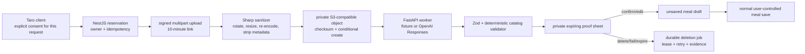

# Food-photo candidate model

Status: durable private-media lifecycle implemented through iteration 015; adversarial prompt/output boundary v2 implemented in iteration 024; production storage/provider approval remains gated

## Authority boundary

A food photo is sensitive, temporary evidence used to prepare a proposal. It is never a nutrition record and never authorizes a meal write.

The model receives only the sanitized JPEG and an allow-list of versioned catalog keys, labels and categories. It does not receive user identity, meal history, health metrics, notes or nutrient values. Nutrients shown after confirmation come from the existing catalog snapshot contract, never from model prose.

## Candidate contract and validation

Prompt `food-photo-candidates-v2` returns 0–5 candidates with an exact catalog key/label, `low | medium | high` confidence word, broad integer gram range and short visual basis. It treats every word visible in the image as untrusted visual data: it must not follow, repeat or reveal image instructions/system messages, and an instruction-dominant image is rejected with no candidates and a manual path. It may otherwise request manual entry or reject an unsuitable image. It cannot output calories, macros, diagnosis, identity inference or food outside the supplied catalog.

Validator `food-photo-catalog-safety-v2` rejects schema drift, duplicate/unknown keys, label mismatch, extreme catalog-relative portions, candidates attached to rejected content and empty responses without a manual path. It also applies the shared NFKC/format-character/separator policy to the displayed summary and visual basis, rejecting medical/prescriptive language and Chinese/English control-instruction leakage even when split by zero-width/full-width characters. Confirmation must select displayed catalog keys and integer grams inside the displayed ranges. There is deliberately no deterministic visual fallback: provider or validation failure deletes media and returns a typed failure rather than invented candidates.

The public read contract accepts v1 and v2 provenance so a candidate created during a rolling deployment remains readable. New worker requests require prompt/validator v2. Migration 0018 widens the append-only provenance constraints rather than rewriting old rows.

## Media and consent lifecycle

| State        | Media/content behavior                                                                    |
| ------------ | ----------------------------------------------------------------------------------------- |
| `reserved`   | No media; affirmative consent and owner-scoped idempotency are persisted                  |
| `processing` | Sanitized private JPEG exists; raw upload was never written                               |
| `ready`      | Sanitized JPEG and validated candidates remain private until confirmation/delete/expiry   |
| `rejected`   | A durable delete is enqueued; minimal rejected result/provenance may be shown             |
| `failed`     | Candidate content is cleared and durable media deletion begins; typed failure remains     |
| `confirmed`  | Selection/provenance remain, media deletion is durably tracked, unsaved draft is returned |
| `deleted`    | Candidate content/selection/hash are cleared; media status reports pending or deleted     |
| `expired`    | The same durable deletion starts after at most 24 hours                                   |

Consent purpose is `food_photo_analysis`, version `food-photo-analysis-2026-07-19.v1`. The client asks again before every new reservation. Upload and preview signatures bind action, photo ID, owner and expiry through HMAC-SHA256. Preview is not a public static path.

The API accepts JPEG, PNG and still WebP up to 6 MiB/20 megapixels. Sharp applies orientation, limits the longest edge to 1600 px, encodes JPEG quality 82 without input metadata, stores only `private-photos/<user UUID>/<photo UUID>.jpg` and records a SHA-256 hash. S3 writes carry the checksum and `If-None-Match: *`, so an upload replay cannot overwrite an existing object.

Confirmation, explicit deletion, rejection, failure, expiry and consent/account withdrawal create PostgreSQL durable jobs in the authoritative database transaction. Workers use two-minute leases, multi-replica-safe `SKIP LOCKED` claims, exponential retry and dead-letter state. API output separates logical deletion from `mediaDeletionStatus`; removing a row is never represented as proof that an unavailable object store has already deleted the bytes. Successful jobs clear their payload.

Local development uses a pinned private MinIO container. Shared/production deployment requires HTTPS object storage, least-privilege IAM, KMS/SSE, lifecycle/versioning/replication, centralized job alerts and named dead-letter recovery. The bucket is part of readiness; a local healthy MinIO is not cloud custody approval.

## Provider contract and data controls

Local Compose defaults to `fixture-food-photo-v1`, visibly labeled as a non-visual demo. The OpenAI adapter uses the Responses API, `gpt-5.6-terra` by default, low reasoning, strict Structured Outputs, `store:false`, 900 output-token cap and explicit image `detail:"high"`. Server-side resizing controls image cost before the provider request. The implementation follows the official [models catalog](https://developers.openai.com/api/docs/models), [image input guide](https://developers.openai.com/api/docs/guides/images-vision), [Structured Outputs guide](https://developers.openai.com/api/docs/guides/structured-outputs), and [data controls documentation](https://developers.openai.com/api/docs/guides/your-data).

`store:false` is not a zero-retention agreement. [OpenAI data controls](https://platform.openai.com/docs/models/default-usage-policies-by-endpoint) distinguish API application state from default abuse-monitoring logs (which may retain content for up to 30 days) and approval-based Zero Data Retention/Modified Abuse Monitoring. A completed MyFitness receipt therefore uses `providerStatus=policy_bound` for any OpenAI-backed event; it never claims `remote_deleted`. Production use remains disabled until the project owner approves provider, region, contract, disclosure, cost, quality and incident handling. No real or billable model request was made in iteration 015.

## Public API

- `POST /v1/nutrition/photo-candidates`: reserve after explicit consent; returns signed upload instructions.
- `POST /v1/nutrition/photo-candidates/:id/upload`: sanitize, analyze and validate one multipart image.
- `GET /v1/nutrition/photo-candidates`: list recent owner-reviewable results.
- `GET /v1/nutrition/photo-candidates/:id/preview`: short-lived signed sanitized preview.
- `POST /v1/nutrition/photo-candidates/:id/confirm`: persist selection, delete photo, return draft inputs; never create a meal.
- `DELETE /v1/nutrition/photo-candidates/:id`: delete media and derived content.

The committed OpenAPI document describes these contracts. Cross-origin uploads retain an explicit origin allow-list and enable credentials because Taro H5 `uploadFile` uses credentialed XHR; wildcard CORS is not allowed.

The v2 deterministic corpus contains 11 exact-reason cases, including image-instruction leakage, zero-width medical claims and spaced full-width calorie prescriptions. Its runner writes the committed report with the repository-pinned formatter, and hosted CI requires post-evaluation format and zero-diff evidence. The corpus proves those encoded outputs are rejected, not that arbitrary real-world image attacks or visual quality are solved; expert-reviewed real/obfuscated images remain a release gate.
