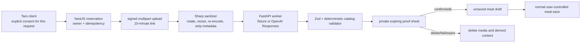

# Food-photo candidate model

Status: implemented locally in iteration 010; production storage/provider approval remains gated

## Authority boundary

A food photo is sensitive, temporary evidence used to prepare a proposal. It is never a nutrition record and never authorizes a meal write.

The model receives only the sanitized JPEG and an allow-list of versioned catalog keys, labels and categories. It does not receive user identity, meal history, health metrics, notes or nutrient values. Nutrients shown after confirmation come from the existing catalog snapshot contract, never from model prose.

## Candidate contract and validation

Prompt `food-photo-candidates-v1` returns 0–5 candidates with an exact catalog key/label, `low | medium | high` confidence word, broad integer gram range and short visual basis. It may request manual entry or reject an unsuitable image. It cannot output calories, macros, diagnosis, identity inference or food outside the supplied catalog.

Validator `food-photo-catalog-safety-v1` rejects schema drift, duplicate/unknown keys, label mismatch, extreme catalog-relative portions, candidates attached to rejected content and empty responses without a manual path. Confirmation must select displayed catalog keys and integer grams inside the displayed ranges. There is deliberately no deterministic visual fallback: provider or validation failure deletes media and returns a typed failure rather than invented candidates.

## Media and consent lifecycle

| State        | Media/content behavior                                                                     |
| ------------ | ------------------------------------------------------------------------------------------ |
| `reserved`   | No media; affirmative consent and owner-scoped idempotency are persisted                   |
| `processing` | Sanitized private JPEG exists; raw upload was never written                                |
| `ready`      | Sanitized JPEG and validated candidates remain private until confirmation/delete/expiry    |
| `rejected`   | Media is deleted immediately; minimal rejected result/provenance may be shown              |
| `failed`     | Media and candidate content are deleted; typed provider/validator failure remains          |
| `confirmed`  | Media and candidate content are deleted; selected catalog keys/grams and provenance remain |
| `deleted`    | Media, candidate content, selection and hash are removed                                   |
| `expired`    | The same deletion occurs after at most 24 hours                                            |

Consent purpose is `food_photo_analysis`, version `food-photo-analysis-2026-07-19.v1`. The client asks again before every new reservation. Upload and preview signatures bind action, photo ID, owner and expiry through HMAC-SHA256. Preview is not a public static path.

The API accepts JPEG, PNG and still WebP up to 6 MiB/20 megapixels. Sharp applies orientation, limits the longest edge to 1600 px, encodes JPEG quality 82 without input metadata, writes only a UUID filename with private permissions and records a SHA-256 hash. Confirmation, explicit deletion, rejection and failure delete the exact UUID path; a 15-minute reconciler expires old rows. Local disk is a development adapter only. Shared/production deployment requires private object storage, KMS-managed signing/secrets, lifecycle rules and multi-replica-safe reconciliation.

## Provider contract and data controls

Local Compose defaults to `fixture-food-photo-v1`, visibly labeled as a non-visual demo. The OpenAI adapter uses the Responses API, `gpt-5.6-terra` by default, low reasoning, strict Structured Outputs, `store:false`, 900 output-token cap and explicit image `detail:"high"`. Server-side resizing controls image cost before the provider request. The implementation follows the official [models catalog](https://developers.openai.com/api/docs/models), [image input guide](https://developers.openai.com/api/docs/guides/images-vision), [Structured Outputs guide](https://developers.openai.com/api/docs/guides/structured-outputs), and [data controls documentation](https://developers.openai.com/api/docs/guides/your-data).

`store:false` is not a zero-retention agreement. OpenAI documents default application-state and abuse-monitoring behavior, approval-based Zero Data Retention/Modified Abuse Monitoring, and special review/retention possibilities for image safety matching. Production use therefore remains disabled until the project owner approves provider, region, contract, disclosure, cost, quality and incident handling. No real or billable model request was made in iteration 010.

## Public API

- `POST /v1/nutrition/photo-candidates`: reserve after explicit consent; returns signed upload instructions.
- `POST /v1/nutrition/photo-candidates/:id/upload`: sanitize, analyze and validate one multipart image.
- `GET /v1/nutrition/photo-candidates`: list recent owner-reviewable results.
- `GET /v1/nutrition/photo-candidates/:id/preview`: short-lived signed sanitized preview.
- `POST /v1/nutrition/photo-candidates/:id/confirm`: persist selection, delete photo, return draft inputs; never create a meal.
- `DELETE /v1/nutrition/photo-candidates/:id`: delete media and derived content.

The committed OpenAPI document describes these contracts. Cross-origin uploads retain an explicit origin allow-list and enable credentials because Taro H5 `uploadFile` uses credentialed XHR; wildcard CORS is not allowed.
