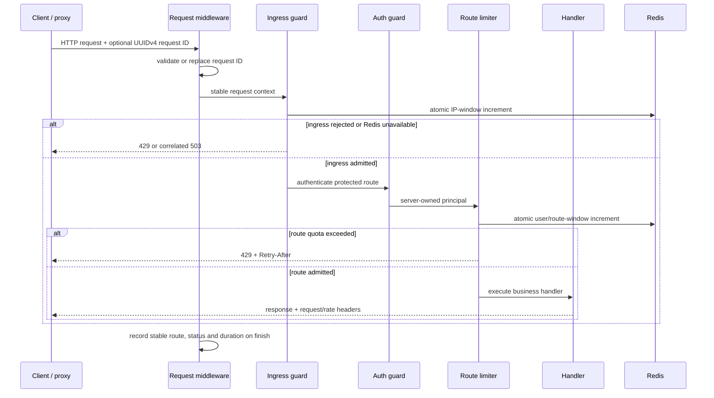

# API operations perimeter

Status: shared request/health perimeter implemented in iteration 012; AI lifecycle aggregates and bounded recovery added in iteration 023

## Purpose

The operations perimeter makes every API request traceable and bounded before an administrator or shared deployment is introduced. It protects database-backed authentication as well as authenticated workloads, exposes dependency readiness separately from process liveness, and emits scrapeable measurements without putting user IDs, IP addresses, tokens, query strings or health payloads into labels.

## Request path

The two layers are deliberate. A route interceptor can use the authenticated user but is too late to protect the token lookup itself. The global ingress guard runs before route authentication and uses only the proxy-normalized remote address. The post-authentication interceptor then applies the default actor quota or a stricter AI/photo/privacy policy.

## Correlation and proxy trust

- A caller-supplied `x-request-id` is accepted only as UUIDv4, normalized to lowercase and echoed as `X-Request-ID`; all other values are replaced.
- Structured request logs contain request ID, allow-listed HTTP method (`OTHER` for unexpected input), stable route template, bounded status, duration and only `anonymous`/`authenticated` actor class.
- Query strings, request bodies, direct user IDs, IPs and authorization headers are never logged or used as metric labels.
- `TRUST_PROXY_HOPS` defaults to `0`. Production must set it to the exact number of trusted reverse-proxy hops; accepting arbitrary forwarded addresses would let callers choose another limit bucket.

## Shared rate limits

Redis stores only `prefix:policy:HMAC(actor)` keys. The HMAC secret stays outside Redis, and each key expires with its policy window. One Lua script performs `INCR`, first-write `PEXPIRE` and `PTTL`, so separate API replicas share a single decision. The local Redis container is non-persistent and uses `noeviction`; production requires a TLS/ACL-protected managed Redis-compatible service and isolated key prefix.

| Policy                | Scope                | Limit/window |
| --------------------- | -------------------- | ------------ |
| API ingress           | normalized remote IP | 1200/minute  |
| Standard route        | user, otherwise IP   | 600/minute   |
| Development session   | IP                   | 60/minute    |
| Verified user session | IP                   | 30/minute    |
| AI explanation        | authenticated user   | 20/minute    |
| Photo reservation     | authenticated user   | 30/minute    |
| Photo upload          | authenticated user   | 12/minute    |
| Privacy export        | authenticated user   | 6/5 minutes  |
| Consent withdrawal    | authenticated user   | 10/5 minutes |
| Account erasure       | authenticated user   | 3/hour       |

These are conservative engineering defaults, not traffic-tested product quotas. A rejection returns `RateLimit-Limit`, `RateLimit-Remaining`, `RateLimit-Reset`, `Retry-After`, a stable error code and the request ID. Redis failure returns a correlated `503`; business traffic never silently falls back to per-process or fail-open counters.

## Health and metrics

- `GET /v1/health/live` checks only that the Node process can answer.
- `GET /v1/health` is readiness and requires PostgreSQL, Redis and private object storage.
- `GET /v1/internal/metrics` requires `x-operations-token`, is not browser administration, and returns Prometheus text with request counts, duration histograms, rejection counts and limiter-backend failures.
- `GET /v1/internal/data-operations` and bounded `POST .../drain` require the same private operations token and expose aggregate durable-job evidence only. They never return payloads, object keys, receipt secrets or user identifiers.
- `GET /v1/internal/ai-explanations` and bounded `POST .../reconcile` require the same token and expose only pending/expired/reconciled counts, oldest pending time and the number advanced. They never return run/user/plan identifiers, prompts, contexts or explanation content, and reconciliation never contacts a provider.
- Metric route labels come from registered route templates. Process-local series must be scraped and aggregated across replicas before alert evidence can be claimed.

The internal token is separate from end-user sessions and must be delivered through a secret manager. The endpoint intentionally exposes no user search, mutation, support or audit capability; those require verified operator identity and RBAC in the next boundary.

## Failure matrix

| Condition                    | Liveness | Readiness | Business request                     | Operator evidence                     |
| ---------------------------- | -------- | --------- | ------------------------------------ | ------------------------------------- |
| PostgreSQL unavailable       | `200`    | `503`     | handler dependent                    | correlated 5xx and readiness failure  |
| Redis unavailable            | `200`    | `503`     | `503`, fail closed                   | backend-failure counter and log event |
| Object storage unavailable   | `200`    | `503`     | uploads fail; durable deletes retry  | job counts/age and readiness failure  |
| Ingress quota exceeded       | `200`    | `200`     | `429`                                | ingress rejection counter             |
| Authenticated quota exceeded | `200`    | `200`     | `429`                                | named route-policy counter            |
| AI explanation deadline      | `200`    | `200`     | same deterministic fallback on retry | aggregate expiry/reconciliation count |
| Operations token invalid     | `200`    | unchanged | internal endpoints `401`             | bounded 401 route metric              |

## Remaining boundary

Independent operator identity/RBAC/audit, durable data jobs and crash-safe AI explanation reconciliation now exist, but this implementation still does not provide centralized scraping, alert delivery, distributed tracing, dead-letter paging/recovery ownership, production provider calibration or policy calibration from real traffic. Fixed windows also allow a boundary burst. Those are explicit release gates, not implied by the presence of metrics/job endpoints.
