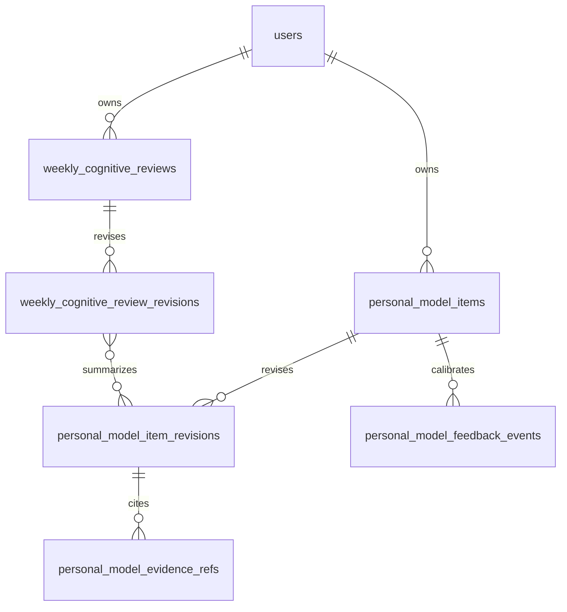
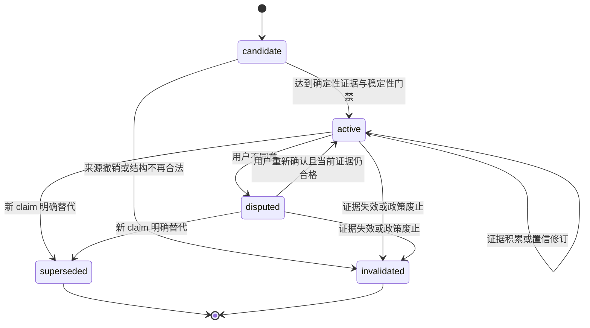

# 个人认知模型

状态：第 181 轮完成领域与架构设计，尚未实现持久化、API 或客户端闭环

## 1. 目标与边界

衡迹的长期目标是从“记录发生了什么”演进为“基于长期证据帮助用户认识自己并做出决定”。健身是第一个垂直领域，核心闭环为：

```text
Record → Evidence → Personal Model → Pattern / Hypothesis
       → Decision → Action → Outcome → Model Update
```

个人认知模型不是静态 `UserProfile`，不是聊天记忆，也不是把全部数据拼成一段 AI 总结。它是一组有类型、有来源、有时间、有置信、有修订、可由用户校准且可以失效的认知条目。系统必须能回答“为什么这样认为”，并回到精确原始记录、计划、反思或资料证据。

现阶段不实现医疗诊断、心理画像、人格标签、因果证明或黑盒自动适应。任何模型条目都不得静默修改健康记录、资料目标、训练、餐食或计划。LLM 可以生成受检候选表达，但不能成为事实来源、生命周期权威或置信更新器。

## 2. 现状复用与缺口

### 2.1 可直接复用的能力

| 现有能力                       | 可复用价值                                          | 仍需保持的边界                             |
| ------------------------------ | --------------------------------------------------- | ------------------------------------------ |
| 建档资料、目标与 `revision`    | 提供本人确认的目标、可训练时间、器械和饮食偏好      | 行为不得反向覆盖目标；高风险资格不变成诊断 |
| 健康记录与不可变修订           | 提供来源、单位、发生时间、时区和更正/删除证据       | AI estimate 与 confirmed 继续分离          |
| 训练与餐食聚合及修订           | 提供实际行为、时长、完成组、餐次和选择时快照        | 缺少记录不等于没有行为或摄入               |
| 固定 7/30/90 日洞察            | 提供受检的时间窗、计数与统计                        | 统计不自动等于 Pattern 或效果              |
| `subjective-recovery-state-v1` | 提供个人基线、覆盖、置信、限制和精确引用            | 它是短期 State，不是长期个性结论           |
| `personal-state-ledger-v1`     | 区分本人确认、确认事实、观察、估计与 Unknown        | 它是一次 Dashboard 投影，没有持久生命周期  |
| 周计划与不可变决定历史         | 提供 Decision 和用户采用/修改/跳过证据              | 计划是提议，不代表已执行                   |
| 计划—训练显式关联              | 提供 Action 与计划修订的明确关系                    | 不从标题、日期或内容猜测依从性             |
| 七日结果回看与本人反思         | 提供 Outcome 窗口、撤销计数和 `user_confirmed` 体验 | 一次结果不证明假设或因果                   |
| AI 解释安全边界                | 提供最小上下文、来源版本、严格 Schema 与 fallback   | 模型文本不写回事实或计划                   |

### 2.2 当前关键缺口

- `personal-state-ledger-v1` 每次读取即重算，不能表达某项认识何时形成、如何变化或为何失效。
- 没有 Goal、Constraint、Preference、Baseline、Behavior、State、Pattern、Hypothesis 的稳定概念边界。
- 没有把支持、反对与上下文证据绑定到精确模型修订的关系。
- 没有模型条目的 candidate、active、disputed、superseded、invalidated 生命周期。
- 没有用户确认、暂时情况、不同意、不确定等校准事件及其修订影响。
- 没有少量、稳定、可复核的 Weekly Cognitive Review。
- 计划结果与本人反思尚未进入 Hypothesis → Outcome → Model Update，但这是有意的安全停点。

现有当前状态账本继续保留，负责回答“现在读到什么”。新的长期模型负责回答“过去如何形成这项认识、现在为何仍成立、什么证据支持或反对、用户如何校准”。两者不能互相冒充。

## 3. 八类认知的严格边界

| 类型       | 回答的问题                       | 主要来源                                   | 禁止推断                         |
| ---------- | -------------------------------- | ------------------------------------------ | -------------------------------- |
| Goal       | 用户希望达到什么                 | 本人确认资料、后续明确校准                 | 不能由近期行为下降推断目标已降低 |
| Constraint | 当前现实限制是什么               | 本人确认可训练日、时长、器械、阶段性上下文 | 不能把未记录解释为没有时间或动力 |
| Preference | 用户长期更愿意选择什么           | 本人确认；重复选择只能先形成候选 Pattern   | 不能把一次替代或一次跳过写成偏好 |
| Baseline   | 个人在明确窗口内的典型范围是什么 | 足量、可比、已确认的纵向证据               | 不能当作健康正常范围或永久标准   |
| Behavior   | 用户实际记录到的长期行为是什么   | 当前合格训练、餐食、记录与明确关联         | 不能等同意图、依从性或完整现实   |
| State      | 用户近期或当前处于什么状态       | 有时效的恢复记录、近期事件和上下文         | 不能自动升级为长期特征           |
| Pattern    | 哪种关系或变化反复出现           | 多窗口可复现的描述性统计                   | 不能描述成原因、机制或必然规律   |
| Hypothesis | 哪种解释值得继续验证             | 已验证 Pattern、领域规则或受检 AI 候选     | 不能成为事实、诊断或自动处方     |

Goal、Constraint 和 Preference 即使由系统观察到候选，也必须保持 candidate，直到用户明确确认；原资料仍是用户事实权威。Baseline、Behavior、State 和 Pattern 由确定性规则生成。Hypothesis 可以由确定性规则或 LLM 提出，但只有 Schema、证据、时间和安全验证通过后才可作为明确不确定的候选显示。

## 4. 领域聚合与结构

### 4.1 `PersonalModelItem`

一个条目表达一个稳定 `subjectKey` 下的一项结构化认知。建议字段：

| 字段                             | 规则                                                             |
| -------------------------------- | ---------------------------------------------------------------- |
| `id`,`userId`                    | 服务端 UUID 与所有者；受保护请求不接受 body 中的 userId          |
| `kind`                           | 八类认知之一                                                     |
| `subjectKey`                     | 有版本的稳定主题，例如 `training.recorded_frequency`             |
| `claimSchemaVersion`             | 决定 claim 的严格联合类型，禁止任意 JSON 叙述成为权威            |
| `claim`                          | 结构化值、单位、统计窗口与比较边界；用户文案由版本化模板生成     |
| `source`                         | `user_confirmed`、`deterministic_rule` 或 `model_candidate`      |
| `status`                         | `candidate`、`active`、`disputed`、`superseded`、`invalidated`   |
| `confidence`                     | 置信档位与可复算收据，不宣称医学概率                             |
| `validFrom`,`validTo`            | 认知适用的现实时间；未知结束时间为 null                          |
| `observedFrom`,`observedThrough` | 本次推导实际覆盖的证据窗口                                       |
| `derivedAt`                      | 系统形成本修订的服务端时刻                                       |
| `revision`                       | 正整数乐观并发与不可变历史序号                                   |
| `feedbackState`                  | `unreviewed`、`confirmed`、`temporary`、`disagreed`、`uncertain` |
| `createdAt`,`updatedAt`          | 聚合生命周期时间                                                 |

`claim` 必须使用少量领域联合类型，而不是自由文本。例如：

- `training_availability_constraint_v1`：本人确认的可训练日与单次时长。
- `recorded_training_frequency_behavior_v1`：完整周数、每周记录课次中位数与范围。
- `recorded_session_duration_baseline_v1`：样本数、中位数、四分位范围和分钟单位。
- `sleep_rpe_pattern_v1`：配对规则、样本数、支持/反对次数与观察窗口。
- `sleep_performance_hypothesis_v1`：可能关系、已知限制和验证问题。

自由文本只能是非权威展示、用户反馈备注或 AI 候选表达，并始终与结构化 claim 分开。

### 4.2 不可变修订

每次有意义的变化追加 `PersonalModelItemRevision`，保存条目完整结构快照、更新动作、置信收据和当时证据集合身份。建议动作包括：

`created`、`evidence_accumulated`、`evidence_contradicted`、`user_confirmed`、`user_marked_temporary`、`user_disagreed`、`user_uncertain`、`superseded`、`invalidated`。

相同推导指纹为 no-op，不因每次页面读取产生新修订。来源更正、软删除或政策升级也不重写旧修订；系统追加新修订，说明哪些证据退出当前资格以及结论如何变化。

### 4.3 聚合关系



这是后续迁移的候选结构，不是第 181 轮已存在的数据库事实。迁移前仍需用共享 contracts 锁定字段与状态机，再以 PostgreSQL 约束重复所有者、revision 和状态不变量。

## 5. 证据模型

每个模型修订必须至少包含一个 `EvidenceSet`；纯 Unknown 条目可以只有“证据不足收据”，不能伪造记录引用。证据集合包含：

- `policyVersion`：查询、配对、窗口与资格规则版本。
- `asOf`：事实截止时刻。
- `windowStart`,`windowEnd`,`timezone`：适用窗口与本地日期语义。
- `includedCount`,`supportingCount`,`contradictingCount`,`withdrawnCount`。
- `evidenceFingerprint`：规范化引用与规则的确定性指纹，用于 no-op，而不是秘密或真实性证明。
- 完整、可分页的 `EvidenceReference` 列表。

每条引用包含：

| 字段                              | 说明                                                                                                                  |
| --------------------------------- | --------------------------------------------------------------------------------------------------------------------- |
| `role`                            | `supporting`、`contradicting` 或 `context`                                                                            |
| `evidenceKind`                    | onboarding、health record、workout、meal、plan revision、plan link、outcome observation、reflection 或 feedback event |
| `aggregateId`,`aggregateRevision` | 精确所有者聚合及当时修订；没有 UUID 的资料使用受控用户聚合键                                                          |
| `occurredAt` 或 `window`          | 现实发生时间或确定性统计窗口                                                                                          |
| `sourceKind`,`statusAtDerivation` | 记录来源与推导时资格                                                                                                  |
| `withdrawnReason`                 | 当前修订排除更正、删除、解除关联或策略变化的原因；未退出时为 null                                                     |

引用必须能导航到现有所有者权威表面或新的分页证据详情；URL 不携带健康值。旧模型修订继续引用当时不可变证据，当前读取则明确标出来源是否已更正、删除或撤销，不能用最新事实静默改写历史认识。

只保存统计摘要而不保存可追溯引用是不合格的。证据很多时使用有界分页和精确总数，不截断为“部分样本却声称完整”。

## 6. 生命周期与状态机



- `candidate` 可以出现在“仍然不知道的事”，不得用于计划或 Contextual Decision。
- `active` 表示当前策略允许展示和引用，不表示用户同意或结论永久正确。
- `disputed` 保留系统证据和用户异议，但默认不得驱动建议。
- `superseded` 表示有明确替代 claim；旧项只读保留。
- `invalidated` 表示证据资格、来源完整性或策略版本使该项不再成立；不能删除历史来掩盖错误。

一次新记录通常只改变证据缓存，不立即生成长期模型修订。只有跨越版本化稳定性门槛、形成材料性 claim 变化、用户反馈或证据撤回时才追加修订。

## 7. 置信与模型更新

置信不是 LLM 自评分，也不是医疗概率。初始档位为 `insufficient`、`low`、`moderate`、`high`，由不同 claim 策略使用可复算收据决定：

- 覆盖：合格记录数、独立日期/周数、窗口完整度。
- 稳定：相邻窗口是否保持方向与量级，是否只由单个异常点造成。
- 支持与反对：两类证据分别计数，不把冲突样本删除。
- 新鲜：最新证据与当前时刻的间隔。
- 来源：本人确认、设备、导入和 AI candidate 保持可区分。
- 政策：`confidencePolicyVersion` 固定阈值、材料变化和上限。

第一阶段规则：

1. 单次结果不能让 Pattern 或 Hypothesis 升级。
2. Hypothesis 初始最高为 moderate；达到 high 必须经过多个非重叠窗口、支持/反对证据审查与真实用户研究后另作决策。
3. 用户选择“符合我的情况”只更新 `feedbackState`，不会机械提高统计置信。
4. 用户选择“我不同意”使条目进入 disputed，但不删除系统观察。
5. 用户选择“只是暂时情况”保留 Goal 与长期 Preference，给 Behavior/State 增加阶段性上下文和有效期提示。
6. 证据更正、删除或关联解除会在下一次更新中计入 withdrawn，不重写旧修订。
7. 相关性只能形成 Pattern 或 Hypothesis，不得在模板或 AI 文案中改写为原因。

更新管线固定为：查询截至时刻证据 → Schema 与所有权校验 → 确定性统计 → 候选 claim → 稳定性/材料性比较 → Schema/安全验证 → 事务追加修订与引用。任一步失败都不得发布部分模型或覆盖当前 active 修订。

## 8. 用户校准

`PersonalModelFeedbackEvent` 是用户对精确条目修订的追加事件，使用 `expectedRevision` 防止在过期认识上静默提交。首批固定选择：

- `matches_me`：符合我的情况。
- `temporary_context`：只是暂时情况。
- `disagree`：我不同意。
- `uncertain`：我也不确定。

反馈可以带受限 `reasonCode` 和最多 300 字的可选说明；说明属于敏感用户内容，不默认发送给 LLM，不进入遥测或 URL，并随账户导出/删除。支持结构化纠正的 claim 可另带严格 correction payload；自由文本本身不能直接变成 Goal、Constraint 或 Preference。

反馈保存后，在同一事务中追加模型修订或明确 no-op 收据。系统不得修改原始健康、训练、餐食或建档事实。用户随后更正来源记录时，仍走原有权威页面和 revision 规则。

## 9. 每周认知回顾（Weekly Cognitive Review）

周度认知回顾不是新增统计 Dashboard。它在一个本地周边界和固定 `observedThrough` 上选择少量高价值变化：

1. 最近发生了什么：最多 3 个事实或行为变化。
2. 哪些偏离个人基线：最多 2 个，必须引用 Baseline 修订。
3. 最近观察到什么新 Pattern：最多 1 个。
4. 哪些认识发生变化：最多 3 个模型修订。
5. 哪些仍然不知道：最多 2 个 candidate、冲突或证据不足项。
6. 接下来最值得验证什么：最多 1 个可选验证问题，不自动写入计划。

每张卡引用精确 `itemId + itemRevision` 和证据集合。回顾本身按 `(userId,weekStart)` 唯一并保留不可变 revision，以便用户之后知道当时看到了什么。重新生成只有在 evidence/model watermark 变化时创建新修订；相同指纹 no-op。

第一阶段使用确定性选择和模板。未来 LLM 只能把已经选定的结构化条目转成简短表达；输出仍需引用允许的模型修订，不能新增事实、数字、因果、医疗判断或验证任务。

## 10. 最小闭环与首批场景

第一阶段闭环：

```text
已有 Evidence
  → 确定性 Personal Model Item
  → 周度认知回顾
  → 用户四选一反馈
  → 新模型修订
```

首批只实现两个低歧义场景：

### 10.1 可训练安排与实际记录频率

- Constraint：从精确建档 revision 读取 `availableDays` 与 `sessionMinutes`，只表达本人确认的可训练安排。
- Behavior：用最近 8 个完整本地周的当前、未删除训练记录计算每周记录课次数分布。
- 两者并列展示，禁止写成“目标未完成”“依从性不足”或“用户真正只想练三次”。
- 少于 4 个完整周或少于 6 条训练时 Behavior 保持 candidate/insufficient。

### 10.2 单次训练记录时长基线

- Baseline：对最近 8 个完整周、当前未删除且结束不早于开始的训练，计算 elapsed minutes 的中位数与四分位范围。
- 至少 6 条、覆盖至少 4 个不同周才可 active；单条极端值不直接改变典型范围。
- 名称固定为“已记录训练的历时时长基线”，不等于有效训练时长、最佳时长或建议时长。

睡眠与 RPE、训练量与恢复、计划调整与体验具有更高配对和因果误解风险，放在核心闭环可纠正之后。它们先生成描述性 Pattern，再由独立门禁形成 Hypothesis。

## 11. 数据库与 API 候选边界

后续数据库迁移建议新增：

- `personal_model_items`：当前聚合、owner、subject、状态、当前 revision 和有效期。
- `personal_model_item_revisions`：不可变完整快照、action、claim、置信收据和推导指纹。
- `personal_model_evidence_refs`：按模型修订保存完整可分页支持/反对/上下文引用。
- `personal_model_feedback_events`：追加式用户校准与可选纠正 payload。
- `weekly_cognitive_reviews` 与 `weekly_cognitive_review_revisions`：每周当前回顾和不可变快照。

全部表直接持有 `user_id`，跨表使用 owner 复合外键；账号删除级联，便携导出和清单必须在功能可见前覆盖这些表。高敏说明不得进入日志，revision 与 evidence 不能在普通条目删除时物理丢失。

候选 API：

- `GET /v1/mirror`：当前模型摘要、最近变化、Unknown 和最新周回顾导航。
- `GET /v1/mirror/items`：按类型/状态有界分页。
- `GET /v1/mirror/items/{itemId}`：当前精确条目。
- `GET /v1/mirror/items/{itemId}/history`：不可变修订分页。
- `GET /v1/mirror/items/{itemId}/evidence`：精确当前或指定修订证据分页。
- `POST /v1/mirror/items/{itemId}/feedback`：四选一校准与严格纠正。
- `POST /v1/mirror/weekly-reviews`：按本地周幂等生成确定性回顾。
- `GET /v1/mirror/weekly-reviews` 与精确详情：当前/历史有界读取。

这些路径尚未进入 OpenAPI。实施时先定义 contracts，再新增迁移与 repository，最后开放 API 和客户端；不得在一轮同时完成全部层。

## 12. AI 与 Contextual Decision 边界

LLM 适合：候选 Pattern/Hypothesis 表达、周回顾压缩、Contextual Decision 自然语言解释。确定性系统继续负责证据查询、窗口、配对、统计、生命周期、置信收据、修订、用户反馈、状态转换和安全门禁。

未来 Contextual Decision 的结构化输出至少包含：

- `judgment`：当前判断，不自动执行。
- `personalEvidence[]`：精确 Personal Model item revision 与原始证据引用。
- `unknowns[]`：缺少、冲突或过期的信息。
- `confidence`：本次决策置信及收据，不复制模型自评分。
- `alternatives[]`：保守可选方案。
- `safetyBoundary`：何时停止、降级或寻求专业人员。

输入必须组合 Current Context、Current State、Personal Model、Historical Evidence、Current Goal 和 Constraints。输出不写回 Personal Model、计划或记录；用户行动和后续 Outcome 通过正常事实路径产生，之后才可能为某个 Hypothesis 增加一次支持或反对证据。

## 13. 隐私、安全与产品风险

- Personal Model 是敏感健康/行为推导数据，必须进入用途说明、清单、导出、更正、反馈、删除和账号擦除。
- AI Estimate、system-derived、user-confirmed、Unknown 与 disputed 在 Schema 和 UI 中分别建模。
- 不记录人格、意志力、自律、疾病、体态好坏或道德化饮食标签。
- 不把缺失记录当成零行为，不从一次结果更新长期认知，不从相关性推断原因。
- 用户不同意不能被当作“用户错误”；异议与系统证据并列保留，并默认禁止该条目驱动建议。
- 反馈说明、工作安排、疼痛、精确时间与设备来源不得进入日志、指标或未经同意的模型上下文。
- 每项 active 模型都必须能追溯、纠正、失效和导出；任何一个缺失都阻止客户端宣称“衡迹了解我”。

R-032 继续覆盖“个人状态账本被误解为完整真相”。R-033 新增覆盖长期认知模型把记录偏差、缺失、短期变化或相关性固化为稳定标签的风险。

## 14. 分阶段实施与验收

| 阶段                   | 范围                                               | 退出证据                                                 |
| ---------------------- | -------------------------------------------------- | -------------------------------------------------------- |
| P0 领域基线            | 本文、ADR、路线图与风险重排                        | 八类边界、状态机、证据和首批场景完成受检；本轮完成       |
| P1 共享契约            | item/revision/evidence/feedback/review 严格 Schema | 跨字段不变量、Unknown、状态转换和边界测试通过            |
| P2 持久内核            | 前四张模型表、owner/revision/追加事件与 repository | 真实 PostgreSQL 证明隔离、并发、修订、撤销与账号删除     |
| P3 首批派生            | 安排约束、8 周记录频率、训练时长基线               | 确定性夹具、时区完整周、最低覆盖和 no-op 指纹通过        |
| P4 Mirror 读取         | “关于我”摘要、详情、历史、证据追溯                 | 未读/空/失败分离，移动端无障碍与隐私路径通过             |
| P5 周回顾与反馈        | 少量回顾、四选一反馈、模型修订                     | 精确 revision、过期反馈冲突、temporary/disputed 语义通过 |
| P6 Pattern/Hypothesis  | 睡眠-RPE 等描述性关系与不确定假设                  | 支持/反对证据、非因果措辞、跨窗口稳定门禁通过            |
| P7 Outcome 更新        | 计划采用、实际关联、恢复与反思增加一次证据         | 单次结果不升级、撤销可见、重复窗口更新可复算             |
| P8 Contextual Decision | 个人历史驱动的结构化建议与解释                     | 引用、Unknown、置信、替代方案、安全 validator 全部通过   |

每个阶段可拆成多轮小迭代。云服务、真实模型、设备接入、部署和极端导出优化不占用认知主线，除非它们阻塞数据安全、隐私或当前阶段验收。

## 15. 待决策与下一步

下一轮只实现 P1 的最小共享契约，不建表、不开放 API：先锁定 `PersonalModelItem` 公共头、首批三个 claim 联合、EvidenceReference、置信收据、状态与 feedback event。验收必须证明 Goal/Constraint 不会被 Behavior 覆盖，Pattern/Hypothesis 不能声明因果，disputed/candidate 不能成为决策输入，Unknown 不被编码为零。

后续待真实数据或用户研究决定：最低周数与材料变化阈值、四分位算法、反馈原因集、是否允许自由说明、Hypothesis 的高置信上限、周回顾卡片数量理解度，以及 Contextual Decision 的安全升级阈值。缺少证据时保持保守默认，不臆造产品基准。

本设计的取舍与被拒绝方案记录在 [ADR-0175](decisions/0175-evidence-backed-revisable-personal-model.md)；实施状态以[项目状态](../PROJECT_STATUS.md)和[已实现产品需求文档](../product/IMPLEMENTED_PRD.md)为准。
