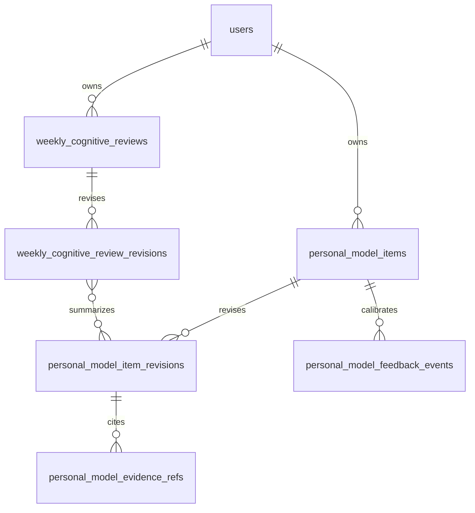
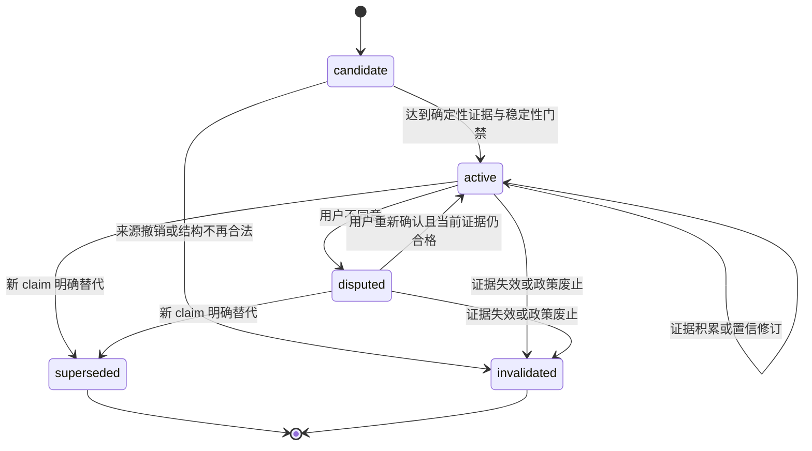

# 个人认知模型

状态：第 188 轮补齐 goal/workout 精确来源资格与撤回请求/解决协议；确定性 refresh 执行、回顾持久化、API、模型导出和客户端闭环仍未实现

## 1. 目标与边界

衡迹的长期目标是从“记录发生了什么”演进为“基于长期证据帮助用户认识自己并做出决定”。健身是第一个垂直领域，核心闭环为：

```text
Record → Evidence → Personal Model → Pattern / Hypothesis
       → Decision → Action → Outcome → Model Update
```

个人认知模型不是静态 `UserProfile`，不是聊天记忆，也不是把全部数据拼成一段 AI 总结。它是一组有类型、有来源、有时间、有置信、有修订、可由用户校准且可以失效的认知条目。系统必须能回答“为什么这样认为”，并回到精确原始记录、计划、反思或资料证据。

现阶段不实现医疗诊断、心理画像、人格标签、因果证明或黑盒自动适应。任何模型条目都不得静默修改健康记录、资料目标、训练、餐食或计划。LLM 可以生成受检候选表达，但不能成为事实来源、生命周期权威或置信更新器。

## 2. 现状复用与缺口

### 2.1 可直接复用的能力

| 现有能力                       | 可复用价值                                          | 仍需保持的边界                             |
| ------------------------------ | --------------------------------------------------- | ------------------------------------------ |
| 建档资料、目标与 `revision`    | 提供本人确认的目标、可训练时间、器械和饮食偏好      | 行为不得反向覆盖目标；高风险资格不变成诊断 |
| 健康记录与不可变修订           | 提供来源、单位、发生时间、时区和更正/删除证据       | AI estimate 与 confirmed 继续分离          |
| 训练与餐食聚合及修订           | 提供实际行为、时长、完成组、餐次和选择时快照        | 缺少记录不等于没有行为或摄入               |
| 固定 7/30/90 日洞察            | 提供受检的时间窗、计数与统计                        | 统计不自动等于 Pattern 或效果              |
| `subjective-recovery-state-v1` | 提供个人基线、覆盖、置信、限制和精确引用            | 它是短期 State，不是长期个性结论           |
| `personal-state-ledger-v1`     | 区分本人确认、确认事实、观察、估计与 Unknown        | 它是一次 Dashboard 投影，没有持久生命周期  |
| 周计划与不可变决定历史         | 提供 Decision 和用户采用/修改/跳过证据              | 计划是提议，不代表已执行                   |
| 计划—训练显式关联              | 提供 Action 与计划修订的明确关系                    | 不从标题、日期或内容猜测依从性             |
| 七日结果回看与本人反思         | 提供 Outcome 窗口、撤销计数和 `user_confirmed` 体验 | 一次结果不证明假设或因果                   |
| AI 解释安全边界                | 提供最小上下文、来源版本、严格 Schema 与 fallback   | 模型文本不写回事实或计划                   |

### 2.2 当前关键缺口

- `personal-state-ledger-v1` 每次读取即重算，不能表达某项认识何时形成、如何变化或为何失效。
- 没有 Goal、Constraint、Preference、Baseline、Behavior、State、Pattern、Hypothesis 的稳定概念边界。
- 共享契约中的证据已按完整条目修订投影为不可变关系，反馈也已持久化；goal/workout 引用现在具备来源级外键、当前资格门禁和撤回 request/resolution 事务证明，但尚无确定性 refresh 执行器，Weekly Cognitive Review 也仍未持久化。
- candidate、active、disputed、superseded、invalidated 生命周期已有机器不变量，但尚无派生器或 repository 执行状态转换。
- 用户确认、暂时情况、不同意、不确定已有追加事件及 revised/no-op 结果契约，但尚无受权 API 和用户界面。
- Weekly Cognitive Review 已有少量、结构化、可复核的 revision/current/history 契约，但尚未生成、存储或展示。
- 计划结果与本人反思尚未进入 Hypothesis → Outcome → Model Update，但这是有意的安全停点。

现有当前状态账本继续保留，负责回答“现在读到什么”。新的长期模型负责回答“过去如何形成这项认识、现在为何仍成立、什么证据支持或反对、用户如何校准”。两者不能互相冒充。

## 3. 八类认知的严格边界

| 类型       | 回答的问题                       | 主要来源                                   | 禁止推断                         |
| ---------- | -------------------------------- | ------------------------------------------ | -------------------------------- |
| Goal       | 用户希望达到什么                 | 本人确认资料、后续明确校准                 | 不能由近期行为下降推断目标已降低 |
| Constraint | 当前现实限制是什么               | 本人确认可训练日、时长、器械、阶段性上下文 | 不能把未记录解释为没有时间或动力 |
| Preference | 用户长期更愿意选择什么           | 本人确认；重复选择只能先形成候选 Pattern   | 不能把一次替代或一次跳过写成偏好 |
| Baseline   | 个人在明确窗口内的典型范围是什么 | 足量、可比、已确认的纵向证据               | 不能当作健康正常范围或永久标准   |
| Behavior   | 用户实际记录到的长期行为是什么   | 当前合格训练、餐食、记录与明确关联         | 不能等同意图、依从性或完整现实   |
| State      | 用户近期或当前处于什么状态       | 有时效的恢复记录、近期事件和上下文         | 不能自动升级为长期特征           |
| Pattern    | 哪种关系或变化反复出现           | 多窗口可复现的描述性统计                   | 不能描述成原因、机制或必然规律   |
| Hypothesis | 哪种解释值得继续验证             | 已验证 Pattern、领域规则或受检 AI 候选     | 不能成为事实、诊断或自动处方     |

Goal、Constraint 和 Preference 即使由系统观察到候选，也必须保持 candidate，直到用户明确确认；原资料仍是用户事实权威。Baseline、Behavior、State 和 Pattern 由确定性规则生成。Hypothesis 可以由确定性规则或 LLM 提出，但只有 Schema、证据、时间和安全验证通过后才可作为明确不确定的候选显示。

## 4. 领域聚合与结构

### 4.1 `PersonalModelItem`

一个条目表达一个稳定 `subjectKey` 下的一项结构化认知。建议字段：

| 字段                             | 规则                                                             |
| -------------------------------- | ---------------------------------------------------------------- |
| `id`,`userId`                    | 服务端 UUID 与所有者；受保护请求不接受 body 中的 userId          |
| `kind`                           | 八类认知之一                                                     |
| `subjectKey`                     | 有版本的稳定主题，例如 `training.recorded_frequency`             |
| `claimSchemaVersion`             | 决定 claim 的严格联合类型，禁止任意 JSON 叙述成为权威            |
| `claim`                          | 结构化值、单位、统计窗口与比较边界；用户文案由版本化模板生成     |
| `source`                         | `user_confirmed`、`deterministic_rule` 或 `model_candidate`      |
| `status`                         | `candidate`、`active`、`disputed`、`superseded`、`invalidated`   |
| `confidence`                     | 置信档位与可复算收据，不宣称医学概率                             |
| `validFrom`,`validTo`            | 认知适用的现实时间；未知结束时间为 null                          |
| `observedFrom`,`observedThrough` | 本次推导实际覆盖的证据窗口                                       |
| `derivedAt`                      | 系统形成本修订的服务端时刻                                       |
| `revision`                       | 正整数乐观并发与不可变历史序号                                   |
| `feedbackState`                  | `unreviewed`、`confirmed`、`temporary`、`disagreed`、`uncertain` |
| `createdAt`,`updatedAt`          | 聚合生命周期时间                                                 |

`claim` 必须使用少量领域联合类型，而不是自由文本。例如：

- `training_availability_constraint_v1`：本人确认的可训练日与单次时长。
- `recorded_training_frequency_behavior_v1`：完整周数、每周记录课次中位数与范围。
- `recorded_session_duration_baseline_v1`：样本数、中位数、四分位范围和分钟单位。
- `sleep_rpe_pattern_v1`：配对规则、样本数、支持/反对次数与观察窗口。
- `sleep_performance_hypothesis_v1`：可能关系、已知限制和验证问题。

自由文本只能是非权威展示、用户反馈备注或 AI 候选表达，并始终与结构化 claim 分开。

### 4.2 不可变修订

每次有意义的变化追加 `PersonalModelItemRevision`，保存条目完整结构快照、更新动作、置信收据和当时证据集合身份。建议动作包括：

`created`、`evidence_accumulated`、`evidence_contradicted`、`user_confirmed`、`user_marked_temporary`、`user_disagreed`、`user_uncertain`、`superseded`、`invalidated`。

相同推导指纹为 no-op，不因每次页面读取产生新修订。来源更正、软删除或政策升级也不重写旧修订；系统追加新修订，说明哪些证据退出当前资格以及结论如何变化。

### 4.3 聚合关系



第 184–188 轮已落地 `personal_model_items`、`personal_model_item_revisions`、`personal_model_feedback_events`、`personal_model_evidence_refs`、来源 refresh request 与 resolution；回顾表仍是候选结构。当前数据库已约束 item 所有者、current revision、完整快照、精确前驱、追加历史、反馈结果绑定、证据快照投影、来源权威和撤回解决关系，但尚未运行确定性派生/refresh，也没有 review 持久关系。

### 4.4 P1a/P1b 共享契约

`packages/contracts/src/personal-model.ts` 已实现首批内部权威边界，P2 持久内核已复用这些边界，公开 API 尚未使用：

- 三个严格 claim 通过 `claimSchemaVersion` 同时锁定认知类型、主题和来源：本人确认的训练安排 Constraint、确定性已记录训练频率 Behavior、确定性已记录课次时长 Baseline。Behavior 不能伪装成 Goal/Constraint，当前联合也不接受 Pattern/Hypothesis 或额外因果字段。
- EvidenceReference 目前只开放真实可复用的 `onboarding_goal_revision` 与 `workout_revision`。每条引用绑定 owner、聚合 UUID、正 revision、时间、来源、作用角色和撤回原因；EvidenceSet 复核计数、所有者、唯一性、窗口及 SHA-256 指纹表示。
- 置信收据按 `user_confirmed` 与 `longitudinal_observation` 分支，公开覆盖周数、合格证据、不同日期、比较/稳定窗口、反对证据和限制，不接受模型自评分。
- Unknown 使用独立 `personal-model-unknown-v1` 收据和原因枚举，不创建全零 Behavior/Baseline 条目。
- 只有 `active` 条目通过 `personalModelDecisionInputSchema`；`candidate`、`disputed`、`superseded` 与 `invalidated` 均失败关闭。
- 反馈事件绑定精确 `itemRevision`，固定四个选择、受限原因、300 字敏感备注和 temporary 有效期；严格对象拒绝任何 `confidenceDelta` 类客户端提权字段。
- `PersonalModelItemRevision` 保存完整条目快照、正修订、精确前驱、动作、推导指纹和可选反馈事件；创建必须从 revision 1 开始，后续只能引用 `revision - 1`，动作必须与反馈状态或 terminal 状态一致。
- `PersonalModelFeedbackApplication` 与 revised/no-op 联合锁定 owner、item 和当前 revision；过期、terminal 或早于目标修订的反馈失败关闭。新修订必须引用事件并使用下一 revision；相同反馈状态只能返回明确 no-op，temporary 还必须具有相同有效期。
- 低覆盖条目允许在用户不同意后保持 `disputed`，从而保存真实异议；它仍不能通过 active-only 决策输入，不会因异议获得统计资格。
- Weekly Cognitive Review 只包含六类结构化卡片。条目引用绑定 owner、`itemId + itemRevision`、推导时刻和证据指纹；拒绝未来、跨 owner、重复引用和自由叙事字段。回顾 revision 固定周一开始的七个本地日，current 信封与最大 50 条、最新优先 history 页保持身份一致。

P1a/P1b 仍只是内部数据契约，本身不表示已经有数据库、请求/响应分页、OpenAPI、派生器或客户端。不得从导出类型推断用户已能看到、校准或生成个人认知回顾。

第 184 轮新增 P2a 内部持久内核：item 表只保存 owner、稳定主题和 current revision 指针；revision 表保存 P1b 完整快照、动作、指纹和变化时刻。复合 owner 外键、精确前驱自引用、延迟 current revision 外键与事务结束门禁共同阻止跨 owner、断链或未发布 revision，所有读回对象重新通过严格共享 Schema。

第 185 轮完成 P2b：feedback event 行保存四选一动作、可选理由/备注、temporary 时限及 revised/no-op 结果收据。事件必须在插入时命中精确 current 非终态 revision；revised 事件以事件→结果 revision 和结果 revision→事件的双向延迟外键绑定 action、前驱、结果修订号和结果指纹，no-op 则明确没有结果 revision。事件和 revision 都不可直接改写，账户删除仍可级联清除。

repository 先单独锁定 item，再以锁后的新数据库语句读取 current revision，避免并发等待者沿等待前的查询快照丢失刚发布历史。幂等比较会把 RFC 3339 带偏移绝对时间折算为同一 UTC 时刻，但不会改写指纹覆盖的 revision/evidence 快照；revision 回读使用快照内的 `updatedAt` 恢复等价 `changedAt`，并校验它与数据库时刻一致。相同事件 ID、相同时间语义、相同输入与相同结果可从不可变 target/result revision 重建并安全重放；同一 ID 改变动作、目标或结果会冲突。普通 append 继续拒绝带反馈事件的 revision，所有用户动作必须经过反馈应用事务。

第 186 轮完成 P2c 首段：每次创建、普通追加或反馈修订时，repository 都在同一事务内把 revision 快照的有序 `evidence.references` 写入 `personal_model_evidence_refs`。延迟双向一致性门禁在事务结束时重新聚合全部关系 JSON，并核对引用顺序、数量、支持/反对/上下文/撤回计数和完整快照；少写、多写、换序或直接旁路都会共同回滚。历史投影不可改写或直接删除，账户删除仍可按 owner 级联清理。

第 188 轮让这张投影同时具备来源级关系证明。生成式 `onboarding_goal_id/revision` 与 `workout_id/revision` 只对对应 evidence kind 取值，再分别通过复合外键命中同 owner 的不可变来源。延迟门禁对 goal 核对 changed time；对 workout 核对 owner、稳定聚合、revision、source kind、开始/结束时刻与时区。新 eligible 引用只能命中当前目标或当前未删除训练，迁移检查点之前不存在的 goal revision 会由外键失败关闭。

来源随后更正或删除时，旧 revision、旧投影和当时的 eligible 标签都不改写。goal/workout revision 的插入触发器只查看受影响 item 的精确 current evidence，追加不可变 `personal_model_source_refresh_requests`；请求保存旧来源修订、新观察修订、理由、受影响 item revision 和 reference。repository 的下一条模型 revision 必须携带同来源的 withdrawn context，之后自动追加 resolution；延迟门禁阻止遗漏撤回、理由错配、伪解决或先发布后补账。重复来源事件以 owner/item/source/revision 唯一键收敛。

这仍不表示完整 P2 或用户闭环已完成。数据库现在能证明来源真实存在、在新 revision 写入时的当前资格，以及来源变化产生了待重算义务；它不会自行决定 claim 如何变化。确定性 refresh 执行器、周回顾、个人模型（Personal Model）便携导出、普通清单/删除和页面尚未接入，也不能证明用户理解标签、证据充分或结论正确；后续界面仍必须展示依据、限制和更正入口。

第 187 轮的 goal history 是来源权威前置，不是 Personal Model 来源绑定本身。共享 `onboarding-goal-snapshot-v1` 固定 owner、稳定聚合、revision、动作、覆盖范围、完整目标和变化时刻；当前目标与新增历史双向延迟核对，历史不可改写，账户删除和本人同步便携导出均覆盖。迁移前已经被覆盖的目标只保存 `checkpoint_only`，后续派生器不得把不存在的早期 revision 当成可验证事实。

来源绑定只有同时命中同一账户、稳定聚合、明确修订和可接受覆盖范围时才算合格；任何一项缺失都失败关闭，不能退回仅比较字符串引用。goal 的 `checkpoint_only` 当前修订仍是可引用的诚实本人确认检查点，但检查点之前没有历史行的编号绝不合格。来源当前资格是新模型 revision 的写入条件，不会反向改写旧模型 revision 在当时形成的历史陈述。

这里的“当前”只代表某个条目已经发布的最新修订，不代表系统掌握了用户完整、永久或唯一的真实状态。数据库可以证明一条历史属于谁、前后顺序是否连续、内容是否被直接改写，却不能证明观察是否充分、结论是否准确或用户是否认同。后续反馈、来源撤回和回顾流程必须继续保留这些不确定性，任何展示层都要让用户看见依据、时间、限制与更正入口。

持久化也不改变资料权威顺序：健康、训练、饮食、计划和本人反思仍由原有记录负责，个人模型只保存带出处的派生认识。来源被更正、撤回或删除时，后续服务必须重新判断条目是否仍然成立、应当争议还是失效，不能因为历史已经写入数据库就拒绝纠正。

这些契约的目的不是替用户下结论，而是让每一项认识都有明确来源、适用时间、反对证据和修改历史。后续任何存储或界面都必须保留“系统观察”“本人确认”“证据不足”“用户不同意”的差异；不能因为技术结构完整，就把有限记录包装成完整、永久或不可质疑的个人真相。

### 4.5 来源资格与撤回语义

来源资格回答的是“这条新认识在写入当下能否继续依赖该版本”，不是“旧认识是否从未成立”。因此资格判断必须放在新修订的提交边界：目标仍是本人当前提交的版本，训练仍是当前未删除版本，引用的时间、时区和来源类型也与不可变快照一致，才允许作为当前合格证据。已经发布的旧修订保留当时通过检查的结果；后来发生更正或删除，只能追加新的撤回上下文，不能回头改变用户曾经看到、确认或争议过的内容。

撤回请求表达一项待处理义务，而不是新的个人结论。它只记录哪个条目仍依赖哪个旧来源、来源发生了哪一种变化、哪个新来源版本触发变化，以及哪条旧证据需要在下一修订中明确退出。请求不能自行改变认知类型、结构化主张、置信档位、生命周期状态或用户反馈状态，也不能因为新来源存在就假定结论必然提高、降低或反转。所有内容变化仍必须由受检派生规则产生，并重新通过完整共享契约。

解决记录表达“某个明确的新模型修订已经处理了这项义务”。合格的新修订至少要保留旧来源的撤回上下文，并使用与来源事实一致的撤回原因；若结论仍成立，还要引用当前合格来源并重新计算结构化主张。若证据不足，则应进入明确的不确定或失效路径，而不是复制旧结论。解决记录只绑定处理证据，不给新结论背书；数据库完整性不能替代统计覆盖、内容安全、用户确认和专家审阅。

多个来源变化可能同时影响一个条目。执行器应锁定条目当前指针，在同一事务读取全部未解决义务，生成一个最小且可重放的新修订，再分别写入解决记录。并发执行者必须由前驱与当前指针门禁收敛，失败者重新读取，而不是跳过待处理请求或重复创造语义相同的历史。若请求涉及不同稳定聚合，派生器必须逐项验证，不能用一个新来源替代另一个来源的撤回责任。

展示层以后读取历史时，应把“当时合格”“后来更正”“后来删除”“已在某修订处理”和“尚待刷新”分开表达。用户看到的重点是证据发生了什么变化、当前结论是否仍可使用以及如何纠正，而不是数据库表名或内部队列状态。任何尚待处理的来源变化都应阻止该条目驱动新建议；但它不应删除用户反馈、旧计划解释或过去审计所需的上下文。

## 5. 证据模型

每个模型修订必须至少包含一个 `EvidenceSet`；纯 Unknown 条目可以只有“证据不足收据”，不能伪造记录引用。证据集合包含：

- `policyVersion`：查询、配对、窗口与资格规则版本。
- `asOf`：事实截止时刻。
- `windowStart`,`windowEnd`,`timezone`：适用窗口与本地日期语义。
- `includedCount`,`supportingCount`,`contradictingCount`,`withdrawnCount`。
- `evidenceFingerprint`：规范化引用与规则的确定性指纹，用于 no-op，而不是秘密或真实性证明。
- 完整、可分页的 `EvidenceReference` 列表。

每条引用包含：

| 字段                              | 说明                                                                                                                  |
| --------------------------------- | --------------------------------------------------------------------------------------------------------------------- |
| `role`                            | `supporting`、`contradicting` 或 `context`                                                                            |
| `evidenceKind`                    | onboarding、health record、workout、meal、plan revision、plan link、outcome observation、reflection 或 feedback event |
| `aggregateId`,`aggregateRevision` | 精确所有者聚合及当时修订；没有 UUID 的资料使用受控用户聚合键                                                          |
| `occurredAt` 或 `window`          | 现实发生时间或确定性统计窗口                                                                                          |
| `sourceKind`,`statusAtDerivation` | 记录来源与推导时资格                                                                                                  |
| `withdrawnReason`                 | 当前修订排除更正、删除、解除关联或策略变化的原因；未退出时为 null                                                     |

引用必须能导航到现有所有者权威表面或新的分页证据详情；URL 不携带健康值。旧模型修订继续引用当时不可变证据，当前读取则明确标出来源是否已更正、删除或撤销，不能用最新事实静默改写历史认识。

只保存统计摘要而不保存可追溯引用是不合格的。证据很多时使用有界分页和精确总数，不截断为“部分样本却声称完整”。

## 6. 生命周期与状态机



- `candidate` 可以出现在“仍然不知道的事”，不得用于计划或 Contextual Decision。
- `active` 表示当前策略允许展示和引用，不表示用户同意或结论永久正确。
- `disputed` 保留系统证据和用户异议，但默认不得驱动建议。
- `superseded` 表示有明确替代 claim；旧项只读保留。
- `invalidated` 表示证据资格、来源完整性或策略版本使该项不再成立；不能删除历史来掩盖错误。

一次新记录通常只改变证据缓存，不立即生成长期模型修订。只有跨越版本化稳定性门槛、形成材料性 claim 变化、用户反馈或证据撤回时才追加修订。

## 7. 置信与模型更新

置信不是 LLM 自评分，也不是医疗概率。初始档位为 `insufficient`、`low`、`moderate`、`high`，由不同 claim 策略使用可复算收据决定：

- 覆盖：合格记录数、独立日期/周数、窗口完整度。
- 稳定：相邻窗口是否保持方向与量级，是否只由单个异常点造成。
- 支持与反对：两类证据分别计数，不把冲突样本删除。
- 新鲜：最新证据与当前时刻的间隔。
- 来源：本人确认、设备、导入和 AI candidate 保持可区分。
- 政策：`confidencePolicyVersion` 固定阈值、材料变化和上限。

第一阶段规则：

1. 单次结果不能让 Pattern 或 Hypothesis 升级。
2. Hypothesis 初始最高为 moderate；达到 high 必须经过多个非重叠窗口、支持/反对证据审查与真实用户研究后另作决策。
3. 用户选择“符合我的情况”只更新 `feedbackState`，不会机械提高统计置信。
4. 用户选择“我不同意”使条目进入 disputed，但不删除系统观察。
5. 用户选择“只是暂时情况”保留 Goal 与长期 Preference，给 Behavior/State 增加阶段性上下文和有效期提示。
6. 证据更正、删除或关联解除会在下一次更新中计入 withdrawn，不重写旧修订。
7. 相关性只能形成 Pattern 或 Hypothesis，不得在模板或 AI 文案中改写为原因。

更新管线固定为：查询截至时刻证据 → Schema 与所有权校验 → 确定性统计 → 候选 claim → 稳定性/材料性比较 → Schema/安全验证 → 事务追加修订与引用。任一步失败都不得发布部分模型或覆盖当前 active 修订。

## 8. 用户校准

`PersonalModelFeedbackEvent` 是用户对精确条目修订的追加事件，使用 `itemRevision` 防止在过期认识上静默提交。首批固定选择：

- `matches_me`：符合我的情况。
- `temporary_context`：只是暂时情况。
- `disagree`：我不同意。
- `uncertain`：我也不确定。

反馈可以带受限 `reasonCode` 和最多 300 字的可选说明；说明属于敏感用户内容，不默认发送给 LLM，不进入遥测或 URL，并随账户导出/删除。支持结构化纠正的 claim 可另带严格 correction payload；自由文本本身不能直接变成 Goal、Constraint 或 Preference。

反馈保存后，在同一事务中追加模型修订或明确 no-op 收据。P1b 已定义结果不变量：反馈必须指向当前非终态条目，revised 结果只能生成精确下一 revision，no-op 只适用于完全相同的当前反馈状态；temporary 的有效期也必须一致。系统不得修改原始健康、训练、餐食或建档事实。用户随后更正来源记录时，仍走原有权威页面和 revision 规则。

## 9. 每周认知回顾（Weekly Cognitive Review）

周度认知回顾不是新增统计 Dashboard。它在一个本地周边界和固定 `observedThrough` 上选择少量高价值变化：

1. 最近发生了什么：最多 3 个事实或行为变化。
2. 哪些偏离个人基线：最多 2 个，必须引用 Baseline 修订。
3. 最近观察到什么新 Pattern：最多 1 个。
4. 哪些认识发生变化：最多 3 个模型修订。
5. 哪些仍然不知道：最多 2 个 candidate、冲突或证据不足项。
6. 接下来最值得验证什么：最多 1 个可选验证问题，不自动写入计划。

每张卡引用精确 `itemId + itemRevision`、owner、`derivedAt` 和证据指纹。P1b 严格对象不提供自由叙事字段，并对六类卡片分别执行 3/2/1/3/2/1 数量上限、角色类型、未来时刻、跨 owner 和重复引用门禁。回顾本身按一个 `reviewId`、一个本地周保存不可变 revision；current 信封即使为空也保留 owner、周、时区和证据截至时刻，非空时必须与 revision 完全一致。history 页最大 50 条且 revision 最新优先。重新生成只有在 evidence/model watermark 变化时创建新修订；相同指纹 no-op 的生成命令仍属于后续服务实现。

第一阶段使用确定性选择和模板。未来 LLM 只能把已经选定的结构化条目转成简短表达；输出仍需引用允许的模型修订，不能新增事实、数字、因果、医疗判断或验证任务。

## 10. 最小闭环与首批场景

第一阶段闭环：

```text
已有 Evidence
  → 确定性 Personal Model Item
  → 周度认知回顾
  → 用户四选一反馈
  → 新模型修订
```

首批只实现两个低歧义场景：

### 10.1 可训练安排与实际记录频率

- Constraint：从精确建档 revision 读取 `availableDays` 与 `sessionMinutes`，只表达本人确认的可训练安排。
- Behavior：用最近 8 个完整本地周的当前、未删除训练记录计算每周记录课次数分布。
- 两者并列展示，禁止写成“目标未完成”“依从性不足”或“用户真正只想练三次”。
- 少于 4 个完整周或少于 6 条训练时 Behavior 保持 candidate/insufficient。

### 10.2 单次训练记录时长基线

- Baseline：对最近 8 个完整周、当前未删除且结束不早于开始的训练，计算 elapsed minutes 的中位数与四分位范围。
- P1a 固定 `elapsed-duration-minutes-v1` 历时分钟语义和 `nearest-rank-quartiles-v1` 四分位算法版本；P3 推导实现仍须用原始样本夹具证明该算法与边界。
- 至少 6 条、覆盖至少 4 个不同周才可 active；单条极端值不直接改变典型范围。
- 名称固定为“已记录训练的历时时长基线”，不等于有效训练时长、最佳时长或建议时长。

睡眠与 RPE、训练量与恢复、计划调整与体验具有更高配对和因果误解风险，放在核心闭环可纠正之后。它们先生成描述性 Pattern，再由独立门禁形成 Hypothesis。

## 11. 数据库与 API 候选边界

Personal Model 持久表边界：

- `personal_model_items`：已实现当前聚合、owner、subject、状态、当前 revision 和有效期。
- `personal_model_item_revisions`：已实现不可变完整快照、action、claim、置信收据和推导指纹。
- `personal_model_evidence_refs`：已实现按模型修订保存有序支持/反对/上下文/撤回引用的精确快照投影，并按 kind 复合绑定精确 goal/workout 来源。
- `personal_model_source_refresh_requests` 与 `personal_model_source_refresh_resolutions`：已实现来源更正/删除的不可变待重算义务和下一模型修订的精确 withdrawn 解决收据；执行器待续。
- `personal_model_feedback_events`：已实现追加式用户校准、可选纠正 payload 和结果收据。
- `weekly_cognitive_reviews` 与 `weekly_cognitive_review_revisions`：仍是每周当前回顾和不可变快照候选表。

全部表直接持有 `user_id`，跨表使用 owner 复合外键；账号删除级联，便携导出和清单必须在功能可见前覆盖这些表。高敏说明不得进入日志，revision 与 evidence 不能在普通条目删除时物理丢失。

候选 API：

- `GET /v1/mirror`：当前模型摘要、最近变化、Unknown 和最新周回顾导航。
- `GET /v1/mirror/items`：按类型/状态有界分页。
- `GET /v1/mirror/items/{itemId}`：当前精确条目。
- `GET /v1/mirror/items/{itemId}/history`：不可变修订分页。
- `GET /v1/mirror/items/{itemId}/evidence`：精确当前或指定修订证据分页。
- `POST /v1/mirror/items/{itemId}/feedback`：四选一校准与严格纠正。
- `POST /v1/mirror/weekly-reviews`：按本地周幂等生成确定性回顾。
- `GET /v1/mirror/weekly-reviews` 与精确详情：当前/历史有界读取。

这些路径尚未进入 OpenAPI。实施时先定义 contracts，再新增迁移与 repository，最后开放 API 和客户端；不得在一轮同时完成全部层。

## 12. AI 与 Contextual Decision 边界

LLM 适合：候选 Pattern/Hypothesis 表达、周回顾压缩、Contextual Decision 自然语言解释。确定性系统继续负责证据查询、窗口、配对、统计、生命周期、置信收据、修订、用户反馈、状态转换和安全门禁。

未来 Contextual Decision 的结构化输出至少包含：

- `judgment`：当前判断，不自动执行。
- `personalEvidence[]`：精确 Personal Model item revision 与原始证据引用。
- `unknowns[]`：缺少、冲突或过期的信息。
- `confidence`：本次决策置信及收据，不复制模型自评分。
- `alternatives[]`：保守可选方案。
- `safetyBoundary`：何时停止、降级或寻求专业人员。

输入必须组合 Current Context、Current State、Personal Model、Historical Evidence、Current Goal 和 Constraints。输出不写回 Personal Model、计划或记录；用户行动和后续 Outcome 通过正常事实路径产生，之后才可能为某个 Hypothesis 增加一次支持或反对证据。

## 13. 隐私、安全与产品风险

- Personal Model 是敏感健康/行为推导数据，必须进入用途说明、清单、导出、更正、反馈、删除和账号擦除。
- AI Estimate、system-derived、user-confirmed、Unknown 与 disputed 在 Schema 和 UI 中分别建模。
- 不记录人格、意志力、自律、疾病、体态好坏或道德化饮食标签。
- 不把缺失记录当成零行为，不从一次结果更新长期认知，不从相关性推断原因。
- 用户不同意不能被当作“用户错误”；异议与系统证据并列保留，并默认禁止该条目驱动建议。
- 反馈说明、工作安排、疼痛、精确时间与设备来源不得进入日志、指标或未经同意的模型上下文。
- 每项 active 模型都必须能追溯、纠正、失效和导出；任何一个缺失都阻止客户端宣称“衡迹了解我”。

R-032 继续覆盖“个人状态账本被误解为完整真相”。R-033 新增覆盖长期认知模型把记录偏差、缺失、短期变化或相关性固化为稳定标签的风险。

## 14. 分阶段实施与验收

| 阶段                   | 范围                                                                             | 退出证据                                                                                       |
| ---------------------- | -------------------------------------------------------------------------------- | ---------------------------------------------------------------------------------------------- |
| P0 领域基线            | 本文、ADR、路线图与风险重排                                                      | 八类边界、状态机、证据和首批场景完成受检；本轮完成                                             |
| P1a 核心共享契约       | item/claim/evidence/confidence/feedback 严格 Schema                              | 三个 claim、Unknown、决策资格和边界测试通过；已完成                                            |
| P1b 修订与回顾契约     | item revision、feedback transition、review 信封                                  | 不可变快照、动作、精确引用、状态转换和回顾数量门禁通过；已完成                                 |
| P2 持久内核            | item/revision/feedback/evidence、goal 历史及来源 refresh 协议已完成；review 待续 | P2a–P2c 已证明隔离、并发、反馈事务、精确投影、来源资格、撤回解决和账号删除；执行器与回顾待完成 |
| P3 首批派生            | 安排约束、8 周记录频率、训练时长基线                                             | 确定性夹具、时区完整周、最低覆盖和 no-op 指纹通过                                              |
| P4 Mirror 读取         | “关于我”摘要、详情、历史、证据追溯                                               | 未读/空/失败分离，移动端无障碍与隐私路径通过                                                   |
| P5 周回顾与反馈        | 少量回顾、四选一反馈、模型修订                                                   | 精确 revision、过期反馈冲突、temporary/disputed 语义通过                                       |
| P6 Pattern/Hypothesis  | 睡眠-RPE 等描述性关系与不确定假设                                                | 支持/反对证据、非因果措辞、跨窗口稳定门禁通过                                                  |
| P7 Outcome 更新        | 计划采用、实际关联、恢复与反思增加一次证据                                       | 单次结果不升级、撤销可见、重复窗口更新可复算                                                   |
| P8 Contextual Decision | 个人历史驱动的结构化建议与解释                                                   | 引用、Unknown、置信、替代方案、安全 validator 全部通过                                         |

每个阶段可拆成多轮小迭代。云服务、真实模型、设备接入、部署和极端导出优化不占用认知主线，除非它们阻塞数据安全、隐私或当前阶段验收。

## 15. 待决策与下一步

下一轮实现首个确定性 `training_availability_constraint_v1` 派生与 refresh 执行器：从当前 goal revision 创建或 no-op，并在 refresh request 存在时生成含旧 withdrawn context 与当前 eligible goal 的下一模型修订。派生器不得推断动机、依从性或未确认目标，不调用 LLM；Weekly Cognitive Review、API、模型导出与客户端仍拆到后续轮次。

后续待真实数据或用户研究决定：材料变化阈值、长期 Pattern 的最低非重叠窗口、Hypothesis 的高置信上限、周回顾卡片数量理解度，以及 Contextual Decision 的安全升级阈值。缺少证据时保持保守默认，不臆造产品基准。

本设计的领域取舍记录在 [ADR-0175](decisions/0175-evidence-backed-revisable-personal-model.md)，P1a 核心契约记录在 [ADR-0176](decisions/0176-personal-model-core-contract.md)，P1b 修订、反馈转换与回顾契约记录在 [ADR-0177](decisions/0177-personal-model-revision-and-weekly-review-contract.md)，P2a item/revision 持久内核记录在 [ADR-0178](decisions/0178-personal-model-item-revision-persistence-core.md)，P2b 反馈事件与应用事务记录在 [ADR-0179](decisions/0179-personal-model-feedback-event-transaction.md)，P2c 证据投影内核记录在 [ADR-0180](decisions/0180-personal-model-evidence-projection-core.md)，onboarding goal 不可变来源历史记录在 [ADR-0181](decisions/0181-onboarding-goal-revision-history.md)，精确来源资格与撤回 refresh 协议记录在 [ADR-0182](decisions/0182-personal-model-source-qualification-refresh.md)；实施状态以[项目状态](../PROJECT_STATUS.md)和[已实现产品需求文档](../product/IMPLEMENTED_PRD.md)为准。
